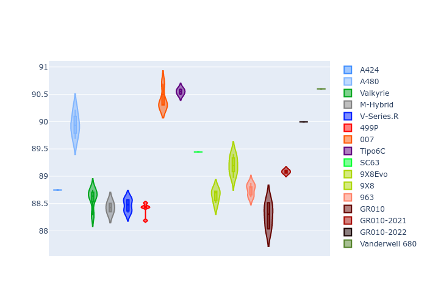
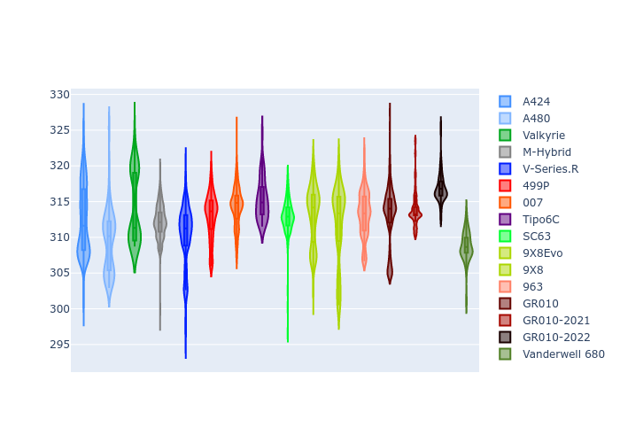

# Combined Plots

## Metadata

- BoP Accuracy: 97.36%
- Overall BoP Grade: A1
- Track: FUJI
- Threshhold: 210.0kph

## BoP Table
| Manufacturer     | Car            | Weight   | Power   | PINC   | E/Stint   | FDS    |
|:-----------------|:---------------|:---------|:--------|:-------|:----------|:-------|
| Alpine           | A424           | 1100kg   | 480.0kw | +0.10% | 889MJ     | -      |
| Alpine           | A480           | 1052kg   | 410.0kw | +0.50% | 763MJ     | -      |
| Aston Martin     | Valkyrie       | 1051kg   | 480.0kw | +0.20% | 878MJ     | -      |
| BMW              | M-Hybrid       | 1100kg   | 480.0kw | +1.70% | 889MJ     | -      |
| Cadillac         | V-Series.R     | 1100kg   | 480.0kw | +6.60% | 896MJ     | -      |
| Ferrari          | 499P           | 1100kg   | 480.0kw | +0.20% | 885MJ     | 200kph |
| Glickenhaus      | 007            | 1055kg   | 489.0kw | +2.70% | 891MJ     | -      |
| Isotta Fraschini | Tipo6C         | 1084kg   | 520.0kw | -2.20% | 915MJ     | 190kph |
| Lamborghini      | SC63           | 1076kg   | 502.0kw | -0.10% | 899MJ     | -      |
| Peugeot          | 9X8Evo         | 1100kg   | 480.0kw | -      | 894MJ     | 190kph |
| Peugeot          | 9X8            | 1095kg   | 485.0kw | +7.20% | 897MJ     | 150kph |
| Porsche          | 963            | 1100kg   | 480.0kw | +1.40% | 887MJ     | -      |
| Toyota           | GR010          | 1100kg   | 480.0kw | -      | 885MJ     | 200kph |
| Toyota           | GR010OLD       | 1100kg   | 480.0kw | -      | 932MJ     | 200kph |
| Vanwall          | Vanderwell 680 | 1030kg   | 520.0kw | -      | 903MJ     | -      |

## Performance Table
| Manufacturer     | Car            | RP      | QP      | Vavg      |   RDLC | BOP-Grade   | Match   |
|:-----------------|:---------------|:--------|:--------|:----------|-------:|:------------|:--------|
| Alpine           | A424           | 1:31.32 | 1:29.89 | 296.97kph |   1.02 | ~A1         | 99.27%  |
| Alpine           | A480           | 1:30.28 | 1:29.82 | 294.42kph |   1.01 | ~A1         | 96.75%  |
| Aston Martin     | Valkyrie       | 1:31.52 | 1:29.44 | 300.99kph |   1.02 | ~A1         | 100.00% |
| BMW              | M-Hybrid       | 1:31.31 | 1:29.58 | 297.18kph |   1.02 | ~A1         | 100.00% |
| Cadillac         | V-Series.R     | 1:31.27 | 1:29.62 | 297.68kph |   1.02 | ~A1         | 99.96%  |
| Ferrari          | 499P           | 1:30.73 | 1:28.96 | 299.63kph |   1.02 | ~A1         | 99.08%  |
| Glickenhaus      | 007            | 1:31.51 | 1:30.76 | 300.56kph |   1.01 | +A2         | 94.15%  |
| Isotta Fraschini | Tipo6C         | 1:31.51 | 1:31.64 | 303.14kph |   1    | ~A1         | 98.51%  |
| Lamborghini      | SC63           | 1:31.51 | 1:30.53 | 301.85kph |   1.01 | ~A1         | 98.19%  |
| Peugeot          | 9X8Evo         | 1:31.48 | 1:29.76 | 298.76kph |   1.02 | ~A1         | 97.45%  |
| Peugeot          | 9X8            | 1:31.52 | 1:30.12 | 295.35kph |   1.02 | ~A1         | 98.91%  |
| Porsche          | 963            | 1:31.28 | 1:29.62 | 297.11kph |   1.02 | ~A1         | 99.89%  |
| Toyota           | GR010          | 1:30.79 | 1:28.94 | 299.99kph |   1.02 | ~A1         | 99.46%  |
| Toyota           | GR010OLD       | 1:30.83 | 1:30.08 | 294.36kph |   1.01 | ~A1         | 100.00% |
| Vanwall          | Vanderwell 680 | 1:32.16 | 1:30.22 | 301.72kph |   1.02 | +C1         | 78.72%  |

## Race Laptimes

## Quali Laptimes

## Topspeeds

## Laptimes Lineplot

