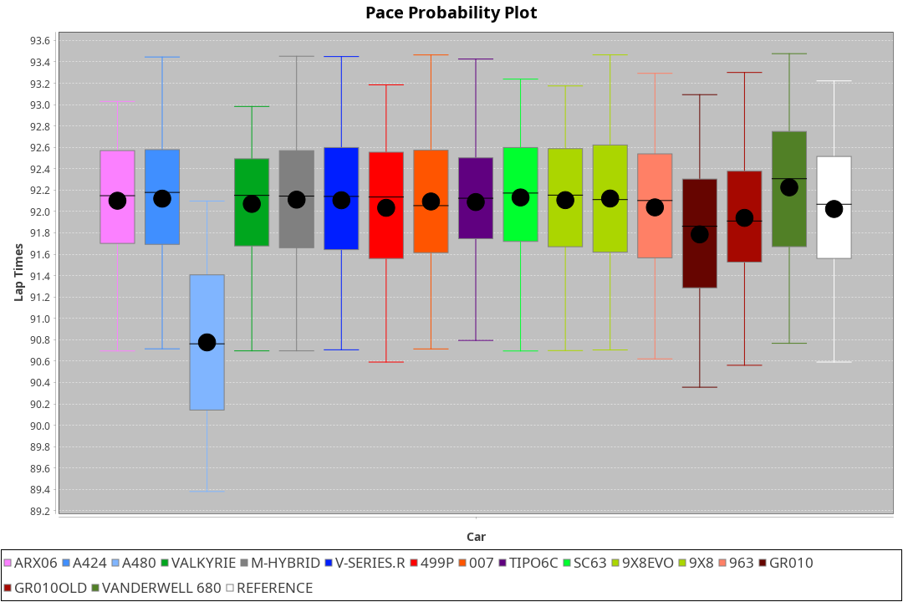
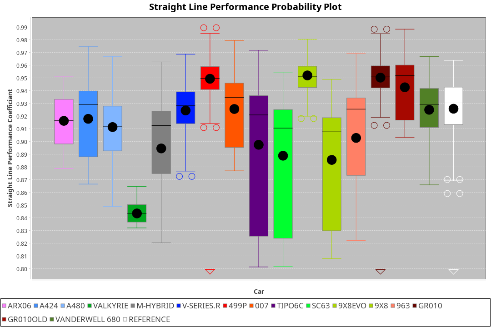
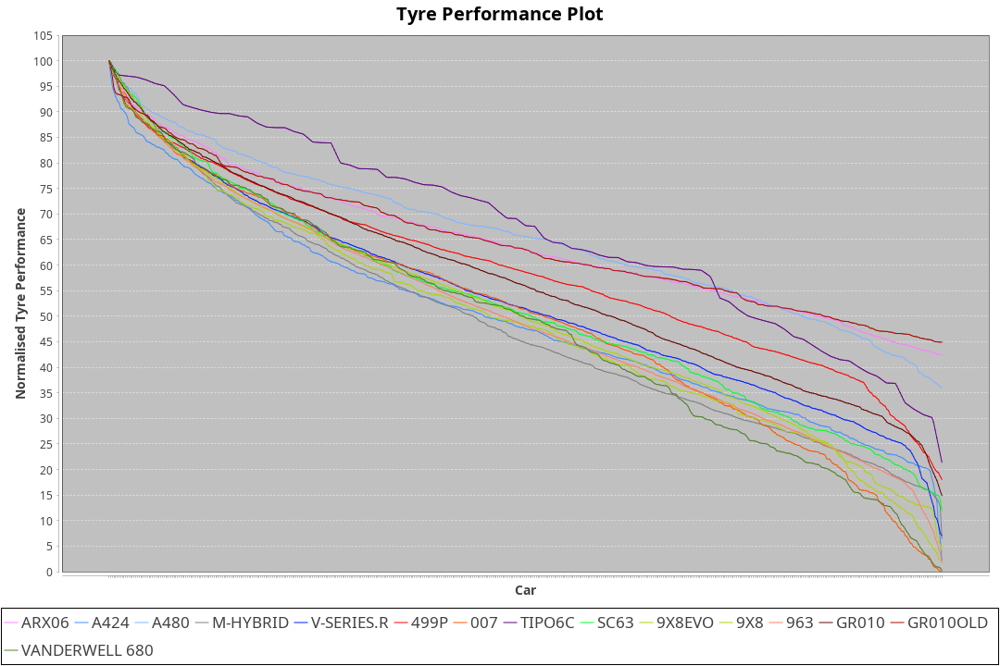

|Manufacturer|Car|Type|RP|QP|Weight|Power¹|Threshhold|PINC|Power²|E/Stint|AVG Vmax|FDS|RDLC|L/Stint|BOP-Grade|ModelAccuracy|ModelPoints|Match%|
|:-|:-|:-|:-|:-|:-|:-|:-|:-|:-|:-|:-|:-|:-|:-|:-|:-|:-|:-|
|Acura|ARX06|LMDH|1:32.49|1:28.32|1033kg|515kw|210.0kph|-2%|505kw|902MJ|322.73kph-340.45kph|-|1.03|41|-C2|100.00%|995|72.54%|
|Alpine|A424|LMDH|1:32.49|1:27.99|1030kg|520kw|210.0kph|-3%|504kw|901MJ|323.78kph-344.89kph|-|1.04|41|~A1|81.46%|523|96.26%|
|BMW|M Hybrid V8 LMDh|LMDH|1:32.50|1:27.97|1043kg|509kw|210.0kph|2%|519kw|897MJ|319.97kph-344.19kph|-|1.03|40|-B1|98.60%|1690|86.89%|
|Cadillac|V-Series.R|LMDH|1:32.50|1:28.21|1036kg|520kw|210.0kph|-4%|499kw|882MJ|317.46kph-342.32kph|-|1.03|41|-B1|98.38%|1765|88.04%|
|Ferrari|499P|LMHHU|1:32.49|1:28.19|1061kg|518kw|210.0kph|-5%|492kw|886MJ|320.20kph-343.02kph|190kph|1.03|41|-A2|92.24%|2247|90.66%|
|Glickenhaus|007|LMHNH|1:33.35|1:29.51|1030kg|520kw|210.0kph|0%|520kw|913MJ|329.21kph-341.39kph|-|0.96|40|+E2|96.18%|554|52.83%|
|Issotta Fraschini|Tipo6C|LMHHU|1:32.53|1:28.71|1030kg|520kw|210.0kph|0%|520kw|917MJ|326.75kph-337.67kph|150kph|1.08|40|+A2|66.67%|96|92.72%|
|Lamborghini|SC63|LMDH|1:32.48|1:27.88|1059kg|520kw|210.0kph|0%|520kw|901MJ|320.66kph-339.27kph|-|1.03|40|-B1|96.77%|419|87.58%|
|Peugeot|9X8|LMHHE|1:32.49|1:28.38|1030kg|520kw|210.0kph|0%|520kw|910MJ|320.53kph-344.61kph|100kph|1.04|40|-A2|87.65%|1795|93.03%|
|Porsche|963|LMDH|1:32.50|1:28.23|1034kg|520kw|210.0kph|-3%|504kw|893MJ|319.99kph-343.99kph|-|1.03|41|-B1|96.81%|5438|88.72%|
|Toyota|GR010 - Hybrid|LMHHU|1:32.48|1:28.03|1067kg|504kw|210.0kph|2%|514kw|901MJ|319.04kph-351.73kph|190kph|1.03|40|-A2|86.04%|1751|93.35%|
|Vanwall|Vanderwell 680|LMHNH|1:34.61|1:30.27|1030kg|520kw|210.0kph|0%|520kw|901MJ|314.21kph-337.41kph|-|1.02|40|+Ω1|91.42%|501|0.45%|

### BoP Accuracy: 78.59%; Overall BoP Grade: C1

## Power below Threshhold
|N/Nmax|TOY|PEU|CAD|POR|FER|ALP|BMW|LBG|IF|GLI|VAN|ACU|
|:-|:-|:-|:-|:-|:-|:-|:-|:-|:-|:-|:-|:-|
|0.550|248|256|256|256|255|256|251|256|256|256|256|254|
|0.575|271|279|279|279|278|279|274|279|279|279|279|277|
|0.600|291|300|300|300|299|300|294|300|300|300|300|297|
|0.625|312|322|322|322|321|322|315|322|322|322|322|319|
|0.650|333|343|343|343|342|343|336|343|343|343|343|340|
|0.675|354|365|365|365|364|365|357|365|365|365|365|362|
|0.700|375|387|387|387|386|387|379|387|387|387|387|383|
|0.725|396|409|409|409|407|409|400|409|409|409|409|405|
|0.750|416|430|430|430|428|430|421|430|430|430|430|426|
|0.775|435|449|449|449|447|449|440|449|449|449|449|445|
|0.800|453|467|467|467|465|467|457|467|467|467|467|463|
|0.825|468|482|482|482|480|482|472|482|482|482|482|478|
|0.850|479|494|494|494|492|494|484|494|494|494|494|489|
|0.875|489|505|505|505|503|505|494|505|505|505|505|500|
|0.900|496|512|512|512|510|512|501|512|512|512|512|507|
|0.925|501|517|517|517|515|517|506|517|517|517|517|512|
|**0.950**|**504**|**520**|**520**|**520**|**518**|**520**|**509**|**520**|**520**|**520**|**520**|**515**|
|0.975|502|518|518|518|516|518|507|518|518|518|518|513|
|1.000|499|514|514|514|512|514|504|514|514|514|514|509|
|1.025|430|444|444|444|442|444|435|444|444|444|444|440|

## Power above Threshhold
|N/Nmax|TOY|PEU|CAD|POR|FER|ALP|BMW|LBG|IF|GLI|VAN|ACU|
|:-|:-|:-|:-|:-|:-|:-|:-|:-|:-|:-|:-|:-|
|0.550|253|256|246|248|242|248|256|256|256|256|256|249|
|0.575|276|279|268|271|265|271|279|279|279|279|279|272|
|0.600|297|300|288|291|284|291|299|300|300|300|300|292|
|0.625|318|322|308|312|304|312|321|322|322|322|322|312|
|0.650|339|343|329|333|325|333|342|343|343|343|343|333|
|0.675|361|365|350|354|345|354|364|365|365|365|365|355|
|0.700|383|387|371|375|366|375|386|387|387|387|387|376|
|0.725|404|409|392|396|387|396|408|409|409|409|409|397|
|0.750|425|430|412|416|407|416|429|430|430|430|430|417|
|0.775|444|449|431|435|425|435|448|449|449|449|449|436|
|0.800|462|467|448|453|442|453|466|467|467|467|467|454|
|0.825|477|482|463|468|456|468|481|482|482|482|482|469|
|0.850|488|494|474|479|467|479|493|494|494|494|494|480|
|0.875|499|505|484|489|477|489|504|505|505|505|505|490|
|0.900|506|512|491|496|484|496|511|512|512|512|512|497|
|0.925|511|517|496|501|489|501|516|517|517|517|517|502|
|**0.950**|**514**|**520**|**499**|**504**|**492**|**504**|**519**|**520**|**520**|**520**|**520**|**505**|
|0.975|512|518|497|502|490|502|517|518|518|518|518|503|
|1.000|508|514|494|499|487|499|513|514|514|514|514|500|
|1.025|439|444|426|430|420|430|443|444|444|444|444|431|
