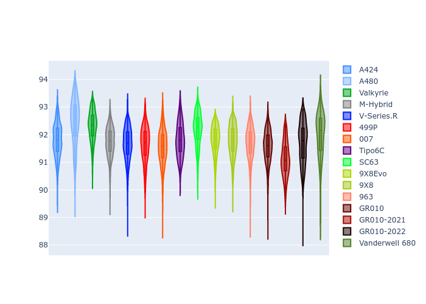
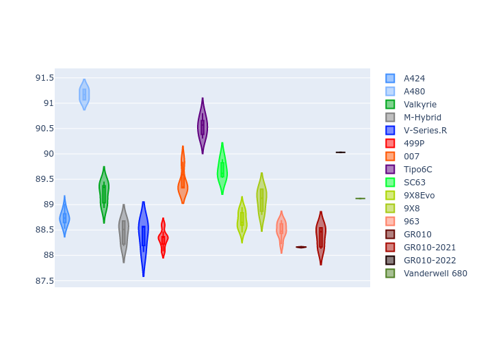
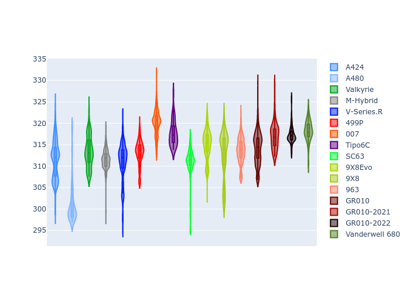
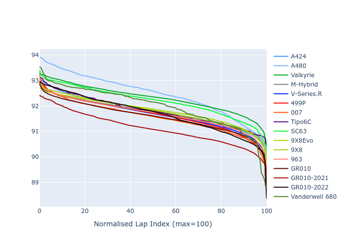

# Combined Plots

## Metadata

- BoP Accuracy: 96.37%
- Overall BoP Grade: A1
- Track: FUJI
- Threshhold: 250.0kph
- Average Laptime: 1:31.91
- Average Quali Laptime: 1:29.12
- Average Topspeed: 313.56kph

## BoP Table
| Manufacturer     | Car            | Weight   | Power   | PINC   | E/Stint   | FDS    | RDP    | QDP    | TDP    |
|:-----------------|:---------------|:---------|:--------|:-------|:----------|:-------|:-------|:-------|:-------|
| Alpine           | A424           | 1048kg   | 515.0kw | +0.70% | 917MJ     | -      | 51.64% | 59.31% | 26.80% |
| Alpine           | A480           | 992kg    | 420.0kw | +0.10% | 776MJ     | -      | 54.81% | 80.56% | 55.69% |
| Aston Martin     | Valkyrie       | 1030kg   | 520.0kw | -      | 911MJ     | -      | 53.50% | 53.33% | 21.51% |
| BMW              | M-Hybrid       | 1040kg   | 517.0kw | -      | 912MJ     | -      | 52.89% | 56.22% | 33.41% |
| Cadillac         | V-Series.R     | 1030kg   | 520.0kw | -      | 911MJ     | -      | 48.63% | 60.80% | 19.01% |
| Ferrari          | 499P           | 1065kg   | 503.0kw | -0.60% | 900MJ     | 190kph | 51.38% | 44.98% | 9.83%  |
| Glickenhaus      | 007            | 1003kg   | 533.0kw | -      | 918MJ     | -      | 46.15% | 49.30% | 41.45% |
| Isotta Fraschini | Tipo6C         | 1015kg   | 523.0kw | -      | 915MJ     | 190kph | 43.95% | 47.22% | 31.53% |
| Lamborghini      | SC63           | 1030kg   | 520.0kw | -1.60% | 906MJ     | -      | 48.33% | 60.95% | 28.65% |
| Peugeot          | 9X8Evo         | 1045kg   | 516.0kw | -1.00% | 919MJ     | 190kph | 48.87% | 52.78% | 15.41% |
| Peugeot          | 9X8            | 1036kg   | 524.0kw | -      | 910MJ     | 150kph | 54.54% | 58.39% | 9.69%  |
| Porsche          | 963            | 1043kg   | 514.0kw | +0.40% | 910MJ     | -      | 50.70% | 44.30% | 29.51% |
| Toyota           | GR010          | 1069kg   | 501.0kw | +1.10% | 904MJ     | 190kph | 51.09% | 52.71% | 11.46% |
| Toyota           | GR010-2021     | 1045kg   | 509.0kw | +0.10% | 900MJ     | 150kph | 53.89% | 50.91% | 25.87% |
| Toyota           | GR010-2022     | 1050kg   | 503.0kw | +0.10% | 896MJ     | 190kph | 53.24% | 64.49% | 9.72%  |
| Vanwall          | Vanderwell 680 | 980kg    | 539.0kw | -      | 914MJ     | -      | 35.83% | 59.29% | 34.15% |

## Performance Table
| Manufacturer     | Car            | RP      | QP      | Vavg      |   RDLC | BOP-Grade   | Match   |
|:-----------------|:---------------|:--------|:--------|:----------|-------:|:------------|:--------|
| Alpine           | A424           | 1:31.66 | 1:28.61 | 312.31kph |   1.03 | ~A1         | 99.94%  |
| Alpine           | A480           | 1:32.69 | 1:30.76 | 300.13kph |   1.02 | +C1         | 80.00%  |
| Aston Martin     | Valkyrie       | 1:31.97 | 1:28.47 | 314.17kph |   1.04 | ~A1         | 100.00% |
| BMW              | M-Hybrid       | 1:31.60 | 1:28.23 | 312.37kph |   1.04 | ~A1         | 99.97%  |
| Cadillac         | V-Series.R     | 1:31.46 | 1:28.12 | 311.54kph |   1.04 | ~A1         | 99.81%  |
| Ferrari          | 499P           | 1:32.62 | 1:28.99 | 311.72kph |   1.04 | +A2         | 91.80%  |
| Glickenhaus      | 007            | 1:30.99 | 1:28.93 | 320.18kph |   1.02 | ~A1         | 98.07%  |
| Isotta Fraschini | Tipo6C         | 1:31.77 | 1:30.60 | 317.65kph |   1.01 | ~A1         | 97.76%  |
| Lamborghini      | SC63           | 1:32.23 | 1:29.67 | 311.51kph |   1.03 | ~A1         | 99.62%  |
| Peugeot          | 9X8Evo         | 1:32.28 | 1:29.09 | 313.07kph |   1.04 | ~A1         | 99.12%  |
| Peugeot          | 9X8            | 1:31.91 | 1:29.26 | 312.75kph |   1.03 | ~A1         | 99.96%  |
| Porsche          | 963            | 1:31.64 | 1:28.43 | 314.49kph |   1.04 | ~A1         | 99.79%  |
| Toyota           | GR010          | 1:32.53 | 1:28.90 | 313.14kph |   1.04 | -A2         | 93.93%  |
| Toyota           | GR010-2021     | 1:32.18 | 1:29.10 | 316.77kph |   1.03 | +A2         | 92.15%  |
| Toyota           | GR010-2022     | 1:32.40 | 1:30.62 | 317.28kph |   1.02 | ~A1         | 98.88%  |
| Vanwall          | Vanderwell 680 | 1:30.66 | 1:28.14 | 317.83kph |   1.03 | -A2         | 91.18%  |

## Race Laptimes

## Quali Laptimes

## Topspeeds

## Laptimes Lineplot

