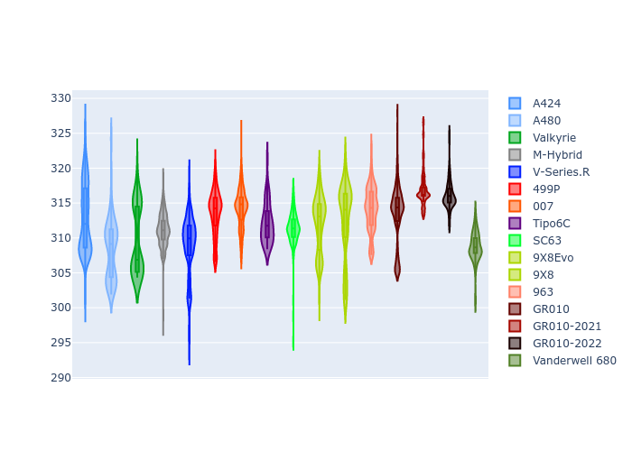
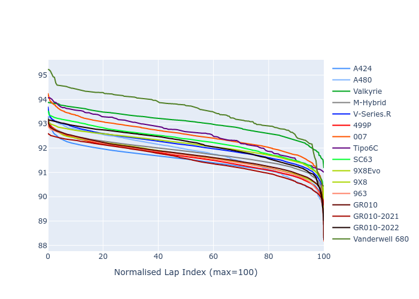

# Combined Plots

## Metadata

- BoP Accuracy: 92.14%
- Overall BoP Grade: A2
- Track: FUJI
- Threshhold: 210.0kph

## BoP Table
| Manufacturer     | Car            | Weight   | Power   | PINC   | E/Stint   | FDS    |
|:-----------------|:---------------|:---------|:--------|:-------|:----------|:-------|
| Alpine           | A424           | 1047kg   | 520.0kw | -      | 919MJ     | -      |
| Alpine           | A480           | 1052kg   | 432.0kw | -      | 782MJ     | -      |
| Aston Martin     | Valkyrie       | 1042kg   | 504.0kw | +0.40% | 899MJ     | -      |
| BMW              | M-Hybrid       | 1041kg   | 512.0kw | -      | 908MJ     | -      |
| Cadillac         | V-Series.R     | 1034kg   | 510.0kw | -      | 902MJ     | -      |
| Ferrari          | 499P           | 1063kg   | 508.0kw | -      | 906MJ     | 190kph |
| Glickenhaus      | 007            | 1030kg   | 520.0kw | -      | 910MJ     | -      |
| Isotta Fraschini | Tipo6C         | 1059kg   | 520.0kw | -      | 917MJ     | 190kph |
| Lamborghini      | SC63           | 1042kg   | 519.0kw | -      | 911MJ     | -      |
| Peugeot          | 9X8Evo         | 1050kg   | 510.0kw | -      | 916MJ     | 190kph |
| Peugeot          | 9X8            | 1030kg   | 520.0kw | -      | 906MJ     | 150kph |
| Porsche          | 963            | 1047kg   | 516.0kw | -      | 911MJ     | -      |
| Toyota           | GR010          | 1080kg   | 512.0kw | -      | 912MJ     | 190kph |
| Toyota           | GR010OLD       | 1065kg   | 513.0kw | -      | 960MJ     | 150kph |
| Vanwall          | Vanderwell 680 | 1030kg   | 520.0kw | -      | 903MJ     | -      |

## Performance Table
| Manufacturer     | Car            | RP      | QP      | Vavg      |   RDLC | BOP-Grade   | Match   |
|:-----------------|:---------------|:--------|:--------|:----------|-------:|:------------|:--------|
| Alpine           | A424           | 1:29.43 | 1:28.08 | 311.14kph |   1.02 | ~A1         | 99.50%  |
| Alpine           | A480           | 1:29.56 | 1:29.12 | 299.65kph |   1    | ~A1         | 99.44%  |
| Aston Martin     | Valkyrie       | 1:30.62 | 1:28.59 | 307.50kph |   1.02 | ~A1         | 97.81%  |
| BMW              | M-Hybrid       | 1:29.68 | 1:28.04 | 308.93kph |   1.02 | ~A1         | 99.77%  |
| Cadillac         | V-Series.R     | 1:29.95 | 1:28.36 | 305.82kph |   1.02 | ~A1         | 100.00% |
| Ferrari          | 499P           | 1:29.32 | 1:27.63 | 309.50kph |   1.02 | ~A1         | 98.25%  |
| Glickenhaus      | 007            | 1:30.43 | 1:29.71 | 307.77kph |   1.01 | +A2         | 91.10%  |
| Isotta Fraschini | Tipo6C         | 1:31.00 | 1:31.13 | 307.56kph |   1    | +B2         | 81.34%  |
| Lamborghini      | SC63           | 1:30.52 | 1:29.57 | 309.17kph |   1.01 | ~A1         | 96.38%  |
| Peugeot          | 9X8Evo         | 1:29.90 | 1:28.26 | 310.58kph |   1.02 | ~A1         | 100.00% |
| Peugeot          | 9X8            | 1:30.09 | 1:28.76 | 303.87kph |   1.01 | ~A1         | 99.96%  |
| Porsche          | 963            | 1:29.60 | 1:28.02 | 309.34kph |   1.02 | ~A1         | 99.77%  |
| Toyota           | GR010          | 1:29.47 | 1:27.68 | 309.13kph |   1.02 | ~A1         | 98.98%  |
| Toyota           | GR010OLD       | 1:28.85 | 1:28.16 | 305.10kph |   1.01 | -A2         | 92.49%  |
| Vanwall          | Vanderwell 680 | 1:32.16 | 1:30.22 | 301.72kph |   1.02 | +Ω1         | 27.38%  |

## Race Laptimes

## Quali Laptimes

## Topspeeds

## Laptimes Lineplot

