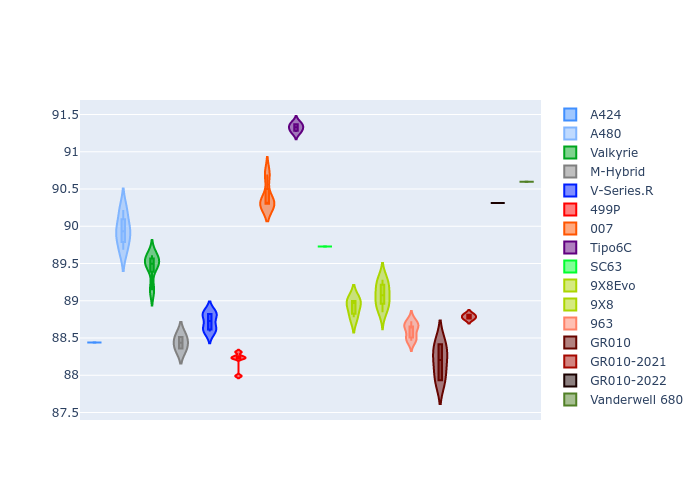

# Combined Plots

## Metadata

- BoP Accuracy: 93.61%
- Overall BoP Grade: A2
- Track: FUJI
- Threshhold: 210.0kph
- Average Laptime: 1:32.11
- Average Quali Laptime: 1:29.32
- Average Topspeed: 312.29kph

## BoP Table
| Manufacturer     | Car            | Weight   | Power   | PINC   | E/Stint   | FDS    | RDP    | QDP    | TDP    |
|:-----------------|:---------------|:---------|:--------|:-------|:----------|:-------|:-------|:-------|:-------|
| Alpine           | A424           | 1047kg   | 520.0kw | -      | 920MJ     | -      | 51.64% | 59.31% | 26.80% |
| Alpine           | A480           | 952kg    | 432.0kw | -      | 782MJ     | -      | 53.05% | 74.07% | 48.97% |
| Aston Martin     | Valkyrie       | 1042kg   | 504.0kw | +0.40% | 899MJ     | -      | 53.50% | 53.33% | 21.51% |
| BMW              | M-Hybrid       | 1041kg   | 512.0kw | -      | 908MJ     | -      | 52.89% | 56.22% | 33.41% |
| Cadillac         | V-Series.R     | 1034kg   | 510.0kw | -      | 902MJ     | -      | 48.63% | 60.80% | 19.01% |
| Ferrari          | 499P           | 1063kg   | 508.0kw | -      | 905MJ     | 190kph | 51.38% | 44.98% | 9.83%  |
| Glickenhaus      | 007            | 1030kg   | 520.0kw | -      | 910MJ     | -      | 46.15% | 49.30% | 41.45% |
| Isotta Fraschini | Tipo6C         | 1059kg   | 520.0kw | -      | 917MJ     | 190kph | 43.95% | 47.22% | 31.53% |
| Lamborghini      | SC63           | 1042kg   | 519.0kw | -      | 911MJ     | -      | 48.33% | 60.95% | 28.65% |
| Peugeot          | 9X8Evo         | 1050kg   | 510.0kw | -      | 917MJ     | 190kph | 48.87% | 52.78% | 15.41% |
| Peugeot          | 9X8            | 1030kg   | 520.0kw | -      | 906MJ     | 150kph | 54.54% | 58.39% | 9.69%  |
| Porsche          | 963            | 1047kg   | 516.0kw | -      | 911MJ     | -      | 50.70% | 44.30% | 29.51% |
| Toyota           | GR010          | 1080kg   | 512.0kw | -      | 912MJ     | 190kph | 51.09% | 52.71% | 11.46% |
| Toyota           | GR010-2021     | 1065kg   | 513.0kw | -      | 906MJ     | 150kph | 54.08% | 54.81% | 9.72%  |
| Toyota           | GR010-2022     | 1080kg   | 512.0kw | -      | 907MJ     | 190kph | 53.45% | 68.83% | 9.58%  |
| Vanwall          | Vanderwell 680 | 1030kg   | 520.0kw | -      | 903MJ     | -      | 49.68% | 60.93% | 34.43% |

## Performance Table
| Manufacturer     | Car            | RP      | QP      | Vavg      |   RDLC | BOP-Grade   | Match   |
|:-----------------|:---------------|:--------|:--------|:----------|-------:|:------------|:--------|
| Alpine           | A424           | 1:31.50 | 1:28.44 | 312.87kph |   1.03 | ~A1         | 99.94%  |
| Alpine           | A480           | 1:31.82 | 1:29.94 | 308.43kph |   1.02 | ~A1         | 99.60%  |
| Aston Martin     | Valkyrie       | 1:33.04 | 1:29.45 | 309.69kph |   1.04 | +C1         | 79.59%  |
| BMW              | M-Hybrid       | 1:31.84 | 1:28.44 | 311.17kph |   1.04 | ~A1         | 100.00% |
| Cadillac         | V-Series.R     | 1:32.09 | 1:28.72 | 308.92kph |   1.04 | ~A1         | 99.65%  |
| Ferrari          | 499P           | 1:31.62 | 1:28.20 | 313.60kph |   1.04 | ~A1         | 99.85%  |
| Glickenhaus      | 007            | 1:32.53 | 1:30.40 | 314.29kph |   1.02 | -A2         | 93.56%  |
| Isotta Fraschini | Tipo6C         | 1:32.59 | 1:31.33 | 312.15kph |   1.01 | +B1         | 86.57%  |
| Lamborghini      | SC63           | 1:32.30 | 1:29.73 | 311.44kph |   1.03 | ~A1         | 99.71%  |
| Peugeot          | 9X8Evo         | 1:32.13 | 1:28.92 | 312.12kph |   1.04 | ~A1         | 100.00% |
| Peugeot          | 9X8            | 1:31.70 | 1:29.08 | 312.54kph |   1.03 | ~A1         | 99.92%  |
| Porsche          | 963            | 1:31.67 | 1:28.60 | 314.13kph |   1.03 | ~A1         | 99.67%  |
| Toyota           | GR010          | 1:31.73 | 1:28.18 | 313.45kph |   1.04 | ~A1         | 99.71%  |
| Toyota           | GR010-2021     | 1:31.52 | 1:28.79 | 316.90kph |   1.03 | ~A1         | 100.00% |
| Toyota           | GR010-2022     | 1:32.16 | 1:30.31 | 316.15kph |   1.02 | ~A1         | 99.66%  |
| Vanwall          | Vanderwell 680 | 1:33.57 | 1:30.60 | 308.75kph |   1.03 | +Ω1         | 40.28%  |

## Race Laptimes

## Quali Laptimes

## Topspeeds

## Laptimes Lineplot

