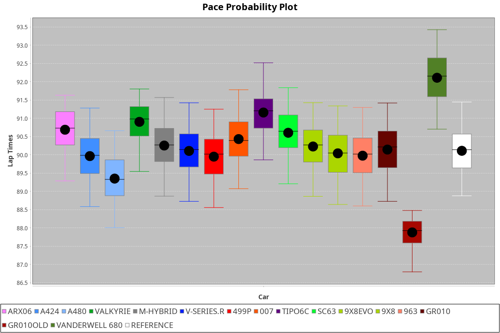
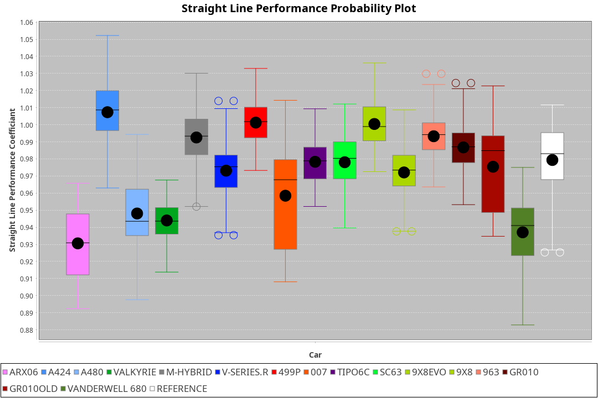
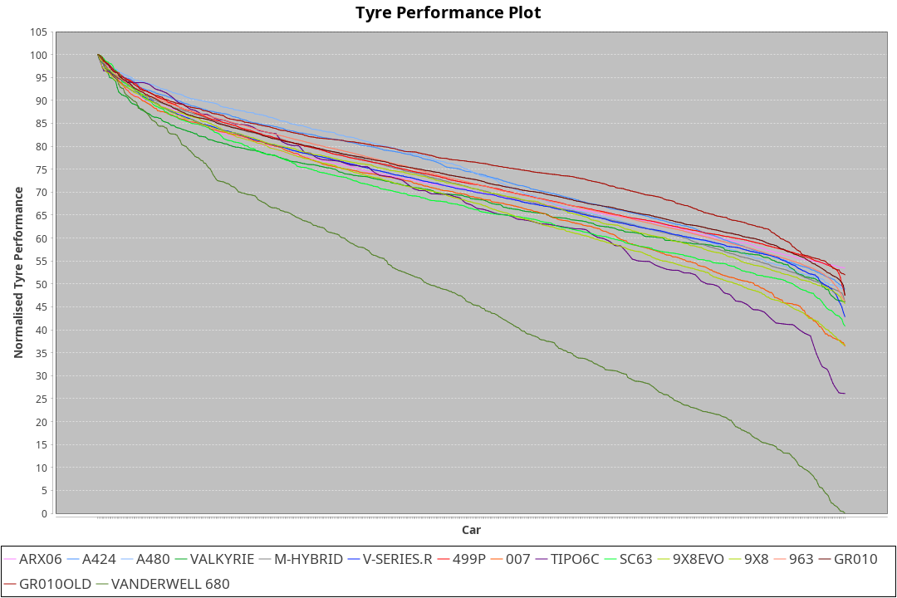

| Manufacturer     | Car            | Weight | Power   | PINC    | E/Stint | FDS     |
|:-|:-|:-|:-|:-|:-|:-|
| Acura            | ARX06          | 1072kg | 511.0kw |    -    | 911MJ   |    -    |
| Alpine           | A424           | 1047kg | 520.0kw |    -    | 915MJ   |    -    |
| Alpine           | A480           | 952kg  | 432.0kw |    -    | 766MJ   |    -    |
| BMW              | M-Hybrid       | 1041kg | 512.0kw |    -    | 905MJ   |    -    |
| Cadillac         | V-Series.R     | 1034kg | 510.0kw |    -    | 898MJ   |    -    |
| Ferrari          | 499P           | 1063kg | 508.0kw |    -    | 899MJ   | 190kph  |
| Glickenhaus      | 007            | 1030kg | 520.0kw |    -    | 910MJ   |    -    |
| Isotta Fraschini | Tipo6C         | 1059kg | 520.0kw |    -    | 917MJ   | 190kph  |
| Lamborghini      | SC63           | 1042kg | 519.0kw |    -    | 910MJ   |    -    |
| Peugeot          | 9X8            | 1030kg | 520.0kw |    -    | 904MJ   | 150kph  |
| Peugeot          | 9X8Evo         | 1050kg | 510.0kw |    -    | 905MJ   | 190kph  |
| Porsche          | 963            | 1047kg | 516.0kw |    -    | 902MJ   |    -    |
| Toyota           | GR010          | 1080kg | 512.0kw |    -    | 904MJ   | 190kph  |
| Toyota           | GR010OLD       | 1065kg | 513.0kw |    -    | 906MJ   | 190kph  |
| Vanwall          | Vanderwell 680 | 1030kg | 520.0kw |    -    | 903MJ   |    -    |

### BoP Accuracy: 73.90%; Overall BoP Grade: C2
| Manufacturer     | Car            | Type  | RP      | QP      | Weight | Power¹  | Threshhold | PINC    | Power²   | E/Stint | AVG Vmax  | FDS     | RDLC | L/Stint | BOP-Grade | Model Accuracy | Model Points | Match%  | SimDiff |
|:-|:-|:-|:-|:-|:-|:-|:-|:-|:-|:-|:-|:-|:-|:-|:-|:-|:-|:-|:-|
| Acura            | ARX06          | LMDH  | 1:30.23 | 1:27.96 | 1072kg | 511.0kw | 210.0kph   |    -    | 511.00kw |  911MJ  | 310.34kph |    -    | 1.00 | 40      | +D1       | 100.00%        | 995          | 68.83%  | #       |
| Alpine           | A424           | LMDH  | 1:30.16 | 1:28.48 | 1047kg | 520.0kw | 210.0kph   |    -    | 520.00kw |  915MJ  | 326.17kph |    -    | 1.00 | 40      | ~A1       | 86.43%         | 618          | 95.56%  | #       |
| Alpine           | A480           | LMP1  | 1:29.49 | 1:28.37 |  952kg | 432.0kw | 210.0kph   |    -    | 432.00kw |  766MJ  | 311.20kph |    -    | 0.97 | 37      | -E1       | 68.63%         | 967          | 59.23%  | ±2.14s  |
| BMW              | M-Hybrid       | LMDH  | 1:30.06 | 1:27.98 | 1041kg | 512.0kw | 210.0kph   |    -    | 512.00kw |  905MJ  | 322.03kph |    -    | 1.01 | 40      | -B2       | 93.77%         | 1672         | 84.82%  | #       |
| Cadillac         | V-Series.R     | LMDH  | 1:29.78 | 1:28.10 | 1034kg | 510.0kw | 210.0kph   |    -    | 510.00kw |  898MJ  | 319.19kph |    -    | 1.02 | 40      | -C2       | 83.12%         | 1921         | 73.02%  | ±2.67s  |
| Ferrari          | 499P           | LMHHU | 1:29.82 | 1:28.00 | 1063kg | 508.0kw | 210.0kph   |    -    | 508.00kw |  899MJ  | 321.84kph | 190kph  | 1.03 | 40      | -B2       | 69.49%         | 1950         | 82.41%  | ±2.06s  |
| Glickenhaus      | 007            | LMHNH | 1:30.40 | 1:29.38 | 1030kg | 520.0kw | 210.0kph   |    -    | 520.00kw |  910MJ  | 321.17kph |    -    | 0.96 | 40      | ~A1       | 89.50%         | 1518         | 100.00% | #       |
| Isotta Fraschini | Tipo6C         | LMHHU | 1:31.07 | 1:30.68 | 1059kg | 520.0kw | 210.0kph   |    -    | 520.00kw |  917MJ  | 319.69kph | 190kph  | 1.05 | 40      | +Ω1       | 73.56%         | 64           | 28.92%  | #       |
| Lamborghini      | SC63           | LMDH  | 1:30.47 | 1:30.20 | 1042kg | 519.0kw | 210.0kph   |    -    | 519.00kw |  910MJ  | 322.45kph |    -    | 1.04 | 40      | +B1       | 95.82%         | 459          | 86.27%  | #       |
| Peugeot          | 9X8            | LMHHE | 1:30.64 | 1:29.00 | 1030kg | 520.0kw | 210.0kph   |    -    | 520.00kw |  904MJ  | 320.10kph | 150kph  | 1.03 | 40      | ~A1       | 88.75%         | 2383         | 100.00% | ±1.88s  |
| Peugeot          | 9X8Evo         | LMHHU | 1:30.06 | 1:28.27 | 1050kg | 510.0kw | 210.0kph   |    -    | 510.00kw |  905MJ  | 322.00kph | 190kph  | 1.00 | 40      | ~A1       | 66.97%         | 221          | 100.00% | #       |
| Porsche          | 963            | LMDH  | 1:29.99 | 1:28.11 | 1047kg | 516.0kw | 210.0kph   |    -    | 516.00kw |  902MJ  | 322.24kph |    -    | 1.01 | 40      | -B1       | 81.02%         | 5243         | 87.80%  | ±2.08s  |
| Toyota           | GR010          | LMHHU | 1:30.02 | 1:28.32 | 1080kg | 512.0kw | 210.0kph   |    -    | 512.00kw |  904MJ  | 319.57kph | 190kph  | 1.01 | 40      | -A2       | 73.70%         | 2701         | 94.46%  | ±1.77s  |
| Toyota           | GR010OLD       | LMHHE | 1:30.20 | 1:28.15 | 1065kg | 513.0kw | 210.0kph   |    -    | 513.00kw |  906MJ  | 317.91kph | 190kph  | 1.03 | 40      | -A2       | 99.03%         | 1536         | 92.06%  | #       |
| Vanwall          | Vanderwell 680 | LMHNH | 1:33.09 | 1:30.55 | 1030kg | 520.0kw | 210.0kph   |    -    | 520.00kw |  903MJ  | 313.49kph |    -    | 1.01 | 40      | +Ω2       | 97.01%         | 649          | -44.91% | ±0.84s  |

## Power below Threshhold
| N/Nmax    | ARX06   | A424    | M-HYBRID | V-SERIES.R | 499P    | 007     | TIPO6C  | SC63    | 9X8     | 9X8EVO  | 963     | GR010   | GR010OLD | VANDERWELL 680 | ​     | RPM      | A480    |
|:-|:-|:-|:-|:-|:-|:-|:-|:-|:-|:-|:-|:-|:-|:-|:-|:-|:-|
|  0.550    |  252    |  256    |  252     |  251       |  250    |  256    |  256    |  256    |  256    |  251    |  254    |  252    |  253     |  256           |  ​    |   --     |   -     |
|  0.575    |  275    |  279    |  275     |  274       |  273    |  279    |  279    |  279    |  279    |  274    |  277    |  275    |  276     |  279           |  ​    |   --     |   -     |
|  0.600    |  295    |  300    |  296     |  295       |  293    |  300    |  300    |  299    |  300    |  295    |  298    |  296    |  296     |  300           |  ​    |   --     |   -     |
|  0.625    |  316    |  322    |  317     |  316       |  314    |  322    |  322    |  321    |  322    |  316    |  319    |  317    |  317     |  322           |  ​    |   --     |   -     |
|  0.650    |  337    |  343    |  338     |  337       |  335    |  343    |  343    |  342    |  343    |  337    |  340    |  338    |  338     |  343           |  ​    |   --     |   -     |
|  0.675    |  359    |  365    |  359     |  358       |  357    |  365    |  365    |  364    |  365    |  358    |  362    |  359    |  360     |  365           |  ​    |   --     |   -     |
|  0.700    |  380    |  387    |  381     |  380       |  378    |  387    |  387    |  386    |  387    |  380    |  384    |  381    |  382     |  387           |  ​    |   --     |   -     |
|  0.725    |  402    |  409    |  403     |  401       |  399    |  409    |  409    |  408    |  409    |  401    |  406    |  403    |  403     |  409           |  ​    |   --     |   -     |
|  0.750    |  422    |  430    |  423     |  422       |  420    |  430    |  430    |  429    |  430    |  422    |  427    |  423    |  424     |  430           |  ​    |   --     |   -     |
|  0.775    |  441    |  449    |  442     |  441       |  439    |  449    |  449    |  448    |  449    |  441    |  446    |  442    |  443     |  449           |  ​    |  5000    |  254    |
|  0.800    |  459    |  467    |  460     |  458       |  456    |  467    |  467    |  466    |  467    |  458    |  463    |  460    |  461     |  467           |  ​    |  5500    |  300    |
|  0.825    |  474    |  482    |  475     |  473       |  471    |  482    |  482    |  481    |  482    |  473    |  478    |  475    |  476     |  482           |  ​    |  6000    |  335    |
|  0.850    |  485    |  494    |  486     |  485       |  483    |  494    |  494    |  493    |  494    |  485    |  490    |  486    |  487     |  494           |  ​    |  6500    |  378    |
|  0.875    |  496    |  505    |  497     |  495       |  493    |  505    |  505    |  504    |  505    |  495    |  501    |  497    |  498     |  505           |  ​    |  7000    |  422    |
|  0.900    |  503    |  512    |  504     |  502       |  500    |  512    |  512    |  511    |  512    |  502    |  508    |  504    |  505     |  512           |  ​    |  7500    |  433    |
|  0.925    |  508    |  517    |  509     |  507       |  505    |  517    |  517    |  516    |  517    |  507    |  513    |  509    |  510     |  517           |  ​    |  8000    |  429    |
| **0.950** | **511** | **520** | **512**  | **510**    | **508** | **520** | **520** | **519** | **520** | **510** | **516** | **512** | **513**  | **520**        | **​** | **8500** | **432** |
|  0.975    |  509    |  518    |  510     |  508       |  506    |  518    |  518    |  517    |  518    |  508    |  514    |  510    |  511     |  518           |  ​    |  9000    |  216    |
|  1.000    |  505    |  514    |  506     |  505       |  503    |  514    |  514    |  513    |  514    |  505    |  510    |  506    |  507     |  514           |  ​    |   --     |   -     |
|  1.025    |  436    |  444    |  437     |  436       |  434    |  444    |  444    |  443    |  444    |  436    |  441    |  437    |  438     |  444           |  ​    |   --     |   -     |

## Power above Threshhold
| N/Nmax    | ARX06   | A424    | M-HYBRID | V-SERIES.R | 499P    | 007     | TIPO6C  | SC63    | 9X8     | 9X8EVO  | 963     | GR010   | GR010OLD | VANDERWELL 680 | ​     | RPM      | A480    |
|:-|:-|:-|:-|:-|:-|:-|:-|:-|:-|:-|:-|:-|:-|:-|:-|:-|:-|
|  0.550    |  252    |  256    |  252     |  251       |  250    |  256    |  256    |  256    |  256    |  251    |  254    |  252    |  253     |  256           |  ​    |   --     |   -     |
|  0.575    |  275    |  279    |  275     |  274       |  273    |  279    |  279    |  279    |  279    |  274    |  277    |  275    |  276     |  279           |  ​    |   --     |   -     |
|  0.600    |  295    |  300    |  296     |  295       |  293    |  300    |  300    |  299    |  300    |  295    |  298    |  296    |  296     |  300           |  ​    |   --     |   -     |
|  0.625    |  316    |  322    |  317     |  316       |  314    |  322    |  322    |  321    |  322    |  316    |  319    |  317    |  317     |  322           |  ​    |   --     |   -     |
|  0.650    |  337    |  343    |  338     |  337       |  335    |  343    |  343    |  342    |  343    |  337    |  340    |  338    |  338     |  343           |  ​    |   --     |   -     |
|  0.675    |  359    |  365    |  359     |  358       |  357    |  365    |  365    |  364    |  365    |  358    |  362    |  359    |  360     |  365           |  ​    |   --     |   -     |
|  0.700    |  380    |  387    |  381     |  380       |  378    |  387    |  387    |  386    |  387    |  380    |  384    |  381    |  382     |  387           |  ​    |   --     |   -     |
|  0.725    |  402    |  409    |  403     |  401       |  399    |  409    |  409    |  408    |  409    |  401    |  406    |  403    |  403     |  409           |  ​    |   --     |   -     |
|  0.750    |  422    |  430    |  423     |  422       |  420    |  430    |  430    |  429    |  430    |  422    |  427    |  423    |  424     |  430           |  ​    |   --     |   -     |
|  0.775    |  441    |  449    |  442     |  441       |  439    |  449    |  449    |  448    |  449    |  441    |  446    |  442    |  443     |  449           |  ​    |  5000    |  254    |
|  0.800    |  459    |  467    |  460     |  458       |  456    |  467    |  467    |  466    |  467    |  458    |  463    |  460    |  461     |  467           |  ​    |  5500    |  300    |
|  0.825    |  474    |  482    |  475     |  473       |  471    |  482    |  482    |  481    |  482    |  473    |  478    |  475    |  476     |  482           |  ​    |  6000    |  335    |
|  0.850    |  485    |  494    |  486     |  485       |  483    |  494    |  494    |  493    |  494    |  485    |  490    |  486    |  487     |  494           |  ​    |  6500    |  378    |
|  0.875    |  496    |  505    |  497     |  495       |  493    |  505    |  505    |  504    |  505    |  495    |  501    |  497    |  498     |  505           |  ​    |  7000    |  422    |
|  0.900    |  503    |  512    |  504     |  502       |  500    |  512    |  512    |  511    |  512    |  502    |  508    |  504    |  505     |  512           |  ​    |  7500    |  433    |
|  0.925    |  508    |  517    |  509     |  507       |  505    |  517    |  517    |  516    |  517    |  507    |  513    |  509    |  510     |  517           |  ​    |  8000    |  429    |
| **0.950** | **511** | **520** | **512**  | **510**    | **508** | **520** | **520** | **519** | **520** | **510** | **516** | **512** | **513**  | **520**        | **​** | **8500** | **432** |
|  0.975    |  509    |  518    |  510     |  508       |  506    |  518    |  518    |  517    |  518    |  508    |  514    |  510    |  511     |  518           |  ​    |  9000    |  216    |
|  1.000    |  505    |  514    |  506     |  505       |  503    |  514    |  514    |  513    |  514    |  505    |  510    |  506    |  507     |  514           |  ​    |   --     |   -     |
|  1.025    |  436    |  444    |  437     |  436       |  434    |  444    |  444    |  443    |  444    |  436    |  441    |  437    |  438     |  444           |  ​    |   --     |   -     |
