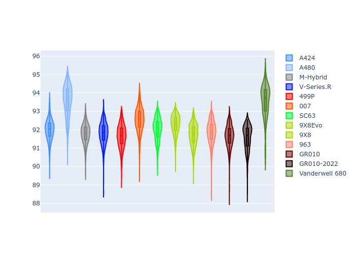
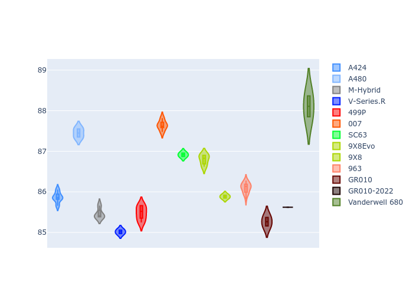
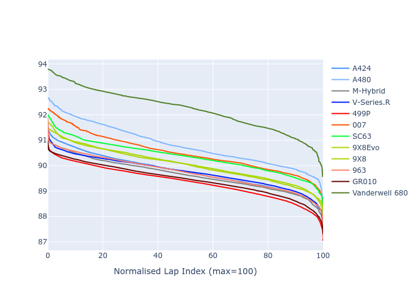

# Combined Plots

## Metadata

- BoP Accuracy: 90.87%
- Overall BoP Grade: A2
- Track: FUJI
- Threshhold: 250.0kph
- Average Laptime: 1:32.15
- Average Quali Laptime: 1:29.29
- Average Topspeed: 311.58kph

## BoP Table
| Manufacturer   | Car            | Weight   | Power   | PINC   | E/Stint   | FDS    | RDP    | QDP    | TDP    |
|:---------------|:---------------|:---------|:--------|:-------|:----------|:-------|:-------|:-------|:-------|
| Alpine         | A424           | 1042kg   | 518.0kw | -3.70% | 907MJ     | -      | 51.64% | 59.31% | 26.80% |
| Alpine         | A480           | 952kg    | 399.0kw | -      | 752MJ     | -      | 53.05% | 74.07% | 48.97% |
| BMW            | M-Hybrid       | 1037kg   | 515.0kw | -1.20% | 907MJ     | -      | 52.89% | 56.22% | 33.41% |
| Cadillac       | V-Series.R     | 1036kg   | 520.0kw | -0.80% | 909MJ     | -      | 48.63% | 60.80% | 19.01% |
| Ferrari        | 499P           | 1055kg   | 500.0kw | +1.30% | 901MJ     | 190kph | 51.38% | 44.98% | 9.83%  |
| Glickenhaus    | 007            | 1030kg   | 520.0kw | -      | 910MJ     | -      | 46.15% | 49.30% | 41.45% |
| Lamborghini    | SC63           | 1030kg   | 520.0kw | -0.10% | 910MJ     | -      | 48.33% | 60.95% | 28.65% |
| Peugeot        | 9X8Evo         | 1030kg   | 503.0kw | -1.90% | 903MJ     | 190kph | 48.87% | 52.78% | 15.41% |
| Peugeot        | 9X8            | 1038kg   | 520.0kw | -      | 907MJ     | 135kph | 54.54% | 58.39% | 9.69%  |
| Porsche        | 963            | 1049kg   | 512.0kw | +0.20% | 908MJ     | -      | 50.70% | 44.30% | 29.51% |
| Toyota         | GR010          | 1070kg   | 493.0kw | +5.40% | 908MJ     | 190kph | 51.09% | 52.71% | 11.46% |
| Toyota         | GR010-2022     | 1053kg   | 513.0kw | -      | 905MJ     | 190kph | 53.45% | 68.83% | 9.58%  |
| Vanwall        | Vanderwell 680 | 1030kg   | 520.0kw | -      | 903MJ     | -      | 49.68% | 60.93% | 34.43% |

## Performance Table
| Manufacturer   | Car            | RP      | QP      | Vavg      |   RDLC | BOP-Grade   | Match   |
|:---------------|:---------------|:--------|:--------|:----------|-------:|:------------|:--------|
| Alpine         | A424           | 1:31.99 | 1:28.90 | 309.58kph |   1.03 | ~A1         | 99.72%  |
| Alpine         | A480           | 1:33.56 | 1:31.61 | 299.68kph |   1.02 | +Ω1         | 43.45%  |
| BMW            | M-Hybrid       | 1:31.78 | 1:28.39 | 311.17kph |   1.04 | ~A1         | 100.00% |
| Cadillac       | V-Series.R     | 1:31.80 | 1:28.45 | 310.16kph |   1.04 | ~A1         | 99.89%  |
| Ferrari        | 499P           | 1:31.64 | 1:28.22 | 313.83kph |   1.04 | ~A1         | 99.91%  |
| Glickenhaus    | 007            | 1:32.53 | 1:30.40 | 314.29kph |   1.02 | ~A1         | 95.49%  |
| Lamborghini    | SC63           | 1:32.02 | 1:29.46 | 312.88kph |   1.03 | ~A1         | 100.00% |
| Peugeot        | 9X8Evo         | 1:32.28 | 1:29.06 | 310.99kph |   1.04 | ~A1         | 100.00% |
| Peugeot        | 9X8            | 1:31.73 | 1:29.10 | 311.66kph |   1.03 | ~A1         | 99.96%  |
| Porsche        | 963            | 1:31.86 | 1:28.78 | 313.21kph |   1.03 | ~A1         | 99.86%  |
| Toyota         | GR010          | 1:31.65 | 1:28.11 | 315.03kph |   1.04 | ~A1         | 99.74%  |
| Toyota         | GR010-2022     | 1:31.56 | 1:29.74 | 319.29kph |   1.02 | ~A1         | 99.24%  |
| Vanwall        | Vanderwell 680 | 1:33.57 | 1:30.60 | 308.75kph |   1.03 | +Ω1         | 44.08%  |

## Race Laptimes

## Quali Laptimes

## Topspeeds

## Laptimes Lineplot

