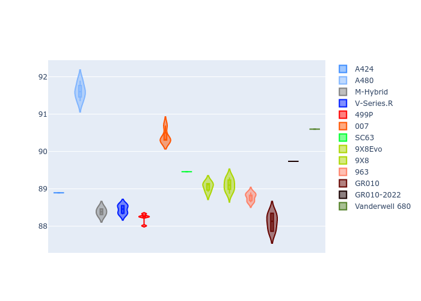
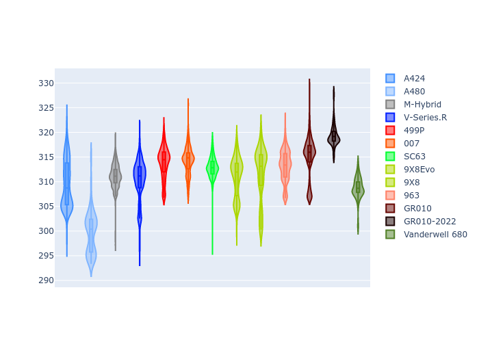

# Combined Plots

## Metadata

- BoP Accuracy: 93.04%
- Overall BoP Grade: A2
- Track: FUJI
- Threshhold: 250.0kph

## BoP Table
| Manufacturer   | Car            | Weight   | Power   | PINC   | E/Stint   | FDS    | RDP    | QDP    | TDP    |
|:---------------|:---------------|:---------|:--------|:-------|:----------|:-------|:-------|:-------|:-------|
| Alpine         | A424           | 1042kg   | 518.0kw | -3.70% | 907MJ     | -      | 52.35% | 61.85% | 27.84% |
| Alpine         | A480           | 952kg    | 399.0kw | -      | 752MJ     | -      | 54.51% | 76.19% | 54.04% |
| BMW            | M-Hybrid       | 1037kg   | 515.0kw | -1.20% | 907MJ     | -      | 53.26% | 57.23% | 34.54% |
| Cadillac       | V-Series.R     | 1036kg   | 520.0kw | -0.80% | 909MJ     | -      | 47.80% | 56.73% | 19.63% |
| Ferrari        | 499P           | 1055kg   | 500.0kw | +1.30% | 901MJ     | 190kph | 53.02% | 42.32% | 9.88%  |
| Glickenhaus    | 007            | 1030kg   | 520.0kw | -      | 910MJ     | -      | 46.49% | 46.07% | 47.78% |
| Lamborghini    | SC63           | 1030kg   | 520.0kw | -0.10% | 910MJ     | -      | 46.33% | 59.50% | 29.33% |
| Peugeot        | 9X8Evo         | 1030kg   | 503.0kw | -1.90% | 903MJ     | 190kph | 48.47% | 51.26% | 16.02% |
| Peugeot        | 9X8            | 1038kg   | 520.0kw | -      | 907MJ     | 135kph | 54.07% | 57.08% | 10.80% |
| Porsche        | 963            | 1049kg   | 512.0kw | +0.20% | 908MJ     | -      | 50.87% | 45.25% | 30.77% |
| Toyota         | GR010          | 1070kg   | 493.0kw | +5.40% | 908MJ     | 190kph | 52.43% | 57.12% | 12.82% |
| Toyota         | GR010-2022     | 1053kg   | 513.0kw | -      | 905MJ     | 190kph | 53.48% | 69.44% | 7.86%  |
| Vanwall        | Vanderwell 680 | 1030kg   | 520.0kw | -      | 903MJ     | -      | 53.41% | 56.28% | 29.85% |

## Performance Table
| Manufacturer   | Car            | RP      | QP      | Vavg      |   RDLC | BOP-Grade   | Match   |
|:---------------|:---------------|:--------|:--------|:----------|-------:|:------------|:--------|
| Alpine         | A424           | 1:30.32 | 1:28.81 | 307.72kph |   1.02 | ~A1         | 99.82%  |
| Alpine         | A480           | 1:31.39 | 1:30.68 | 292.88kph |   1.01 | +C1         | 78.77%  |
| BMW            | M-Hybrid       | 1:30.02 | 1:28.21 | 308.91kph |   1.02 | ~A1         | 99.60%  |
| Cadillac       | V-Series.R     | 1:29.92 | 1:28.15 | 306.81kph |   1.02 | ~A1         | 99.57%  |
| Ferrari        | 499P           | 1:30.22 | 1:27.99 | 309.63kph |   1.03 | ~A1         | 99.79%  |
| Glickenhaus    | 007            | 1:30.43 | 1:29.71 | 307.77kph |   1.01 | ~A1         | 97.68%  |
| Lamborghini    | SC63           | 1:30.43 | 1:29.44 | 310.60kph |   1.01 | ~A1         | 100.00% |
| Peugeot        | 9X8Evo         | 1:30.92 | 1:29.21 | 309.50kph |   1.02 | +A2         | 94.73%  |
| Peugeot        | 9X8            | 1:30.04 | 1:28.41 | 301.57kph |   1.02 | ~A1         | 99.38%  |
| Porsche        | 963            | 1:30.24 | 1:28.48 | 308.80kph |   1.02 | ~A1         | 99.81%  |
| Toyota         | GR010          | 1:30.23 | 1:27.91 | 311.05kph |   1.03 | ~A1         | 99.85%  |
| Toyota         | GR010-2022     | 1:29.62 | 1:28.84 | 310.31kph |   1.01 | ~A1         | 99.71%  |
| Vanwall        | Vanderwell 680 | 1:32.13 | 1:30.22 | 301.72kph |   1.02 | +Ω1         | 40.77%  |

## Race Laptimes

## Quali Laptimes

## Topspeeds

## Laptimes Lineplot

