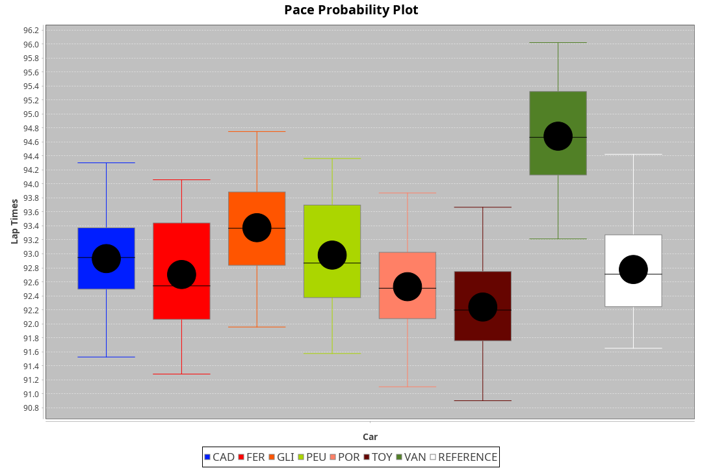
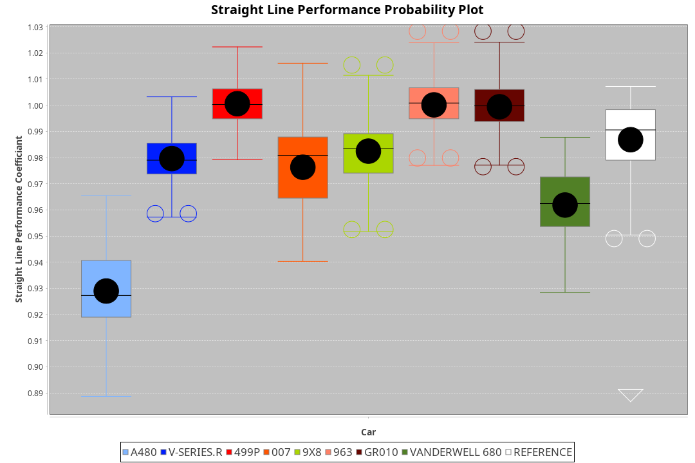
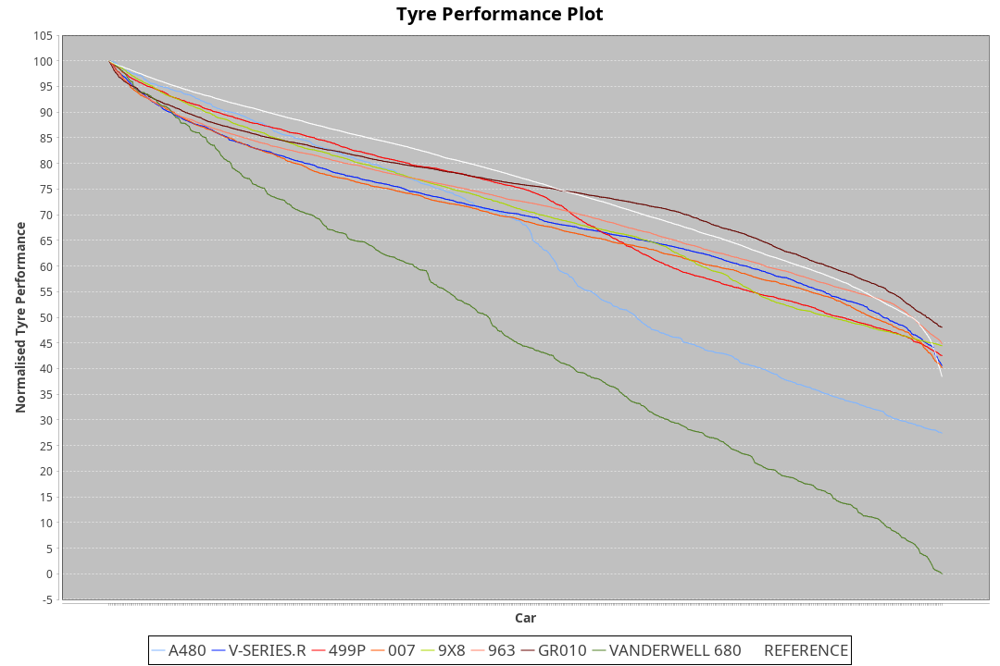

|Manufacturer|Car|Type|RP|QP|Weight|Power¹|Threshhold|PINC|Power²|E/Stint|AVG Vmax|FDS|RDLC|L/Stint|BOP-Grade|ModelAccuracy|ModelPoints|Match%|
|:-|:-|:-|:-|:-|:-|:-|:-|:-|:-|:-|:-|:-|:-|:-|:-|:-|:-|:-|
|Cadillac|V-Series.R|LMDH|1:32.91|1:28.59|1039kg|505kw|0.0kph|0%|505kw|879MJ|317.39kph-342.24kph|-|1.03|41|-A2|98.38%|1765|93.39%|
|Ferrari|499P|LMHHU|1:32.67|1:28.35|1076kg|505kw|0.0kph|0%|505kw|889MJ|320.19kph-343.01kph|190kph|1.02|41|-B2|92.24%|2247|82.29%|
|Glickenhaus|007|LMHNH|1:33.35|1:29.51|1030kg|520kw|0.0kph|0%|520kw|913MJ|329.21kph-341.39kph|-|0.96|40|+D1|96.18%|554|69.09%|
|Peugeot|9X8|LMHHE|1:32.97|1:28.82|1038kg|520kw|0.0kph|0%|520kw|911MJ|319.91kph-343.94kph|135kph|1.03|40|~A1|87.65%|1795|100.00%|
|Porsche|963|LMDH|1:32.49|1:28.22|1048kg|514kw|0.0kph|0%|514kw|897MJ|319.86kph-343.84kph|-|1.02|41|-D1|96.81%|5438|69.67%|
|Toyota|GR010 - Hybrid|LMHHU|1:32.28|1:27.84|1080kg|514kw|0.0kph|0%|514kw|907MJ|318.39kph-351.01kph|190kph|1.02|41|-D2|86.04%|1751|61.52%|
|Vanwall|Vanderwell 680|LMHNH|1:34.61|1:30.27|1030kg|520kw|0.0kph|0%|520kw|901MJ|314.21kph-337.41kph|-|1.02|40|+Ω1|91.42%|501|20.07%|

### BoP Accuracy: 70.86%; Overall BoP Grade: C2

## Power below Threshhold
|N/Nmax|TOY|PEU|GLI|CAD|FER|POR|VAN|
|:-|:-|:-|:-|:-|:-|:-|:-|
|0.550|253|256|256|249|249|253|256|
|0.575|276|279|279|272|272|276|279|
|0.600|297|300|300|292|292|297|300|
|0.625|318|322|322|312|312|318|322|
|0.650|339|343|343|333|333|339|343|
|0.675|361|365|365|355|355|361|365|
|0.700|383|387|387|376|376|383|387|
|0.725|404|409|409|397|397|404|409|
|0.750|425|430|430|417|417|425|430|
|0.775|444|449|449|436|436|444|449|
|0.800|462|467|467|454|454|462|467|
|0.825|477|482|482|469|469|477|482|
|0.850|488|494|494|480|480|488|494|
|0.875|499|505|505|490|490|499|505|
|0.900|506|512|512|497|497|506|512|
|0.925|511|517|517|502|502|511|517|
|**0.950**|**514**|**520**|**520**|**505**|**505**|**514**|**520**|
|0.975|512|518|518|503|503|512|518|
|1.000|508|514|514|500|500|508|514|
|1.025|439|444|444|431|431|439|444|

## Power above Threshhold
|N/Nmax|TOY|PEU|GLI|CAD|FER|POR|VAN|
|:-|:-|:-|:-|:-|:-|:-|:-|
|0.550|253|256|256|249|249|253|256|
|0.575|276|279|279|272|272|276|279|
|0.600|297|300|300|292|292|297|300|
|0.625|318|322|322|312|312|318|322|
|0.650|339|343|343|333|333|339|343|
|0.675|361|365|365|355|355|361|365|
|0.700|383|387|387|376|376|383|387|
|0.725|404|409|409|397|397|404|409|
|0.750|425|430|430|417|417|425|430|
|0.775|444|449|449|436|436|444|449|
|0.800|462|467|467|454|454|462|467|
|0.825|477|482|482|469|469|477|482|
|0.850|488|494|494|480|480|488|494|
|0.875|499|505|505|490|490|499|505|
|0.900|506|512|512|497|497|506|512|
|0.925|511|517|517|502|502|511|517|
|**0.950**|**514**|**520**|**520**|**505**|**505**|**514**|**520**|
|0.975|512|518|518|503|503|512|518|
|1.000|508|514|514|500|500|508|514|
|1.025|439|444|444|431|431|439|444|
