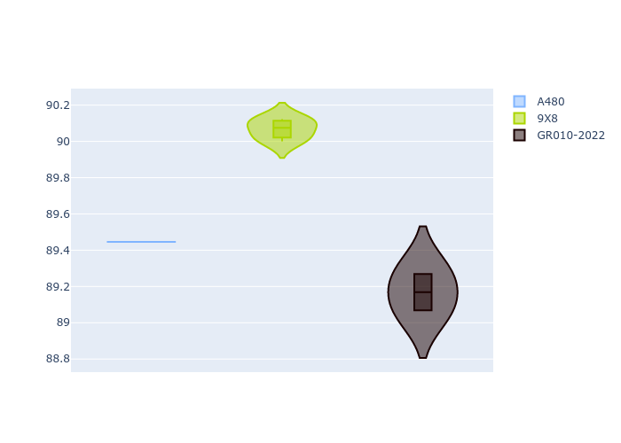

# Combined Plots

## Metadata

- BoP Accuracy: 91.53%
- Overall BoP Grade: A2
- Track: FUJI
- Threshhold: 0.0kph
- Average Laptime: 1:32.33
- Average Quali Laptime: 1:31.50
- Average Topspeed: 308.66kph

## BoP Table
| Manufacturer   | Car        | Weight   | Power   | PINC   | E/Stint   | FDS    | RDP    | QDP     | TDP    |
|:---------------|:-----------|:---------|:--------|:-------|:----------|:-------|:-------|:--------|:-------|
| Alpine         | A480       | 952kg    | 399.0kw | -      | 752MJ     | -      | 61.30% | 100.00% | 11.72% |
| Peugeot        | 9X8        | 1061kg   | 515.0kw | -      | 909MJ     | 150kph | 62.67% | 66.67%  | 1.30%  |
| Toyota         | GR010-2022 | 1053kg   | 513.0kw | -      | 905MJ     | 190kph | 58.84% | 40.00%  | 3.32%  |

## Performance Table
| Manufacturer   | Car        | RP      | QP      | Vavg      |   RDLC | BOP-Grade   | Match   |
|:---------------|:-----------|:--------|:--------|:----------|-------:|:------------|:--------|
| Alpine         | A480       | 1:32.41 | 1:31.39 | 302.89kph |   1.01 | +B1         | 87.94%  |
| Peugeot        | 9X8        | 1:32.47 | 1:32.01 | 305.58kph |   1    | +B1         | 87.00%  |
| Toyota         | GR010-2022 | 1:32.12 | 1:31.09 | 317.51kph |   1.01 | ~A1         | 99.63%  |

## Race Laptimes

## Quali Laptimes

## Topspeeds

## Laptimes Lineplot

