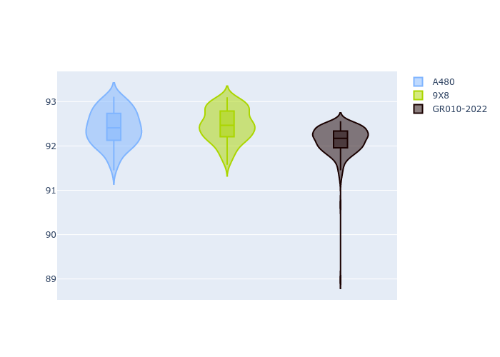
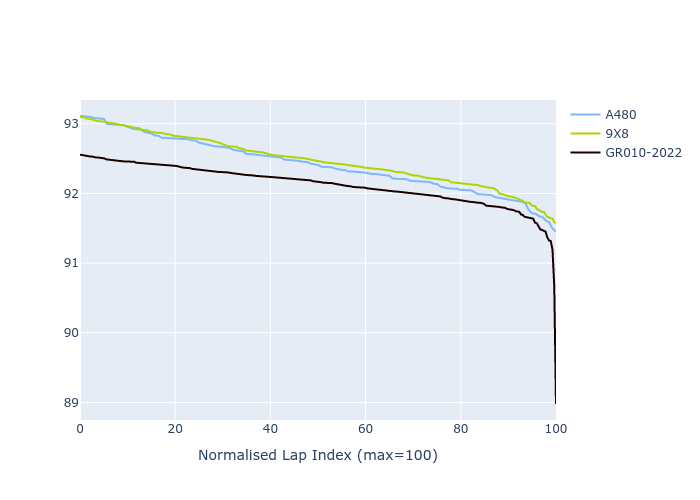

# Combined Plots

## Metadata

- BoP Accuracy: 91.71%
- Overall BoP Grade: A2
- Track: FUJI
- Threshhold: 0.0kph

## BoP Table
| Manufacturer   | Car        | Weight   | Power   | PINC   | E/Stint   | FDS    | RDP    | QDP     | TDP    |
|:---------------|:-----------|:---------|:--------|:-------|:----------|:-------|:-------|:--------|:-------|
| Alpine         | A480       | 952kg    | 399.0kw | -      | 752MJ     | -      | 60.43% | 100.00% | 11.72% |
| Peugeot        | 9X8        | 1061kg   | 515.0kw | -      | 909MJ     | 150kph | 62.67% | 66.67%  | 1.30%  |
| Toyota         | GR010-2022 | 1053kg   | 513.0kw | -      | 905MJ     | 190kph | 58.62% | 40.00%  | 3.32%  |

## Performance Table
| Manufacturer   | Car        | RP      | QP      | Vavg      |   RDLC | BOP-Grade   | Match   |
|:---------------|:-----------|:--------|:--------|:----------|-------:|:------------|:--------|
| Alpine         | A480       | 1:31.98 | 1:30.27 | 304.28kph |   1.02 | +B1         | 88.49%  |
| Peugeot        | 9X8        | 1:32.05 | 1:30.88 | 306.99kph |   1.01 | +B1         | 87.00%  |
| Toyota         | GR010-2022 | 1:31.70 | 1:29.97 | 318.97kph |   1.02 | ~A1         | 99.63%  |

## Race Laptimes

## Quali Laptimes

## Topspeeds

## Laptimes Lineplot

