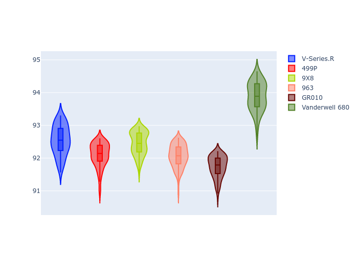
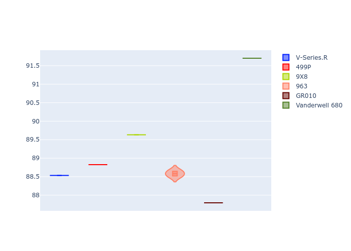
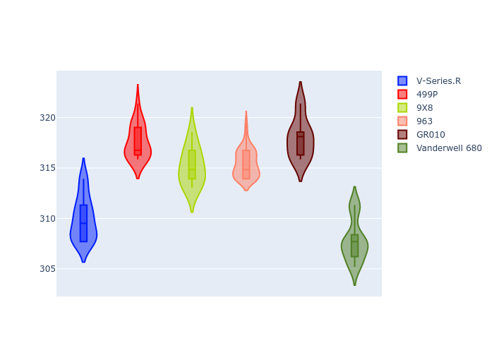
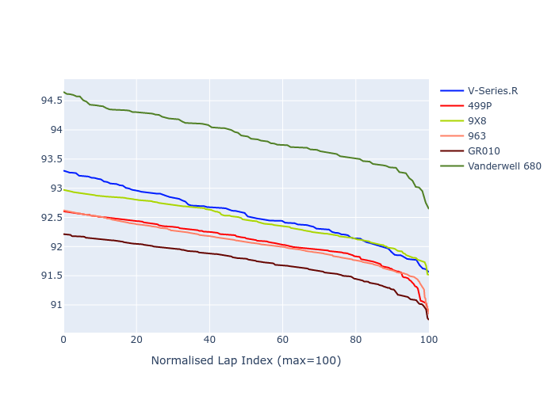

# Combined Plots

## Metadata

- BoP Accuracy: 77.93%
- Overall BoP Grade: C1
- Track: FUJI
- Threshhold: 0.0kph
- Average Laptime: 1:32.46
- Average Quali Laptime: 1:29.10
- Average Topspeed: 313.99kph

## BoP Table
| Manufacturer   | Car            | Weight   | Power   | PINC   | E/Stint   | FDS    | RDP    | QDP    | TDP    |
|:---------------|:---------------|:---------|:--------|:-------|:----------|:-------|:-------|:-------|:-------|
| Cadillac       | V-Series.R     | 1039kg   | 505.0kw | -      | 894MJ     | -      | 53.88% | 50.00% | 21.12% |
| Ferrari        | 499P           | 1076kg   | 505.0kw | -      | 898MJ     | 190kph | 58.11% | 20.00% | 4.15%  |
| Peugeot        | 9X8            | 1038kg   | 520.0kw | -      | 907MJ     | 135kph | 56.83% | 25.00% | 2.08%  |
| Porsche        | 963            | 1048kg   | 514.0kw | -      | 906MJ     | -      | 60.72% | 25.00% | 10.69% |
| Toyota         | GR010          | 1080kg   | 514.0kw | -      | 907MJ     | 190kph | 56.77% | 25.00% | 2.48%  |
| Vanwall        | Vanderwell 680 | 1030kg   | 520.0kw | -      | 903MJ     | -      | 53.08% | 50.00% | 10.27% |

## Performance Table
| Manufacturer   | Car            | RP      | QP      | Vavg      |   RDLC | BOP-Grade   | Match   |
|:---------------|:---------------|:--------|:--------|:----------|-------:|:------------|:--------|
| Cadillac       | V-Series.R     | 1:32.54 | 1:28.44 | 309.95kph |   1.05 | +B2         | 84.75%  |
| Ferrari        | 499P           | 1:32.09 | 1:28.72 | 317.57kph |   1.04 | ~A1         | 95.47%  |
| Peugeot        | 9X8            | 1:32.45 | 1:29.61 | 315.15kph |   1.03 | ~A1         | 100.00% |
| Porsche        | 963            | 1:32.06 | 1:28.54 | 315.47kph |   1.04 | ~A1         | 97.52%  |
| Toyota         | GR010          | 1:31.73 | 1:27.67 | 317.98kph |   1.05 | -B1         | 85.38%  |
| Vanwall        | Vanderwell 680 | 1:33.88 | 1:31.62 | 307.80kph |   1.02 | +Ω1         | 4.46%   |

## Race Laptimes

## Quali Laptimes

## Topspeeds

## Laptimes Lineplot

