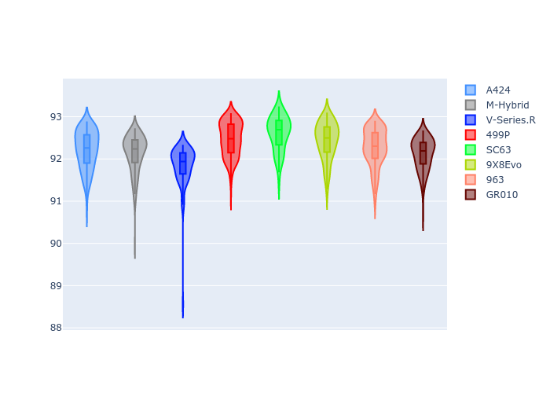
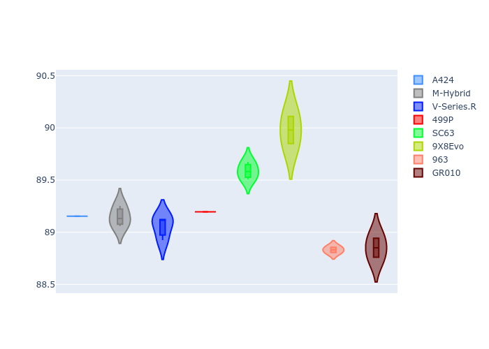
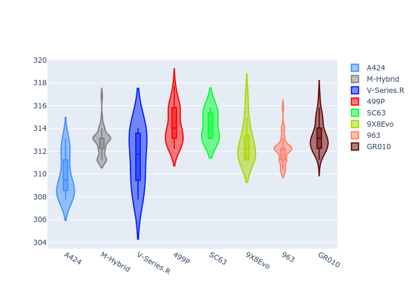
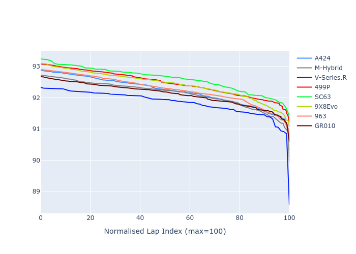

# Combined Plots

## Metadata

- BoP Accuracy: 91.25%
- Overall BoP Grade: A2
- Track: FUJI
- Threshhold: 250.0kph
- Average Laptime: 1:32.26
- Average Quali Laptime: 1:30.41
- Average Topspeed: 316.12kph

## BoP Table
| Manufacturer   | Car        | Weight   | Power   | PINC   | E/Stint   | FDS    | RDP    | QDP    | TDP   |
|:---------------|:-----------|:---------|:--------|:-------|:----------|:-------|:-------|:-------|:------|
| Alpine         | A424       | 1042kg   | 518.0kw | -3.70% | 907MJ     | -      | 49.77% | 25.00% | 9.44% |
| BMW            | M-Hybrid   | 1037kg   | 515.0kw | -1.20% | 907MJ     | -      | 49.88% | 60.00% | 6.84% |
| Cadillac       | V-Series.R | 1036kg   | 520.0kw | -0.80% | 909MJ     | -      | 46.63% | 75.00% | 3.70% |
| Ferrari        | 499P       | 1055kg   | 500.0kw | +1.30% | 901MJ     | 190kph | 52.53% | 11.11% | 7.86% |
| Lamborghini    | SC63       | 1030kg   | 520.0kw | -0.10% | 910MJ     | -      | 50.68% | 75.00% | 4.68% |
| Peugeot        | 9X8Evo     | 1030kg   | 503.0kw | -1.90% | 903MJ     | 190kph | 51.88% | 40.00% | 2.90% |
| Porsche        | 963        | 1049kg   | 512.0kw | +0.20% | 908MJ     | -      | 48.03% | 20.00% | 5.44% |
| Toyota         | GR010      | 1070kg   | 493.0kw | +5.40% | 908MJ     | 190kph | 49.73% | 33.33% | 7.04% |

## Performance Table
| Manufacturer   | Car        | RP      | QP      | Vavg      |   RDLC | BOP-Grade   | Match   |
|:---------------|:-----------|:--------|:--------|:----------|-------:|:------------|:--------|
| Alpine         | A424       | 1:32.22 | 1:30.45 | 313.30kph |   1.02 | ~A1         | 98.58%  |
| BMW            | M-Hybrid   | 1:32.13 | 1:30.31 | 316.38kph |   1.02 | ~A1         | 99.52%  |
| Cadillac       | V-Series.R | 1:31.83 | 1:30.19 | 314.93kph |   1.02 | ~A1         | 98.89%  |
| Ferrari        | 499P       | 1:32.47 | 1:30.35 | 317.79kph |   1.02 | +C1         | 79.74%  |
| Lamborghini    | SC63       | 1:32.60 | 1:30.77 | 317.80kph |   1.02 | +C2         | 72.97%  |
| Peugeot        | 9X8Evo     | 1:32.43 | 1:31.17 | 316.22kph |   1.01 | +B2         | 84.16%  |
| Porsche        | 963        | 1:32.27 | 1:29.98 | 315.65kph |   1.03 | ~A1         | 96.10%  |
| Toyota         | GR010      | 1:32.11 | 1:30.04 | 316.88kph |   1.02 | ~A1         | 100.00% |

## Race Laptimes

## Quali Laptimes

## Topspeeds

## Laptimes Lineplot

