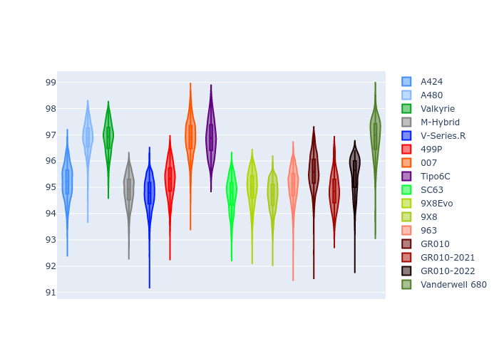
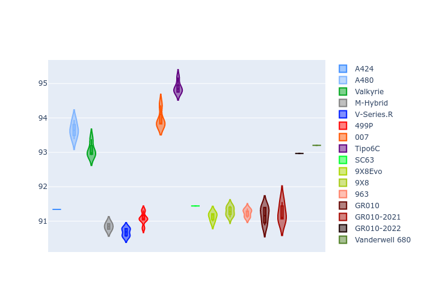
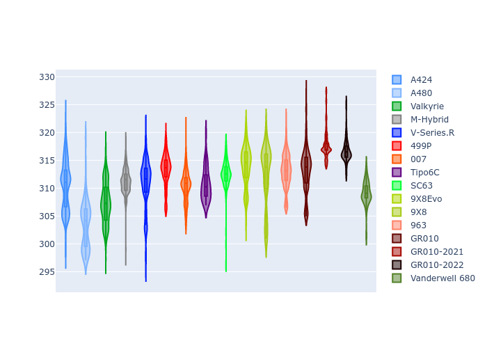
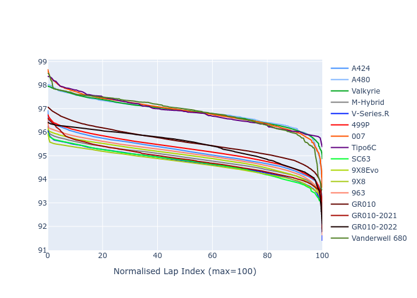

# Combined Plots

## Metadata

- BoP Accuracy: 91.37%
- Overall BoP Grade: A2
- Track: IMOLA
- Threshhold: 250.0kph
- Average Laptime: 1:35.27
- Average Quali Laptime: 1:31.81
- Laptime Std Dev: 0.67 seconds
- Filtered Average Topspeed: 311.64kph

## BoP Table
| Manufacturer     | Car            | Weight   | Power   | PINC   | E/Stint   | FDS    | RDP    | QDP    | TDP    |
|:-----------------|:---------------|:---------|:--------|:-------|:----------|:-------|:-------|:-------|:-------|
| Alpine           | A424           | 1066kg   | 511.0kw | +0.10% | 917MJ     | -      | 52.20% | 54.51% | 24.58% |
| Alpine           | A480           | 988kg    | 422.0kw | +0.10% | 761MJ     | -      | 53.05% | 74.07% | 48.97% |
| Aston Martin     | Valkyrie       | 1037kg   | 496.0kw | -      | 890MJ     | -      | 53.39% | 54.11% | 23.71% |
| BMW              | M-Hybrid       | 1060kg   | 513.0kw | +0.10% | 913MJ     | -      | 53.47% | 52.95% | 33.73% |
| Cadillac         | V-Series.R     | 1057kg   | 519.0kw | -      | 912MJ     | -      | 49.22% | 60.31% | 18.04% |
| Ferrari          | 499P           | 1072kg   | 503.0kw | -0.10% | 903MJ     | 190kph | 51.56% | 44.72% | 9.86%  |
| Glickenhaus      | 007            | 1033kg   | 496.0kw | -      | 889MJ     | -      | 46.14% | 49.30% | 41.45% |
| Isotta Fraschini | Tipo6C         | 1033kg   | 493.0kw | -      | 893MJ     | 190kph | 43.95% | 47.22% | 31.53% |
| Lamborghini      | SC63           | 1050kg   | 520.0kw | +0.10% | 914MJ     | -      | 48.25% | 60.95% | 28.65% |
| Peugeot          | 9X8Evo         | 1062kg   | 518.0kw | -0.10% | 919MJ     | 190kph | 50.17% | 49.36% | 17.73% |
| Peugeot          | 9X8            | 1056kg   | 524.0kw | -      | 910MJ     | 150kph | 54.54% | 58.39% | 9.69%  |
| Porsche          | 963            | 1066kg   | 511.0kw | +0.10% | 910MJ     | -      | 50.78% | 41.25% | 27.61% |
| Toyota           | GR010          | 1081kg   | 502.0kw | +0.10% | 902MJ     | 190kph | 51.68% | 51.25% | 14.48% |
| Toyota           | GR010-2021     | 1065kg   | 509.0kw | -0.10% | 902MJ     | 150kph | 54.04% | 54.81% | 9.72%  |
| Toyota           | GR010-2022     | 1070kg   | 503.0kw | -0.10% | 895MJ     | 190kph | 53.24% | 64.49% | 9.72%  |
| Vanwall          | Vanderwell 680 | 1036kg   | 517.0kw | -      | 906MJ     | -      | 49.68% | 60.93% | 34.43% |

## Performance Table
| Manufacturer     | Car            | RP      | QP      | Vavg      |   RDLC | BOP-Grade   | Match   |
|:-----------------|:---------------|:--------|:--------|:----------|-------:|:------------|:--------|
| Alpine           | A424           | 1:35.06 | 1:31.20 | 310.44kph |   1.04 | ~A1         | 100.00% |
| Alpine           | A480           | 1:36.21 | 1:34.19 | 303.52kph |   1.02 | +D1         | 67.07%  |
| Aston Martin     | Valkyrie       | 1:36.21 | 1:32.28 | 307.33kph |   1.04 | +B2         | 80.60%  |
| BMW              | M-Hybrid       | 1:34.81 | 1:30.74 | 311.25kph |   1.04 | ~A1         | 99.96%  |
| Cadillac         | V-Series.R     | 1:34.57 | 1:30.53 | 310.87kph |   1.04 | ~A1         | 99.80%  |
| Ferrari          | 499P           | 1:35.05 | 1:30.92 | 313.29kph |   1.05 | ~A1         | 99.99%  |
| Glickenhaus      | 007            | 1:36.21 | 1:33.30 | 310.35kph |   1.03 | +C1         | 75.74%  |
| Isotta Fraschini | Tipo6C         | 1:36.20 | 1:34.17 | 310.68kph |   1.02 | +C1         | 75.37%  |
| Lamborghini      | SC63           | 1:34.67 | 1:31.44 | 312.62kph |   1.04 | ~A1         | 99.90%  |
| Peugeot          | 9X8Evo         | 1:34.83 | 1:30.94 | 313.93kph |   1.04 | ~A1         | 99.98%  |
| Peugeot          | 9X8            | 1:34.56 | 1:31.11 | 312.32kph |   1.04 | ~A1         | 99.88%  |
| Porsche          | 963            | 1:34.96 | 1:30.96 | 313.08kph |   1.04 | ~A1         | 99.94%  |
| Toyota           | GR010          | 1:35.32 | 1:31.07 | 313.08kph |   1.05 | ~A1         | 99.76%  |
| Toyota           | GR010-2021     | 1:34.35 | 1:30.83 | 317.68kph |   1.04 | ~A1         | 100.00% |
| Toyota           | GR010-2022     | 1:35.16 | 1:32.75 | 316.70kph |   1.03 | ~A1         | 99.48%  |
| Vanwall          | Vanderwell 680 | 1:36.21 | 1:32.50 | 309.17kph |   1.04 | +D2         | 64.45%  |

## Race Laptimes

## Quali Laptimes

## Topspeeds

## Laptimes Lineplot

