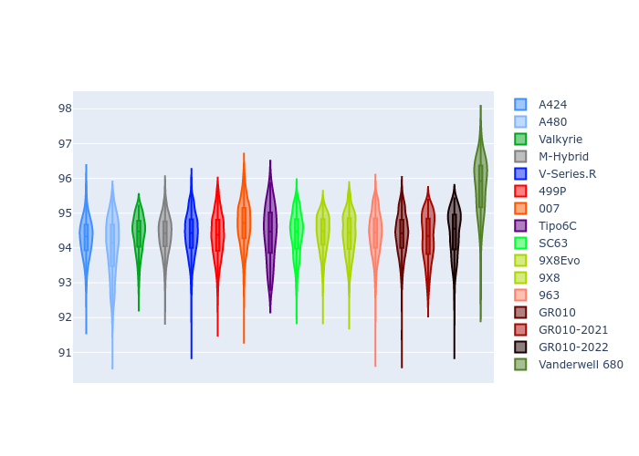

# Combined Plots

## Metadata

- BoP Accuracy: 96.24%
- Overall BoP Grade: A1
- Track: IMOLA
- Threshhold: 250.0kph
- Average Laptime: 1:34.46
- Average Quali Laptime: 1:30.94
- Average Topspeed: 313.44kph

## BoP Table
| Manufacturer     | Car            | Weight   | Power   | PINC   | E/Stint   | FDS    | RDP    | QDP    | TDP    |
|:-----------------|:---------------|:---------|:--------|:-------|:----------|:-------|:-------|:-------|:-------|
| Alpine           | A424           | 1067kg   | 520.0kw | -      | 925MJ     | -      | 51.64% | 59.31% | 26.80% |
| Alpine           | A480           | 952kg    | 432.0kw | +0.10% | 767MJ     | -      | 53.05% | 74.07% | 48.97% |
| Aston Martin     | Valkyrie       | 1035kg   | 520.0kw | -      | 912MJ     | -      | 53.50% | 53.33% | 21.51% |
| BMW              | M-Hybrid       | 1055kg   | 512.0kw | +0.10% | 912MJ     | -      | 52.89% | 56.22% | 33.41% |
| Cadillac         | V-Series.R     | 1042kg   | 511.0kw | +0.10% | 903MJ     | -      | 48.63% | 60.80% | 19.01% |
| Ferrari          | 499P           | 1083kg   | 508.0kw | -0.10% | 908MJ     | 190kph | 51.38% | 44.98% | 9.83%  |
| Glickenhaus      | 007            | 1030kg   | 520.0kw | -      | 910MJ     | -      | 46.15% | 49.30% | 41.45% |
| Isotta Fraschini | Tipo6C         | 1040kg   | 518.0kw | -      | 916MJ     | 190kph | 43.95% | 47.22% | 31.53% |
| Lamborghini      | SC63           | 1033kg   | 516.0kw | -      | 908MJ     | -      | 48.33% | 60.95% | 28.65% |
| Peugeot          | 9X8Evo         | 1056kg   | 510.0kw | +0.10% | 911MJ     | 190kph | 48.87% | 52.78% | 15.41% |
| Peugeot          | 9X8            | 1036kg   | 509.0kw | -      | 895MJ     | 150kph | 54.54% | 58.39% | 9.69%  |
| Porsche          | 963            | 1065kg   | 516.0kw | -0.10% | 914MJ     | -      | 50.70% | 44.30% | 29.51% |
| Toyota           | GR010          | 1094kg   | 512.0kw | -      | 912MJ     | 190kph | 51.09% | 52.71% | 11.46% |
| Toyota           | GR010-2021     | 1085kg   | 513.0kw | -0.10% | 907MJ     | 150kph | 54.08% | 54.81% | 9.72%  |
| Toyota           | GR010-2022     | 1078kg   | 512.0kw | -      | 904MJ     | 190kph | 53.45% | 68.83% | 9.58%  |
| Vanwall          | Vanderwell 680 | 1030kg   | 520.0kw | -      | 908MJ     | -      | 49.68% | 60.93% | 34.43% |

## Performance Table
| Manufacturer     | Car            | RP      | QP      | Vavg      |   RDLC | BOP-Grade   | Match   |
|:-----------------|:---------------|:--------|:--------|:----------|-------:|:------------|:--------|
| Alpine           | A424           | 1:34.29 | 1:30.46 | 312.47kph |   1.04 | ~A1         | 99.48%  |
| Alpine           | A480           | 1:34.01 | 1:31.43 | 310.25kph |   1.03 | ~A1         | 99.47%  |
| Aston Martin     | Valkyrie       | 1:34.39 | 1:30.14 | 315.38kph |   1.05 | ~A1         | 100.00% |
| BMW              | M-Hybrid       | 1:34.38 | 1:30.23 | 311.48kph |   1.05 | ~A1         | 100.00% |
| Cadillac         | V-Series.R     | 1:34.39 | 1:30.28 | 310.09kph |   1.05 | ~A1         | 99.75%  |
| Ferrari          | 499P           | 1:34.34 | 1:30.16 | 313.14kph |   1.05 | ~A1         | 99.98%  |
| Glickenhaus      | 007            | 1:34.68 | 1:31.84 | 316.04kph |   1.03 | ~A1         | 96.55%  |
| Isotta Fraschini | Tipo6C         | 1:34.39 | 1:32.44 | 315.52kph |   1.02 | ~A1         | 98.51%  |
| Lamborghini      | SC63           | 1:34.39 | 1:31.11 | 313.51kph |   1.04 | ~A1         | 100.00% |
| Peugeot          | 9X8Evo         | 1:34.42 | 1:30.48 | 313.30kph |   1.04 | ~A1         | 100.00% |
| Peugeot          | 9X8            | 1:34.39 | 1:31.02 | 311.20kph |   1.04 | ~A1         | 100.00% |
| Porsche          | 963            | 1:34.40 | 1:30.57 | 313.85kph |   1.04 | ~A1         | 99.85%  |
| Toyota           | GR010          | 1:34.39 | 1:30.08 | 313.73kph |   1.05 | ~A1         | 99.79%  |
| Toyota           | GR010-2021     | 1:34.29 | 1:30.81 | 316.44kph |   1.04 | ~A1         | 100.00% |
| Toyota           | GR010-2022     | 1:34.42 | 1:31.87 | 318.13kph |   1.03 | ~A1         | 99.49%  |
| Vanwall          | Vanderwell 680 | 1:35.74 | 1:32.04 | 310.47kph |   1.04 | +Ω1         | 46.92%  |

## Race Laptimes

## Quali Laptimes

## Topspeeds

## Laptimes Lineplot

