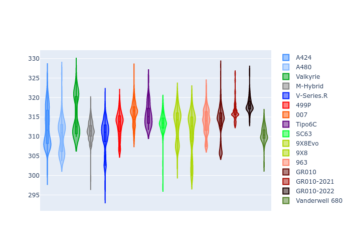
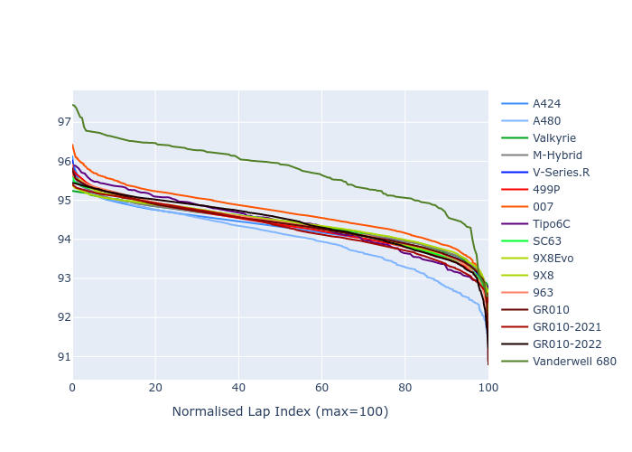

# Combined Plots

## Metadata

- BoP Accuracy: 95.40%
- Overall BoP Grade: A1
- Track: IMOLA
- Threshhold: 210.0kph

## BoP Table
| Manufacturer     | Car            | Weight   | Power   | PINC   | E/Stint   | FDS    |
|:-----------------|:---------------|:---------|:--------|:-------|:----------|:-------|
| Alpine           | A424           | 1067kg   | 520.0kw | -1.00% | 922MJ     | -      |
| Alpine           | A480           | 1052kg   | 432.0kw | +1.00% | 768MJ     | -      |
| Aston Martin     | Valkyrie       | 1059kg   | 504.0kw | +1.00% | 902MJ     | -      |
| BMW              | M-Hybrid       | 1061kg   | 512.0kw | -1.00% | 910MJ     | -      |
| Cadillac         | V-Series.R     | 1054kg   | 510.0kw | +1.00% | 906MJ     | -      |
| Ferrari          | 499P           | 1083kg   | 508.0kw | -1.00% | 906MJ     | 190kph |
| Glickenhaus      | 007            | 1050kg   | 520.0kw | -      | 912MJ     | -      |
| Isotta Fraschini | Tipo6C         | 1059kg   | 520.0kw | -      | 920MJ     | 190kph |
| Lamborghini      | SC63           | 1062kg   | 519.0kw | -1.00% | 912MJ     | -      |
| Peugeot          | 9X8Evo         | 1070kg   | 510.0kw | -1.00% | 910MJ     | 190kph |
| Peugeot          | 9X8            | 1050kg   | 520.0kw | -      | 906MJ     | 150kph |
| Porsche          | 963            | 1067kg   | 516.0kw | -1.00% | 912MJ     | -      |
| Toyota           | GR010          | 1100kg   | 512.0kw | -1.00% | 910MJ     | 190kph |
| Toyota           | GR010OLD       | 1085kg   | 513.0kw | +1.00% | 964MJ     | 150kph |
| Vanwall          | Vanderwell 680 | 1030kg   | 520.0kw | -      | 903MJ     | -      |

## Performance Table
| Manufacturer     | Car            | RP      | QP      | Vavg      |   RDLC | BOP-Grade   | Match   |
|:-----------------|:---------------|:--------|:--------|:----------|-------:|:------------|:--------|
| Alpine           | A424           | 1:34.03 | 1:29.83 | 309.92kph |   1.05 | ~A1         | 98.89%  |
| Alpine           | A480           | 1:34.24 | 1:30.96 | 302.12kph |   1.04 | ~A1         | 99.44%  |
| Aston Martin     | Valkyrie       | 1:35.40 | 1:30.46 | 307.87kph |   1.05 | ~A1         | 97.34%  |
| BMW              | M-Hybrid       | 1:34.49 | 1:29.96 | 307.70kph |   1.05 | ~A1         | 99.96%  |
| Cadillac         | V-Series.R     | 1:34.47 | 1:30.02 | 306.21kph |   1.05 | ~A1         | 99.87%  |
| Ferrari          | 499P           | 1:34.61 | 1:30.01 | 308.31kph |   1.05 | ~A1         | 99.94%  |
| Glickenhaus      | 007            | 1:34.83 | 1:31.26 | 307.34kph |   1.04 | ~A1         | 96.43%  |
| Isotta Fraschini | Tipo6C         | 1:35.40 | 1:32.68 | 309.28kph |   1.03 | +A2         | 94.03%  |
| Lamborghini      | SC63           | 1:35.16 | 1:31.34 | 307.94kph |   1.04 | ~A1         | 97.35%  |
| Peugeot          | 9X8Evo         | 1:35.09 | 1:30.53 | 309.37kph |   1.05 | ~A1         | 96.69%  |
| Peugeot          | 9X8            | 1:34.63 | 1:30.44 | 303.45kph |   1.05 | ~A1         | 99.96%  |
| Porsche          | 963            | 1:34.32 | 1:29.87 | 308.12kph |   1.05 | ~A1         | 99.79%  |
| Toyota           | GR010          | 1:34.77 | 1:30.06 | 307.98kph |   1.05 | ~A1         | 100.00% |
| Toyota           | GR010OLD       | 1:33.64 | 1:30.12 | 305.55kph |   1.04 | -A2         | 94.74%  |
| Vanwall          | Vanderwell 680 | 1:36.14 | 1:31.31 | 303.40kph |   1.05 | +E1         | 56.55%  |

## Race Laptimes

## Quali Laptimes

## Topspeeds

## Laptimes Lineplot

