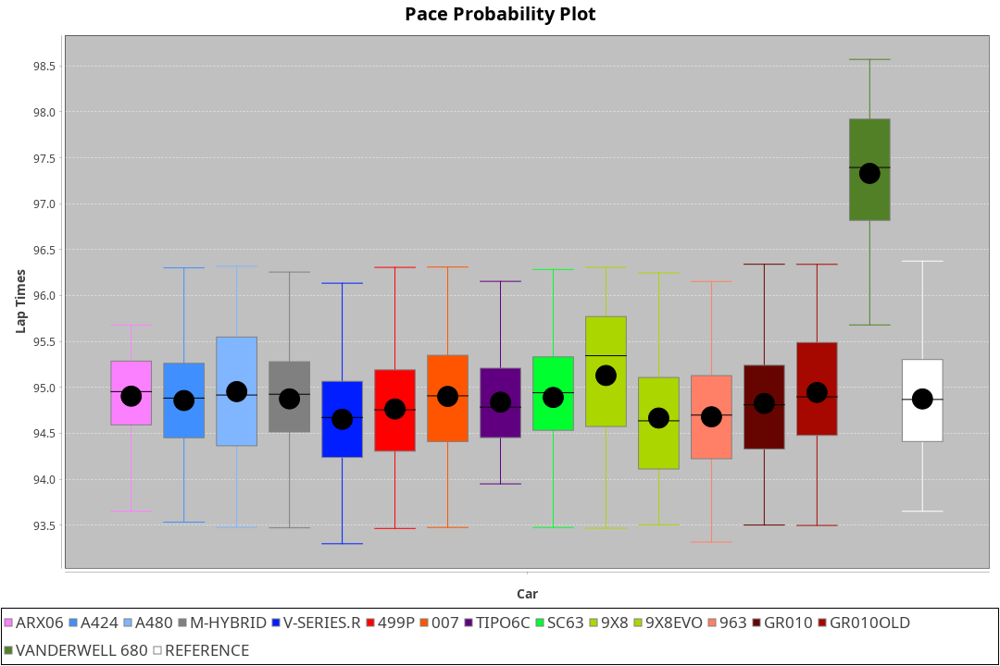
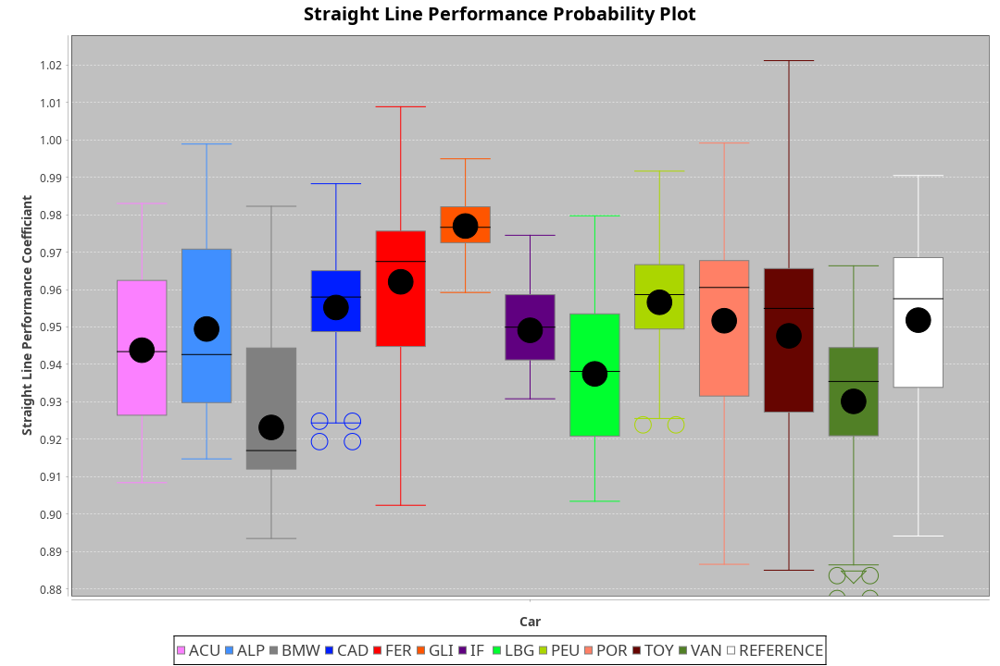

|Manufacturer|Car|Type|RP|QP|Weight|Power¹|Threshhold|PINC|Power²|E/Stint|AVG Vmax|FDS|RDLC|L/Stint|BOP-Grade|ModelAccuracy|ModelPoints|Match%|
|:-|:-|:-|:-|:-|:-|:-|:-|:-|:-|:-|:-|:-|:-|:-|:-|:-|:-|:-|
|Acura|ARX06|LMDH|1:36.25|1:32.47|1065kg|509kw|210.0kph|0%|509kw|904MJ|289.16kph-305.03kph|-|1.00|37|-D2|100.00%|995|62.28%|
|Alpine|A424|LMDH|1:36.65|1:32.48|1071kg|508kw|210.0kph|0%|508kw|903MJ|289.34kph-308.20kph|-|0.99|37|~A1|81.46%|523|100.00%|
|BMW|M Hybrid V8 LMDh|LMDH|1:36.68|1:32.49|1060kg|505kw|210.0kph|0%|505kw|891MJ|285.89kph-307.53kph|-|1.01|37|~A1|98.60%|1690|100.00%|
|Cadillac|V-Series.R|LMDH|1:36.65|1:32.72|1038kg|496kw|210.0kph|0%|496kw|871MJ|285.19kph-307.53kph|-|1.02|37|~A1|98.38%|1765|98.90%|
|Ferrari|499P|LMHHU|1:36.53|1:32.58|1085kg|500kw|210.0kph|0%|500kw|885MJ|287.62kph-308.12kph|190kph|1.01|37|~A1|92.24%|2247|96.56%|
|Glickenhaus|007|LMHNH|1:36.65|1:33.25|1034kg|516kw|210.0kph|0%|516kw|910MJ|296.21kph-307.17kph|-|0.95|37|+A2|96.18%|554|91.57%|
|Issotta Fraschini|Tipo6C|LMHHU|1:36.90|1:33.44|1075kg|520kw|210.0kph|0%|520kw|922MJ|291.72kph-301.47kph|190kph|1.04|37|+B1|66.67%|96|87.90%|
|Lamborghini|SC63|LMDH|1:36.65|1:32.38|1041kg|503kw|210.0kph|0%|503kw|884MJ|288.19kph-304.92kph|-|1.05|37|~A1|96.77%|419|97.15%|
|Peugeot|9X8|LMHHE|1:36.65|1:32.90|1038kg|513kw|210.0kph|0%|513kw|905MJ|287.71kph-309.32kph|150kph|1.02|37|~A1|87.65%|1795|100.00%|
|Porsche|963|LMDH|1:36.65|1:32.74|1052kg|502kw|210.0kph|0%|502kw|887MJ|286.66kph-308.16kph|-|1.01|37|~A1|96.81%|5438|100.00%|
|Toyota|GR010 - Hybrid|LMHHU|1:36.60|1:32.49|1099kg|507kw|210.0kph|0%|507kw|903MJ|285.08kph-314.29kph|190kph|1.00|37|~A1|86.04%|1751|100.00%|
|Vanwall|Vanderwell 680|LMHNH|1:37.48|1:33.60|1030kg|520kw|210.0kph|0%|520kw|901MJ|283.54kph-304.47kph|-|1.01|37|+D1|91.42%|501|68.79%|

### BoP Accuracy: 91.93%; Overall BoP Grade: A2

## Power below Threshhold
|N/Nmax|TOY|PEU|CAD|POR|FER|ALP|BMW|LBG|IF|GLI|VAN|ACU|
|:-|:-|:-|:-|:-|:-|:-|:-|:-|:-|:-|:-|:-|
|0.550|250|253|244|247|246|250|249|248|256|254|256|251|
|0.575|273|276|267|270|269|273|272|271|279|277|279|274|
|0.600|293|296|287|290|289|293|292|291|300|298|300|294|
|0.625|314|317|307|310|309|314|312|311|322|319|322|315|
|0.650|335|338|327|331|330|335|333|332|343|340|343|336|
|0.675|356|360|348|352|351|357|355|353|365|362|365|357|
|0.700|377|382|369|374|372|378|376|374|387|384|387|379|
|0.725|399|403|390|395|393|399|397|395|409|406|409|400|
|0.750|419|424|410|415|413|420|417|416|430|427|430|421|
|0.775|438|443|429|434|432|439|436|435|449|446|449|440|
|0.800|455|461|445|451|449|456|454|452|467|463|467|457|
|0.825|470|476|460|466|464|471|469|467|482|478|482|472|
|0.850|482|487|471|477|475|483|480|478|494|490|494|484|
|0.875|492|498|481|487|485|493|490|488|505|501|505|494|
|0.900|499|505|488|494|492|500|497|495|512|508|512|501|
|0.925|504|510|493|499|497|505|502|500|517|513|517|506|
|**0.950**|**507**|**513**|**496**|**502**|**500**|**508**|**505**|**503**|**520**|**516**|**520**|**509**|
|0.975|505|511|494|500|498|506|503|501|518|514|518|507|
|1.000|502|507|491|497|495|503|500|498|514|510|514|504|
|1.025|433|438|424|429|427|434|431|430|444|441|444|435|

## Power above Threshhold
|N/Nmax|TOY|PEU|CAD|POR|FER|ALP|BMW|LBG|IF|GLI|VAN|ACU|
|:-|:-|:-|:-|:-|:-|:-|:-|:-|:-|:-|:-|:-|
|0.550|250|253|244|247|246|250|249|248|256|254|256|251|
|0.575|273|276|267|270|269|273|272|271|279|277|279|274|
|0.600|293|296|287|290|289|293|292|291|300|298|300|294|
|0.625|314|317|307|310|309|314|312|311|322|319|322|315|
|0.650|335|338|327|331|330|335|333|332|343|340|343|336|
|0.675|356|360|348|352|351|357|355|353|365|362|365|357|
|0.700|377|382|369|374|372|378|376|374|387|384|387|379|
|0.725|399|403|390|395|393|399|397|395|409|406|409|400|
|0.750|419|424|410|415|413|420|417|416|430|427|430|421|
|0.775|438|443|429|434|432|439|436|435|449|446|449|440|
|0.800|455|461|445|451|449|456|454|452|467|463|467|457|
|0.825|470|476|460|466|464|471|469|467|482|478|482|472|
|0.850|482|487|471|477|475|483|480|478|494|490|494|484|
|0.875|492|498|481|487|485|493|490|488|505|501|505|494|
|0.900|499|505|488|494|492|500|497|495|512|508|512|501|
|0.925|504|510|493|499|497|505|502|500|517|513|517|506|
|**0.950**|**507**|**513**|**496**|**502**|**500**|**508**|**505**|**503**|**520**|**516**|**520**|**509**|
|0.975|505|511|494|500|498|506|503|501|518|514|518|507|
|1.000|502|507|491|497|495|503|500|498|514|510|514|504|
|1.025|433|438|424|429|427|434|431|430|444|441|444|435|
