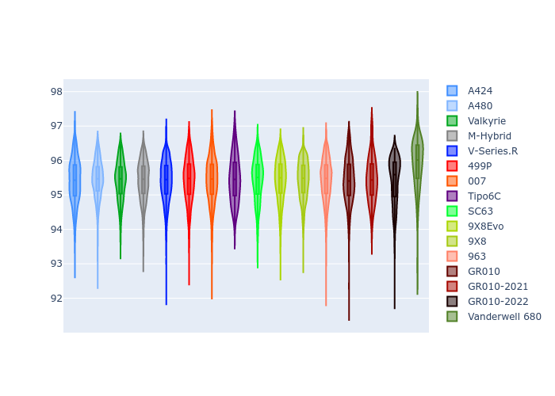
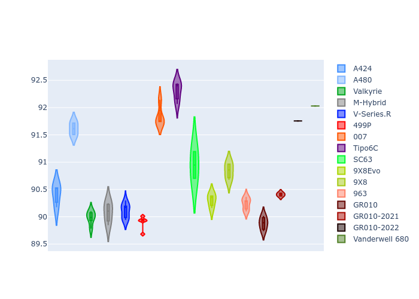
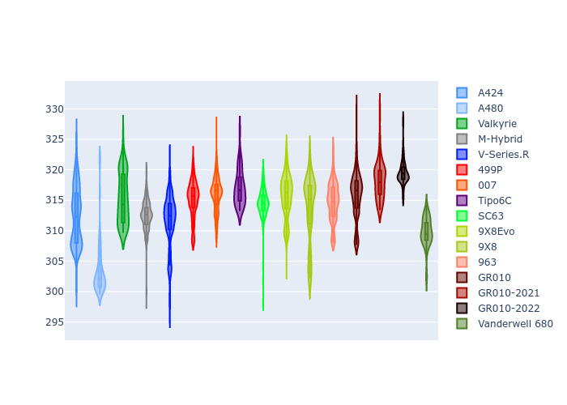
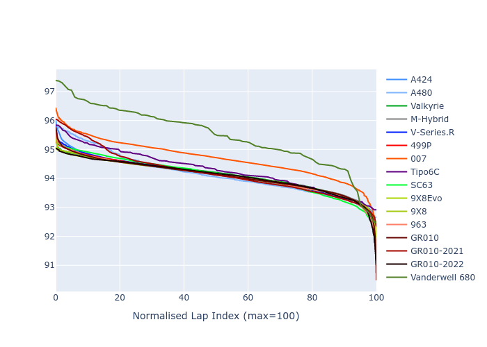

# Combined Plots

## Metadata

- BoP Accuracy: 99.31%
- Overall BoP Grade: A1
- Track: IMOLA
- Threshhold: 0.0kph
- Average Laptime: 1:35.36
- Average Quali Laptime: 1:31.88
- Laptime Std Dev: 0.12 seconds
- Filtered Average Topspeed: 311.25kph

## BoP Table
| Manufacturer     | Car            | Weight   | Power   | PINC   | E/Stint   | FDS    | RDP    | QDP    | TDP    |
|:-----------------|:---------------|:---------|:--------|:-------|:----------|:-------|:-------|:-------|:-------|
| Alpine           | A424           | 1033kg   | 490.0kw | -      | 894MJ     | -      | 52.20% | 54.51% | 24.58% |
| Alpine           | A480           | 938kg    | 410.0kw | -      | 745MJ     | -      | 53.05% | 74.07% | 48.97% |
| Aston Martin     | Valkyrie       | 1057kg   | 520.0kw | -      | 914MJ     | -      | 53.39% | 54.11% | 23.71% |
| BMW              | M-Hybrid       | 1035kg   | 492.0kw | -      | 892MJ     | -      | 53.47% | 52.95% | 33.73% |
| Cadillac         | V-Series.R     | 1038kg   | 497.0kw | -      | 890MJ     | -      | 49.22% | 60.31% | 18.04% |
| Ferrari          | 499P           | 1067kg   | 496.0kw | -      | 896MJ     | 190kph | 51.56% | 44.72% | 9.86%  |
| Glickenhaus      | 007            | 1048kg   | 520.0kw | -      | 912MJ     | -      | 46.14% | 49.30% | 41.45% |
| Isotta Fraschini | Tipo6C         | 1062kg   | 520.0kw | -      | 920MJ     | 190kph | 43.95% | 47.22% | 31.53% |
| Lamborghini      | SC63           | 1067kg   | 520.0kw | -      | 915MJ     | -      | 48.25% | 60.95% | 28.65% |
| Peugeot          | 9X8Evo         | 1032kg   | 494.0kw | -      | 894MJ     | 200kph | 50.17% | 49.36% | 17.73% |
| Peugeot          | 9X8            | 1038kg   | 502.0kw | -      | 889MJ     | 150kph | 54.54% | 58.39% | 9.69%  |
| Porsche          | 963            | 1030kg   | 487.0kw | -      | 884MJ     | -      | 50.78% | 41.25% | 27.61% |
| Toyota           | GR010          | 1064kg   | 494.0kw | -      | 892MJ     | 200kph | 51.68% | 51.25% | 14.48% |
| Toyota           | GR010-2021     | 1063kg   | 492.0kw | -      | 887MJ     | 150kph | 54.04% | 54.81% | 9.72%  |
| Toyota           | GR010-2022     | 1059kg   | 495.0kw | -      | 887MJ     | 200kph | 53.24% | 64.49% | 9.72%  |
| Vanwall          | Vanderwell 680 | 1030kg   | 520.0kw | -      | 908MJ     | -      | 49.68% | 60.93% | 34.43% |

## Performance Table
| Manufacturer     | Car            | RP      | QP      | Vavg      |   RDLC | BOP-Grade   | Match   |
|:-----------------|:---------------|:--------|:--------|:----------|-------:|:------------|:--------|
| Alpine           | A424           | 1:35.33 | 1:31.45 | 309.17kph |   1.04 | ~A1         | 99.94%  |
| Alpine           | A480           | 1:35.32 | 1:33.33 | 305.98kph |   1.02 | ~A1         | 98.80%  |
| Aston Martin     | Valkyrie       | 1:35.34 | 1:31.47 | 310.48kph |   1.04 | ~A1         | 100.00% |
| BMW              | M-Hybrid       | 1:35.34 | 1:31.23 | 309.15kph |   1.05 | ~A1         | 100.00% |
| Cadillac         | V-Series.R     | 1:35.32 | 1:31.22 | 308.04kph |   1.04 | ~A1         | 99.86%  |
| Ferrari          | 499P           | 1:35.33 | 1:31.18 | 312.32kph |   1.05 | ~A1         | 99.72%  |
| Glickenhaus      | 007            | 1:35.32 | 1:32.46 | 314.06kph |   1.03 | ~A1         | 99.02%  |
| Isotta Fraschini | Tipo6C         | 1:35.35 | 1:33.35 | 313.58kph |   1.02 | ~A1         | 100.00% |
| Lamborghini      | SC63           | 1:35.33 | 1:32.06 | 310.72kph |   1.04 | ~A1         | 100.00% |
| Peugeot          | 9X8Evo         | 1:35.32 | 1:31.39 | 311.89kph |   1.04 | ~A1         | 100.00% |
| Peugeot          | 9X8            | 1:35.33 | 1:31.83 | 309.43kph |   1.04 | ~A1         | 100.00% |
| Porsche          | 963            | 1:35.32 | 1:31.30 | 311.44kph |   1.04 | ~A1         | 99.91%  |
| Toyota           | GR010          | 1:35.32 | 1:31.07 | 312.97kph |   1.05 | ~A1         | 99.85%  |
| Toyota           | GR010-2021     | 1:35.34 | 1:31.75 | 314.10kph |   1.04 | ~A1         | 100.00% |
| Toyota           | GR010-2022     | 1:35.31 | 1:32.89 | 316.13kph |   1.03 | ~A1         | 99.48%  |
| Vanwall          | Vanderwell 680 | 1:35.81 | 1:32.13 | 310.47kph |   1.04 | -A2         | 92.42%  |

## Race Laptimes

## Quali Laptimes

## Topspeeds

## Laptimes Lineplot

