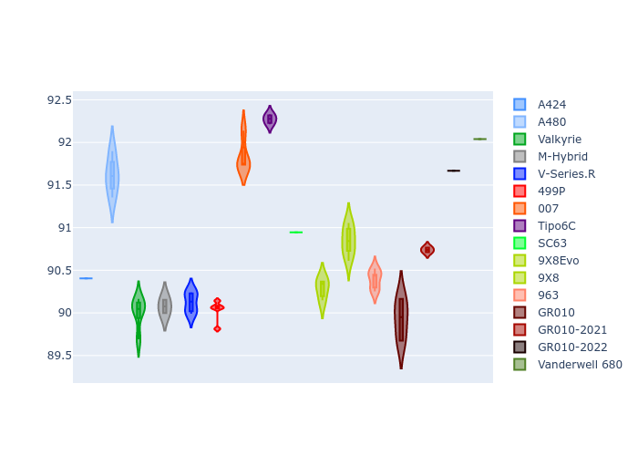

# Combined Plots

## Metadata

- BoP Accuracy: 97.38%
- Overall BoP Grade: A1
- Track: IMOLA
- Threshhold: 0.0kph

## BoP Table
| Manufacturer     | Car            | Weight   | Power   | PINC   | E/Stint   | FDS    | RDP    | QDP    | TDP    |
|:-----------------|:---------------|:---------|:--------|:-------|:----------|:-------|:-------|:-------|:-------|
| Alpine           | A424           | 1058kg   | 480.0kw | -      | 887MJ     | -      | 52.35% | 61.85% | 27.84% |
| Alpine           | A480           | 952kg    | 410.0kw | -      | 762MJ     | -      | 54.51% | 76.19% | 54.04% |
| Aston Martin     | Valkyrie       | 1030kg   | 481.0kw | -      | 876MJ     | -      | 53.59% | 53.33% | 21.51% |
| BMW              | M-Hybrid       | 1054kg   | 480.0kw | -      | 882MJ     | -      | 53.26% | 57.23% | 34.54% |
| Cadillac         | V-Series.R     | 1045kg   | 481.0kw | -      | 876MJ     | -      | 47.80% | 56.73% | 19.63% |
| Ferrari          | 499P           | 1087kg   | 480.0kw | -      | 884MJ     | 190kph | 53.02% | 42.32% | 9.88%  |
| Glickenhaus      | 007            | 1031kg   | 487.0kw | -      | 880MJ     | -      | 46.49% | 46.07% | 47.78% |
| Isotta Fraschini | Tipo6C         | 1082kg   | 520.0kw | -      | 923MJ     | 190kph | 43.95% | 47.22% | 31.53% |
| Lamborghini      | SC63           | 1060kg   | 502.0kw | -      | 898MJ     | -      | 46.33% | 59.50% | 29.33% |
| Peugeot          | 9X8Evo         | 1045kg   | 480.0kw | -      | 882MJ     | 190kph | 48.47% | 51.26% | 16.02% |
| Peugeot          | 9X8            | 1045kg   | 487.0kw | -      | 878MJ     | 150kph | 54.07% | 57.08% | 10.80% |
| Porsche          | 963            | 1056kg   | 480.0kw | -      | 881MJ     | -      | 50.87% | 45.25% | 30.77% |
| Toyota           | GR010          | 1092kg   | 480.0kw | -      | 883MJ     | 190kph | 52.43% | 57.12% | 12.82% |
| Toyota           | GR010-2021     | 1078kg   | 482.0kw | -      | 879MJ     | 150kph | 54.09% | 52.67% | 26.37% |
| Toyota           | GR010-2022     | 1088kg   | 480.0kw | -      | 876MJ     | 190kph | 53.48% | 69.44% | 7.86%  |
| Vanwall          | Vanderwell 680 | 1032kg   | 520.0kw | -      | 903MJ     | -      | 53.41% | 56.28% | 29.85% |

## Performance Table
| Manufacturer     | Car            | RP      | QP      | Vavg      |   RDLC | BOP-Grade   | Match   |
|:-----------------|:---------------|:--------|:--------|:----------|-------:|:------------|:--------|
| Alpine           | A424           | 1:36.16 | 1:31.68 | 302.58kph |   1.05 | ~A1         | 99.22%  |
| Alpine           | A480           | 1:34.45 | 1:30.94 | 297.43kph |   1.04 | -C2         | 73.61%  |
| Aston Martin     | Valkyrie       | 1:36.16 | 1:31.13 | 304.96kph |   1.06 | ~A1         | 100.00% |
| BMW              | M-Hybrid       | 1:36.16 | 1:31.35 | 302.07kph |   1.05 | ~A1         | 99.46%  |
| Cadillac         | V-Series.R     | 1:36.16 | 1:31.37 | 299.68kph |   1.05 | ~A1         | 99.79%  |
| Ferrari          | 499P           | 1:36.17 | 1:30.92 | 302.37kph |   1.06 | ~A1         | 99.84%  |
| Glickenhaus      | 007            | 1:36.17 | 1:32.52 | 302.12kph |   1.04 | ~A1         | 95.91%  |
| Isotta Fraschini | Tipo6C         | 1:36.16 | 1:33.50 | 306.88kph |   1.03 | ~A1         | 95.52%  |
| Lamborghini      | SC63           | 1:36.16 | 1:32.22 | 305.27kph |   1.04 | ~A1         | 100.00% |
| Peugeot          | 9X8Evo         | 1:36.18 | 1:31.51 | 306.06kph |   1.05 | ~A1         | 98.95%  |
| Peugeot          | 9X8            | 1:36.15 | 1:31.53 | 295.42kph |   1.05 | ~A1         | 99.94%  |
| Porsche          | 963            | 1:36.17 | 1:31.41 | 302.45kph |   1.05 | ~A1         | 99.84%  |
| Toyota           | GR010          | 1:36.15 | 1:30.81 | 302.89kph |   1.06 | ~A1         | 99.71%  |
| Toyota           | GR010-2021     | 1:36.15 | 1:31.71 | 295.20kph |   1.05 | ~A1         | 98.97%  |
| Toyota           | GR010-2022     | 1:36.16 | 1:32.42 | 301.03kph |   1.04 | ~A1         | 100.00% |
| Vanwall          | Vanderwell 680 | 1:36.16 | 1:31.36 | 303.19kph |   1.05 | ~A1         | 97.32%  |

## Race Laptimes

## Quali Laptimes

## Topspeeds

## Laptimes Lineplot

