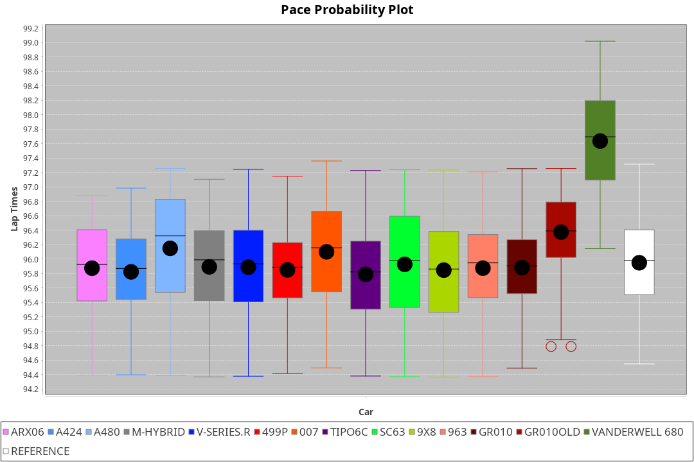
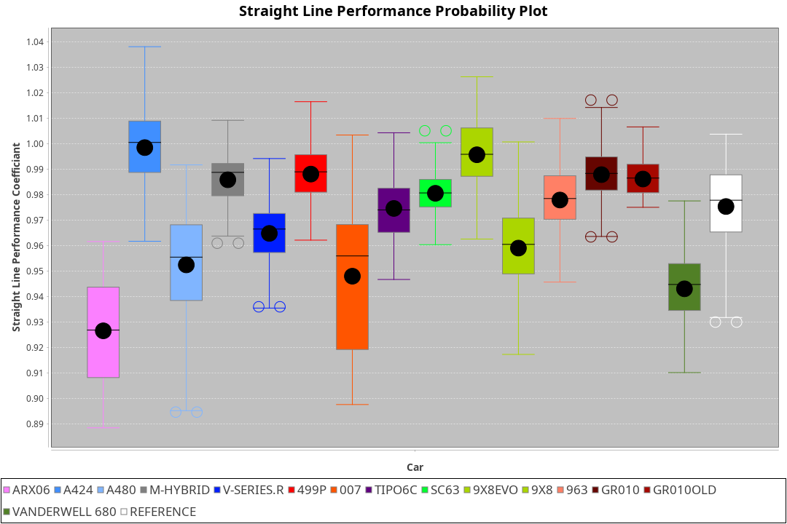
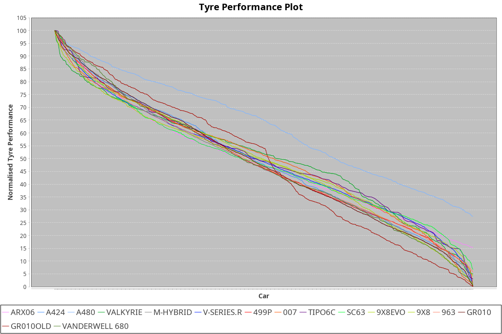

| Manufacturer     | Car            | Weight | Power   | PINC    | E/Stint | FDS     |
|:-|:-|:-|:-|:-|:-|:-|
| Acura            | ARX06          | 1051kg | 519.0kw |    -    | 916MJ   |    -    |
| Alpine           | A424           | 1036kg | 520.0kw |    -    | 914MJ   |    -    |
| Alpine           | A480           | 930kg  | 436.0kw |    -    | 768MJ   |    -    |
| BMW              | M-Hybrid       | 1038kg | 520.0kw |    -    | 911MJ   |    -    |
| Cadillac         | V-Series.R     | 1044kg | 520.0kw |    -    | 908MJ   |    -    |
| Ferrari          | 499P           | 1063kg | 519.0kw |    -    | 909MJ   | 190kph  |
| Glickenhaus      | 007            | 1030kg | 520.0kw |    -    | 910MJ   |    -    |
| Isotta Fraschini | Tipo6C         | 1030kg | 520.0kw |    -    | 914MJ   | 150kph  |
| Lamborghini      | SC63           | 1030kg | 520.0kw |    -    | 910MJ   |    -    |
| Peugeot          | 9X8            | 1037kg | 503.0kw |    -    | 890MJ   |    -    |
| Peugeot          | 9X8Evo         | 1030kg | 512.0kw |    -    | 904MJ   | 190kph  |
| Porsche          | 963            | 1037kg | 517.0kw |    -    | 902MJ   |    -    |
| Toyota           | GR010          | 1066kg | 519.0kw |    -    | 909MJ   | 190kph  |
| Toyota           | GR010OLD       | 1071kg | 491.0kw |    -    | 887MJ   |    -    |
| Vanwall          | Vanderwell 680 | 1030kg | 520.0kw |    -    | 903MJ   |    -    |

### BoP Accuracy: 82.50%; Overall BoP Grade: B2
| Manufacturer     | Car            | Type  | RP      | QP      | Weight | Power¹  | Threshhold | PINC    | Power²   | E/Stint | AVG Vmax  | FDS     | RDLC | L/Stint | BOP-Grade | Model Accuracy | Model Points | Match%  | SimDiff |
|:-|:-|:-|:-|:-|:-|:-|:-|:-|:-|:-|:-|:-|:-|:-|:-|:-|:-|:-|:-|
| Acura            | ARX06          | LMDH  | 1:33.93 | 1:29.41 | 1051kg | 519.0kw | 0.0kph     |    -    | 519.00kw |  916MJ  | 303.51kph |    -    | 1.02 | 37      | +D1       | 100.00%        | 995          | 68.73%  | #       |
| Alpine           | A424           | LMDH  | 1:33.92 | 1:29.98 | 1036kg | 520.0kw | 0.0kph     |    -    | 520.00kw |  914MJ  | 316.15kph |    -    | 1.02 | 36      | -A2       | 86.43%         | 618          | 93.01%  | ±0.04s  |
| Alpine           | A480           | LMP1  | 1:33.92 | 1:30.54 |  930kg | 436.0kw | 0.0kph     |    -    | 436.00kw |  768MJ  | 304.06kph |    -    | 1.00 | 34      | ~A1       | 68.63%         | 967          | 100.00% | #       |
| BMW              | M-Hybrid       | LMDH  | 1:33.92 | 1:29.58 | 1038kg | 520.0kw | 0.0kph     |    -    | 520.00kw |  911MJ  | 313.03kph |    -    | 1.02 | 37      | -B1       | 93.77%         | 1672         | 88.25%  | ±0.11s  |
| Cadillac         | V-Series.R     | LMDH  | 1:33.92 | 1:29.96 | 1044kg | 520.0kw | 0.0kph     |    -    | 520.00kw |  908MJ  | 309.30kph |    -    | 1.02 | 37      | ~A1       | 83.12%         | 1921         | 95.04%  | ±0.48s  |
| Ferrari          | 499P           | LMHHU | 1:33.91 | 1:29.82 | 1063kg | 519.0kw | 0.0kph     |    -    | 519.00kw |  909MJ  | 313.18kph | 190kph  | 1.02 | 37      | ~A1       | 69.49%         | 1950         | 100.00% | ±0.41s  |
| Glickenhaus      | 007            | LMHNH | 1:34.32 | 1:31.05 | 1030kg | 520.0kw | 0.0kph     |    -    | 520.00kw |  910MJ  | 310.11kph |    -    | 0.96 | 36      | ~A1       | 89.50%         | 1518         | 100.00% | #       |
| Isotta Fraschini | Tipo6C         | LMHHU | 1:33.94 | 1:31.33 | 1030kg | 520.0kw | 0.0kph     |    -    | 520.00kw |  914MJ  | 311.81kph | 150kph  | 1.08 | 37      | +C2       | 73.56%         | 64           | 73.15%  | ±0.30s  |
| Lamborghini      | SC63           | LMDH  | 1:34.16 | 1:31.66 | 1030kg | 520.0kw | 0.0kph     |    -    | 520.00kw |  910MJ  | 312.88kph |    -    | 1.05 | 36      | +A2       | 95.82%         | 459          | 93.85%  | ±0.08s  |
| Peugeot          | 9X8            | LMHHE | 1:33.93 | 1:30.06 | 1037kg | 503.0kw | 0.0kph     |    -    | 503.00kw |  890MJ  | 304.64kph |    -    | 1.02 | 37      | -A2       | 88.75%         | 2383         | 92.68%  | #       |
| Peugeot          | 9X8Evo         | LMHHU | 1:33.91 | 1:29.87 | 1030kg | 512.0kw | 0.0kph     |    -    | 512.00kw |  904MJ  | 313.53kph | 190kph  | 1.02 | 37      | ~A1       | 66.97%         | 221          | 100.00% | ±0.46s  |
| Porsche          | 963            | LMDH  | 1:33.91 | 1:29.78 | 1037kg | 517.0kw | 0.0kph     |    -    | 517.00kw |  902MJ  | 312.45kph |    -    | 1.02 | 37      | ~A1       | 81.02%         | 5243         | 96.16%  | ±0.28s  |
| Toyota           | GR010          | LMHHU | 1:33.92 | 1:29.97 | 1066kg | 519.0kw | 0.0kph     |    -    | 519.00kw |  909MJ  | 311.57kph | 190kph  | 1.02 | 37      | ~A1       | 73.70%         | 2701         | 100.00% | ±0.24s  |
| Toyota           | GR010OLD       | LMHHE | 1:33.93 | 1:29.64 | 1071kg | 491.0kw | 0.0kph     |    -    | 491.00kw |  887MJ  | 301.52kph |    -    | 1.02 | 37      | -B1       | 99.03%         | 1536         | 87.97%  | #       |
| Vanwall          | Vanderwell 680 | LMHNH | 1:37.13 | 1:32.24 | 1030kg | 520.0kw | 0.0kph     |    -    | 520.00kw |  903MJ  | 302.71kph |    -    | 1.01 | 36      | +Ω2       | 97.01%         | 649          | -51.32% | #       |

## Power below Threshhold
| N/Nmax    | ARX06   | A424    | M-HYBRID | V-SERIES.R | 499P    | 007     | TIPO6C  | SC63    | 9X8     | 9X8EVO  | 963     | GR010   | GR010OLD | VANDERWELL 680 | ​     | RPM      | A480    |
|:-|:-|:-|:-|:-|:-|:-|:-|:-|:-|:-|:-|:-|:-|:-|:-|:-|:-|
|  0.550    |  256    |  256    |  256     |  256       |  256    |  256    |  256    |  256    |  248    |  252    |  255    |  256    |  242     |  256           |  ​    |   --     |   -     |
|  0.575    |  279    |  279    |  279     |  279       |  279    |  279    |  279    |  279    |  271    |  275    |  278    |  279    |  264     |  279           |  ​    |   --     |   -     |
|  0.600    |  299    |  300    |  300     |  300       |  299    |  300    |  300    |  300    |  291    |  296    |  298    |  299    |  284     |  300           |  ​    |   --     |   -     |
|  0.625    |  321    |  322    |  322     |  322       |  321    |  322    |  322    |  322    |  311    |  317    |  320    |  321    |  304     |  322           |  ​    |   --     |   -     |
|  0.650    |  342    |  343    |  343     |  343       |  342    |  343    |  343    |  343    |  332    |  338    |  341    |  342    |  324     |  343           |  ​    |   --     |   -     |
|  0.675    |  364    |  365    |  365     |  365       |  364    |  365    |  365    |  365    |  353    |  359    |  363    |  364    |  345     |  365           |  ​    |   --     |   -     |
|  0.700    |  386    |  387    |  387     |  387       |  386    |  387    |  387    |  387    |  374    |  381    |  385    |  386    |  366     |  387           |  ​    |   --     |   -     |
|  0.725    |  408    |  409    |  409     |  409       |  408    |  409    |  409    |  409    |  395    |  403    |  407    |  408    |  386     |  409           |  ​    |   --     |   -     |
|  0.750    |  429    |  430    |  430     |  430       |  429    |  430    |  430    |  430    |  416    |  423    |  427    |  429    |  406     |  430           |  ​    |   --     |   -     |
|  0.775    |  448    |  449    |  449     |  449       |  448    |  449    |  449    |  449    |  435    |  442    |  446    |  448    |  424     |  449           |  ​    |  5000    |  256    |
|  0.800    |  466    |  467    |  467     |  467       |  466    |  467    |  467    |  467    |  452    |  460    |  464    |  466    |  441     |  467           |  ​    |  5500    |  302    |
|  0.825    |  481    |  482    |  482     |  482       |  481    |  482    |  482    |  482    |  467    |  475    |  479    |  481    |  455     |  482           |  ​    |  6000    |  338    |
|  0.850    |  493    |  494    |  494     |  494       |  493    |  494    |  494    |  494    |  478    |  486    |  491    |  493    |  466     |  494           |  ​    |  6500    |  382    |
|  0.875    |  504    |  505    |  505     |  505       |  504    |  505    |  505    |  505    |  488    |  497    |  502    |  504    |  476     |  505           |  ​    |  7000    |  426    |
|  0.900    |  511    |  512    |  512     |  512       |  511    |  512    |  512    |  512    |  495    |  504    |  509    |  511    |  483     |  512           |  ​    |  7500    |  437    |
|  0.925    |  516    |  517    |  517     |  517       |  516    |  517    |  517    |  517    |  500    |  509    |  514    |  516    |  488     |  517           |  ​    |  8000    |  433    |
| **0.950** | **519** | **520** | **520**  | **520**    | **519** | **520** | **520** | **520** | **503** | **512** | **517** | **519** | **491**  | **520**        | **​** | **8500** | **436** |
|  0.975    |  517    |  518    |  518     |  518       |  517    |  518    |  518    |  518    |  501    |  510    |  515    |  517    |  489     |  518           |  ​    |  9000    |  218    |
|  1.000    |  513    |  514    |  514     |  514       |  513    |  514    |  514    |  514    |  498    |  506    |  511    |  513    |  486     |  514           |  ​    |   --     |   -     |
|  1.025    |  443    |  444    |  444     |  444       |  443    |  444    |  444    |  444    |  430    |  437    |  441    |  443    |  419     |  444           |  ​    |   --     |   -     |

## Power above Threshhold
| N/Nmax    | ARX06   | A424    | M-HYBRID | V-SERIES.R | 499P    | 007     | TIPO6C  | SC63    | 9X8     | 9X8EVO  | 963     | GR010   | GR010OLD | VANDERWELL 680 | ​     | RPM      | A480    |
|:-|:-|:-|:-|:-|:-|:-|:-|:-|:-|:-|:-|:-|:-|:-|:-|:-|:-|
|  0.550    |  256    |  256    |  256     |  256       |  256    |  256    |  256    |  256    |  248    |  252    |  255    |  256    |  242     |  256           |  ​    |   --     |   -     |
|  0.575    |  279    |  279    |  279     |  279       |  279    |  279    |  279    |  279    |  271    |  275    |  278    |  279    |  264     |  279           |  ​    |   --     |   -     |
|  0.600    |  299    |  300    |  300     |  300       |  299    |  300    |  300    |  300    |  291    |  296    |  298    |  299    |  284     |  300           |  ​    |   --     |   -     |
|  0.625    |  321    |  322    |  322     |  322       |  321    |  322    |  322    |  322    |  311    |  317    |  320    |  321    |  304     |  322           |  ​    |   --     |   -     |
|  0.650    |  342    |  343    |  343     |  343       |  342    |  343    |  343    |  343    |  332    |  338    |  341    |  342    |  324     |  343           |  ​    |   --     |   -     |
|  0.675    |  364    |  365    |  365     |  365       |  364    |  365    |  365    |  365    |  353    |  359    |  363    |  364    |  345     |  365           |  ​    |   --     |   -     |
|  0.700    |  386    |  387    |  387     |  387       |  386    |  387    |  387    |  387    |  374    |  381    |  385    |  386    |  366     |  387           |  ​    |   --     |   -     |
|  0.725    |  408    |  409    |  409     |  409       |  408    |  409    |  409    |  409    |  395    |  403    |  407    |  408    |  386     |  409           |  ​    |   --     |   -     |
|  0.750    |  429    |  430    |  430     |  430       |  429    |  430    |  430    |  430    |  416    |  423    |  427    |  429    |  406     |  430           |  ​    |   --     |   -     |
|  0.775    |  448    |  449    |  449     |  449       |  448    |  449    |  449    |  449    |  435    |  442    |  446    |  448    |  424     |  449           |  ​    |  5000    |  256    |
|  0.800    |  466    |  467    |  467     |  467       |  466    |  467    |  467    |  467    |  452    |  460    |  464    |  466    |  441     |  467           |  ​    |  5500    |  302    |
|  0.825    |  481    |  482    |  482     |  482       |  481    |  482    |  482    |  482    |  467    |  475    |  479    |  481    |  455     |  482           |  ​    |  6000    |  338    |
|  0.850    |  493    |  494    |  494     |  494       |  493    |  494    |  494    |  494    |  478    |  486    |  491    |  493    |  466     |  494           |  ​    |  6500    |  382    |
|  0.875    |  504    |  505    |  505     |  505       |  504    |  505    |  505    |  505    |  488    |  497    |  502    |  504    |  476     |  505           |  ​    |  7000    |  426    |
|  0.900    |  511    |  512    |  512     |  512       |  511    |  512    |  512    |  512    |  495    |  504    |  509    |  511    |  483     |  512           |  ​    |  7500    |  437    |
|  0.925    |  516    |  517    |  517     |  517       |  516    |  517    |  517    |  517    |  500    |  509    |  514    |  516    |  488     |  517           |  ​    |  8000    |  433    |
| **0.950** | **519** | **520** | **520**  | **520**    | **519** | **520** | **520** | **520** | **503** | **512** | **517** | **519** | **491**  | **520**        | **​** | **8500** | **436** |
|  0.975    |  517    |  518    |  518     |  518       |  517    |  518    |  518    |  518    |  501    |  510    |  515    |  517    |  489     |  518           |  ​    |  9000    |  218    |
|  1.000    |  513    |  514    |  514     |  514       |  513    |  514    |  514    |  514    |  498    |  506    |  511    |  513    |  486     |  514           |  ​    |   --     |   -     |
|  1.025    |  443    |  444    |  444     |  444       |  443    |  444    |  444    |  444    |  430    |  437    |  441    |  443    |  419     |  444           |  ​    |   --     |   -     |
