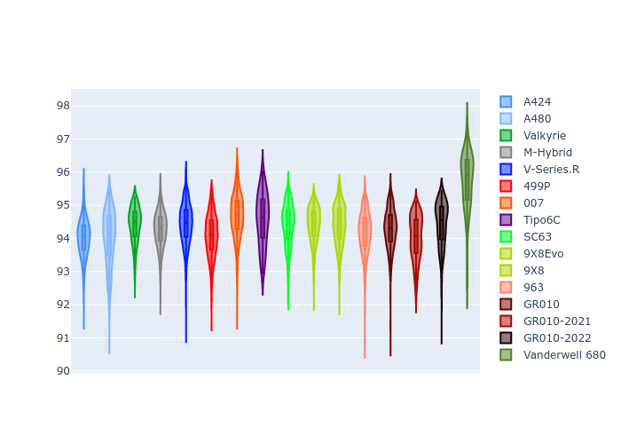
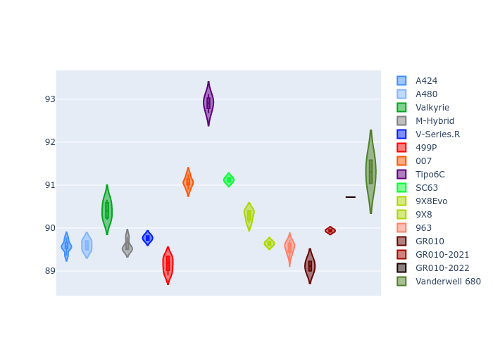
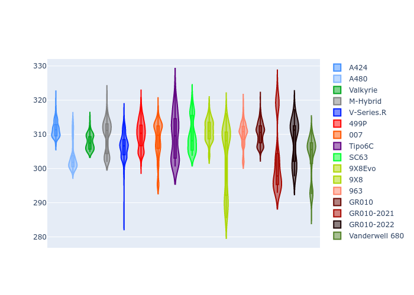
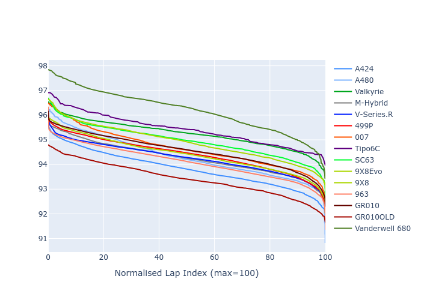

# Combined Plots

## Metadata

- BoP Accuracy: 96.00%
- Overall BoP Grade: A1
- Track: IMOLA
- Threshhold: 250.0kph
- Average Laptime: 1:34.40
- Average Quali Laptime: 1:30.88
- Average Topspeed: 313.67kph

## BoP Table
| Manufacturer     | Car            | Weight   | Power   | PINC   | E/Stint   | FDS    | RDP    | QDP    | TDP    |
|:-----------------|:---------------|:---------|:--------|:-------|:----------|:-------|:-------|:-------|:-------|
| Alpine           | A424           | 1057kg   | 520.0kw | -      | 924MJ     | -      | 51.64% | 59.31% | 26.80% |
| Alpine           | A480           | 952kg    | 432.0kw | +0.10% | 767MJ     | -      | 53.05% | 74.07% | 48.97% |
| Aston Martin     | Valkyrie       | 1036kg   | 520.0kw | -      | 912MJ     | -      | 53.50% | 53.33% | 21.51% |
| BMW              | M-Hybrid       | 1051kg   | 512.0kw | +0.10% | 911MJ     | -      | 52.89% | 56.22% | 33.41% |
| Cadillac         | V-Series.R     | 1042kg   | 510.0kw | +0.10% | 902MJ     | -      | 48.63% | 60.80% | 19.01% |
| Ferrari          | 499P           | 1073kg   | 508.0kw | -0.10% | 907MJ     | 190kph | 51.38% | 44.98% | 9.83%  |
| Glickenhaus      | 007            | 1030kg   | 520.0kw | -      | 910MJ     | -      | 46.15% | 49.30% | 41.45% |
| Isotta Fraschini | Tipo6C         | 1049kg   | 520.0kw | -      | 919MJ     | 190kph | 43.95% | 47.22% | 31.53% |
| Lamborghini      | SC63           | 1034kg   | 516.0kw | -      | 908MJ     | -      | 48.33% | 60.95% | 28.65% |
| Peugeot          | 9X8Evo         | 1056kg   | 510.0kw | +0.10% | 911MJ     | 190kph | 48.87% | 52.78% | 15.41% |
| Peugeot          | 9X8            | 1034kg   | 507.0kw | -      | 893MJ     | 150kph | 54.54% | 58.39% | 9.69%  |
| Porsche          | 963            | 1057kg   | 516.0kw | -0.10% | 913MJ     | -      | 50.70% | 44.30% | 29.51% |
| Toyota           | GR010          | 1090kg   | 512.0kw | -      | 911MJ     | 190kph | 51.09% | 52.71% | 11.46% |
| Toyota           | GR010-2021     | 1075kg   | 513.0kw | -0.10% | 906MJ     | 150kph | 54.08% | 54.81% | 9.72%  |
| Toyota           | GR010-2022     | 1078kg   | 512.0kw | -      | 904MJ     | 190kph | 53.45% | 68.83% | 9.58%  |
| Vanwall          | Vanderwell 680 | 1030kg   | 520.0kw | -      | 908MJ     | -      | 49.68% | 60.93% | 34.43% |

## Performance Table
| Manufacturer     | Car            | RP      | QP      | Vavg      |   RDLC | BOP-Grade   | Match   |
|:-----------------|:---------------|:--------|:--------|:----------|-------:|:------------|:--------|
| Alpine           | A424           | 1:34.01 | 1:30.20 | 313.54kph |   1.04 | ~A1         | 99.91%  |
| Alpine           | A480           | 1:34.01 | 1:31.43 | 310.25kph |   1.03 | ~A1         | 99.60%  |
| Aston Martin     | Valkyrie       | 1:34.42 | 1:30.16 | 315.26kph |   1.05 | ~A1         | 100.00% |
| BMW              | M-Hybrid       | 1:34.27 | 1:30.13 | 311.91kph |   1.05 | ~A1         | 100.00% |
| Cadillac         | V-Series.R     | 1:34.43 | 1:30.32 | 309.87kph |   1.05 | ~A1         | 99.53%  |
| Ferrari          | 499P           | 1:34.08 | 1:29.92 | 314.19kph |   1.05 | ~A1         | 99.91%  |
| Glickenhaus      | 007            | 1:34.68 | 1:31.84 | 316.04kph |   1.03 | ~A1         | 95.99%  |
| Isotta Fraschini | Tipo6C         | 1:34.55 | 1:32.59 | 314.98kph |   1.02 | ~A1         | 96.27%  |
| Lamborghini      | SC63           | 1:34.42 | 1:31.13 | 313.40kph |   1.04 | ~A1         | 100.00% |
| Peugeot          | 9X8Evo         | 1:34.42 | 1:30.48 | 313.30kph |   1.04 | ~A1         | 100.00% |
| Peugeot          | 9X8            | 1:34.42 | 1:31.05 | 310.98kph |   1.04 | ~A1         | 100.00% |
| Porsche          | 963            | 1:34.18 | 1:30.36 | 314.71kph |   1.04 | ~A1         | 99.84%  |
| Toyota           | GR010          | 1:34.29 | 1:29.99 | 314.15kph |   1.05 | ~A1         | 99.79%  |
| Toyota           | GR010-2021     | 1:34.02 | 1:30.56 | 317.51kph |   1.04 | ~A1         | 100.00% |
| Toyota           | GR010-2022     | 1:34.42 | 1:31.87 | 318.13kph |   1.03 | ~A1         | 99.66%  |
| Vanwall          | Vanderwell 680 | 1:35.74 | 1:32.04 | 310.47kph |   1.04 | +Ω1         | 45.50%  |

## Race Laptimes

## Quali Laptimes

## Topspeeds

## Laptimes Lineplot

