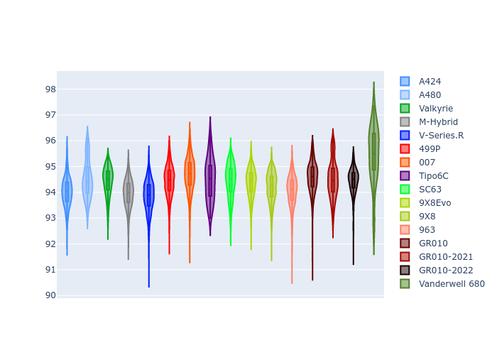
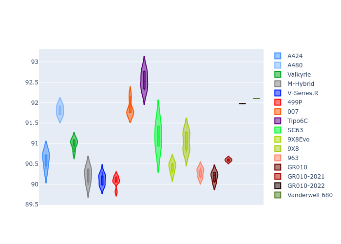
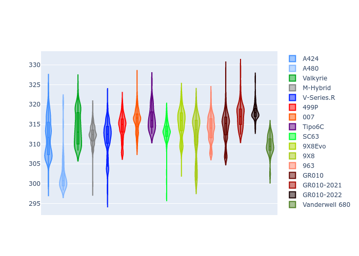
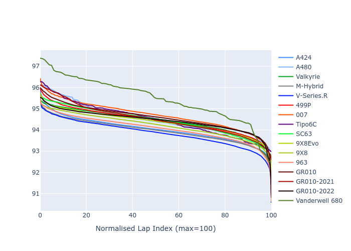

# Combined Plots

## Metadata

- BoP Accuracy: 79.70%
- Overall BoP Grade: C1
- Track: IMOLA
- Threshhold: 250.0kph
- Average Laptime: 1:35.42
- Average Quali Laptime: 1:31.90
- Laptime Std Dev: 1.11 seconds
- Filtered Average Topspeed: 311.66kph

## BoP Table
| Manufacturer     | Car            | Weight   | Power   | PINC   | E/Stint   | FDS    | RDP    | QDP    | TDP    |
|:-----------------|:---------------|:---------|:--------|:-------|:----------|:-------|:-------|:-------|:-------|
| Alpine           | A424           | 1056kg   | 511.0kw | +0.10% | 916MJ     | -      | 51.45% | 55.09% | 24.89% |
| Alpine           | A480           | 990kg    | 421.0kw | +0.10% | 776MJ     | -      | 54.77% | 76.19% | 54.04% |
| Aston Martin     | Valkyrie       | 1039kg   | 483.0kw | -      | 879MJ     | -      | 53.07% | 48.70% | 24.00% |
| BMW              | M-Hybrid       | 1050kg   | 513.0kw | +0.10% | 912MJ     | -      | 52.63% | 52.34% | 34.06% |
| Cadillac         | V-Series.R     | 1047kg   | 519.0kw | -      | 910MJ     | -      | 48.80% | 57.26% | 18.10% |
| Ferrari          | 499P           | 1062kg   | 503.0kw | -0.10% | 902MJ     | 190kph | 51.39% | 44.34% | 9.89%  |
| Glickenhaus      | 007            | 1039kg   | 486.0kw | -      | 880MJ     | -      | 46.14% | 49.30% | 41.45% |
| Isotta Fraschini | Tipo6C         | 1034kg   | 481.0kw | -      | 882MJ     | 190kph | 43.95% | 47.22% | 31.53% |
| Lamborghini      | SC63           | 1040kg   | 520.0kw | +0.10% | 912MJ     | -      | 48.32% | 60.95% | 28.65% |
| Peugeot          | 9X8Evo         | 1052kg   | 518.0kw | -0.10% | 918MJ     | 190kph | 49.16% | 50.25% | 18.00% |
| Peugeot          | 9X8            | 1046kg   | 524.0kw | -      | 909MJ     | 150kph | 54.54% | 58.39% | 9.69%  |
| Porsche          | 963            | 1056kg   | 511.0kw | +0.10% | 909MJ     | -      | 50.61% | 41.90% | 27.68% |
| Toyota           | GR010          | 1071kg   | 502.0kw | +0.10% | 901MJ     | 190kph | 51.33% | 51.71% | 14.89% |
| Toyota           | GR010-2021     | 1055kg   | 509.0kw | -0.10% | 901MJ     | 150kph | 54.02% | 52.67% | 26.37% |
| Toyota           | GR010-2022     | 1060kg   | 503.0kw | -0.10% | 894MJ     | 190kph | 53.24% | 64.49% | 9.72%  |
| Vanwall          | Vanderwell 680 | 1037kg   | 506.0kw | -      | 892MJ     | -      | 50.86% | 59.83% | 31.84% |

## Performance Table
| Manufacturer     | Car            | RP      | QP      | Vavg      |   RDLC | BOP-Grade   | Match   |
|:-----------------|:---------------|:--------|:--------|:----------|-------:|:------------|:--------|
| Alpine           | A424           | 1:34.84 | 1:31.02 | 311.87kph |   1.04 | ~A1         | 99.95%  |
| Alpine           | A480           | 1:37.02 | 1:33.79 | 303.39kph |   1.03 | +Ω1         | 32.21%  |
| Aston Martin     | Valkyrie       | 1:37.01 | 1:33.20 | 305.79kph |   1.04 | +Ω1         | 35.00%  |
| BMW              | M-Hybrid       | 1:34.55 | 1:30.52 | 312.39kph |   1.04 | ~A1         | 99.80%  |
| Cadillac         | V-Series.R     | 1:34.39 | 1:30.35 | 311.74kph |   1.04 | ~A1         | 99.44%  |
| Ferrari          | 499P           | 1:34.95 | 1:30.77 | 314.30kph |   1.05 | ~A1         | 99.88%  |
| Glickenhaus      | 007            | 1:37.02 | 1:34.10 | 307.42kph |   1.03 | +Ω1         | 36.62%  |
| Isotta Fraschini | Tipo6C         | 1:37.02 | 1:35.03 | 307.81kph |   1.02 | +Ω1         | 40.30%  |
| Lamborghini      | SC63           | 1:34.38 | 1:31.11 | 313.71kph |   1.04 | ~A1         | 99.42%  |
| Peugeot          | 9X8Evo         | 1:34.62 | 1:30.80 | 315.52kph |   1.04 | ~A1         | 99.52%  |
| Peugeot          | 9X8            | 1:34.33 | 1:30.95 | 313.40kph |   1.04 | ~A1         | 99.65%  |
| Porsche          | 963            | 1:34.72 | 1:30.91 | 313.89kph |   1.04 | ~A1         | 99.58%  |
| Toyota           | GR010          | 1:35.26 | 1:30.87 | 313.49kph |   1.05 | ~A1         | 99.78%  |
| Toyota           | GR010-2021     | 1:34.48 | 1:30.92 | 317.52kph |   1.04 | ~A1         | 100.00% |
| Toyota           | GR010-2022     | 1:35.12 | 1:32.64 | 317.78kph |   1.03 | ~A1         | 99.33%  |
| Vanwall          | Vanderwell 680 | 1:37.02 | 1:33.34 | 306.48kph |   1.04 | +Ω1         | 34.67%  |

## Race Laptimes

## Quali Laptimes

## Topspeeds

## Laptimes Lineplot

