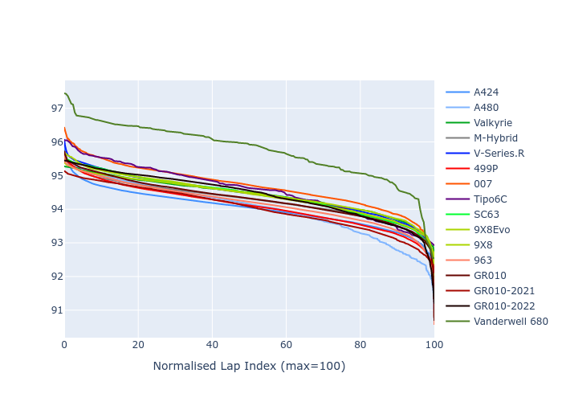

# Combined Plots

## Metadata

- BoP Accuracy: 92.66%
- Overall BoP Grade: A2
- Track: IMOLA
- Threshhold: 250.0kph

## BoP Table
| Manufacturer     | Car            | Weight   | Power   | PINC   | E/Stint   | FDS    | RDP    | QDP    | TDP    |
|:-----------------|:---------------|:---------|:--------|:-------|:----------|:-------|:-------|:-------|:-------|
| Alpine           | A424           | 1057kg   | 520.0kw | -0.10% | 923MJ     | -      | 52.35% | 61.85% | 27.84% |
| Alpine           | A480           | 952kg    | 432.0kw | +0.10% | 783MJ     | -      | 54.51% | 76.19% | 54.04% |
| Aston Martin     | Valkyrie       | 1052kg   | 504.0kw | +0.10% | 899MJ     | -      | 53.59% | 53.33% | 21.51% |
| BMW              | M-Hybrid       | 1051kg   | 512.0kw | -0.10% | 911MJ     | -      | 53.26% | 57.23% | 34.54% |
| Cadillac         | V-Series.R     | 1044kg   | 510.0kw | +0.10% | 903MJ     | -      | 47.80% | 56.73% | 19.63% |
| Ferrari          | 499P           | 1073kg   | 508.0kw | -0.10% | 907MJ     | 190kph | 53.02% | 42.32% | 9.88%  |
| Glickenhaus      | 007            | 1040kg   | 520.0kw | -      | 911MJ     | -      | 46.49% | 46.07% | 47.78% |
| Isotta Fraschini | Tipo6C         | 1059kg   | 520.0kw | -      | 920MJ     | 190kph | 43.95% | 47.22% | 31.53% |
| Lamborghini      | SC63           | 1052kg   | 519.0kw | -0.10% | 912MJ     | -      | 46.33% | 59.50% | 29.33% |
| Peugeot          | 9X8Evo         | 1060kg   | 510.0kw | -0.10% | 911MJ     | 190kph | 48.47% | 51.26% | 16.02% |
| Peugeot          | 9X8            | 1040kg   | 520.0kw | -      | 907MJ     | 150kph | 54.07% | 57.08% | 10.80% |
| Porsche          | 963            | 1057kg   | 516.0kw | -0.10% | 913MJ     | -      | 50.87% | 45.25% | 30.77% |
| Toyota           | GR010          | 1090kg   | 512.0kw | -0.10% | 911MJ     | 190kph | 52.43% | 57.12% | 12.82% |
| Toyota           | GR010-2021     | 1075kg   | 513.0kw | +0.10% | 907MJ     | 150kph | 54.09% | 52.67% | 26.37% |
| Toyota           | GR010-2022     | 1090kg   | 512.0kw | +0.10% | 906MJ     | 190kph | 53.48% | 69.44% | 7.86%  |
| Vanwall          | Vanderwell 680 | 1030kg   | 520.0kw | -      | 903MJ     | -      | 53.41% | 56.28% | 29.85% |

## Performance Table
| Manufacturer     | Car            | RP      | QP      | Vavg      |   RDLC | BOP-Grade   | Match   |
|:-----------------|:---------------|:--------|:--------|:----------|-------:|:------------|:--------|
| Alpine           | A424           | 1:33.88 | 1:29.57 | 311.50kph |   1.05 | ~A1         | 98.63%  |
| Alpine           | A480           | 1:33.03 | 1:29.60 | 303.20kph |   1.04 | -C1         | 75.60%  |
| Aston Martin     | Valkyrie       | 1:35.37 | 1:30.41 | 307.88kph |   1.05 | +A2         | 94.83%  |
| BMW              | M-Hybrid       | 1:34.24 | 1:29.59 | 309.45kph |   1.05 | ~A1         | 99.60%  |
| Cadillac         | V-Series.R     | 1:34.41 | 1:29.77 | 306.30kph |   1.05 | ~A1         | 99.96%  |
| Ferrari          | 499P           | 1:34.21 | 1:29.14 | 310.01kph |   1.06 | ~A1         | 99.50%  |
| Glickenhaus      | 007            | 1:34.63 | 1:31.07 | 308.41kph |   1.04 | ~A1         | 95.91%  |
| Isotta Fraschini | Tipo6C         | 1:35.54 | 1:32.91 | 309.28kph |   1.03 | +C1         | 78.36%  |
| Lamborghini      | SC63           | 1:34.98 | 1:31.12 | 309.74kph |   1.04 | ~A1         | 97.71%  |
| Peugeot          | 9X8Evo         | 1:34.85 | 1:30.30 | 311.16kph |   1.05 | ~A1         | 97.20%  |
| Peugeot          | 9X8            | 1:34.10 | 1:29.64 | 303.05kph |   1.05 | ~A1         | 99.21%  |
| Porsche          | 963            | 1:34.14 | 1:29.55 | 310.29kph |   1.05 | ~A1         | 99.68%  |
| Toyota           | GR010          | 1:34.29 | 1:29.12 | 310.18kph |   1.06 | ~A1         | 99.76%  |
| Toyota           | GR010-2021     | 1:34.24 | 1:29.94 | 302.34kph |   1.05 | ~A1         | 99.85%  |
| Toyota           | GR010-2022     | 1:34.35 | 1:30.72 | 308.03kph |   1.04 | ~A1         | 100.00% |
| Vanwall          | Vanderwell 680 | 1:36.10 | 1:31.31 | 303.40kph |   1.05 | +Ω1         | 46.73%  |

## Race Laptimes

## Quali Laptimes

## Topspeeds

## Laptimes Lineplot

