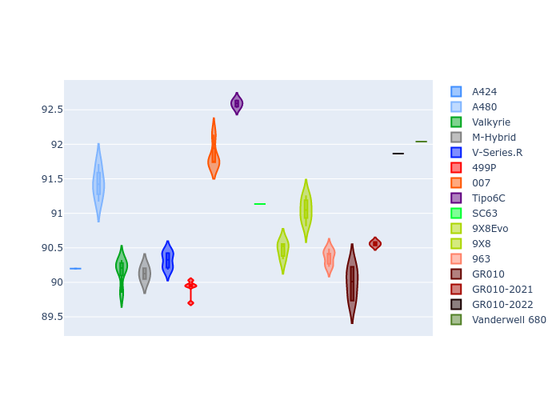
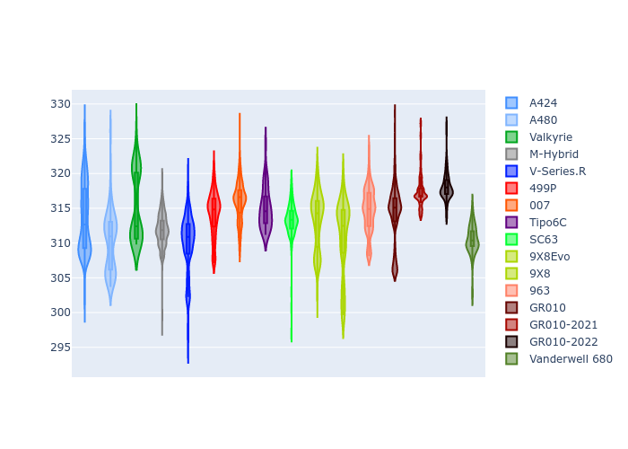

# Combined Plots

## Metadata

- BoP Accuracy: 94.46%
- Overall BoP Grade: A2
- Track: IMOLA
- Threshhold: 210.0kph

## BoP Table
| Manufacturer     | Car            | Weight   | Power   | PINC   | E/Stint   | FDS    |
|:-----------------|:---------------|:---------|:--------|:-------|:----------|:-------|
| Alpine           | A424           | 1057kg   | 520.0kw | -1.00% | 921MJ     | -      |
| Alpine           | A480           | 1052kg   | 432.0kw | +1.00% | 768MJ     | -      |
| Aston Martin     | Valkyrie       | 1052kg   | 504.0kw | +1.00% | 901MJ     | -      |
| BMW              | M-Hybrid       | 1051kg   | 512.0kw | -1.00% | 909MJ     | -      |
| Cadillac         | V-Series.R     | 1044kg   | 510.0kw | +1.00% | 904MJ     | -      |
| Ferrari          | 499P           | 1073kg   | 508.0kw | -1.00% | 905MJ     | 190kph |
| Glickenhaus      | 007            | 1040kg   | 520.0kw | -      | 911MJ     | -      |
| Isotta Fraschini | Tipo6C         | 1059kg   | 520.0kw | -      | 920MJ     | 190kph |
| Lamborghini      | SC63           | 1052kg   | 519.0kw | -1.00% | 910MJ     | -      |
| Peugeot          | 9X8Evo         | 1060kg   | 510.0kw | -1.00% | 909MJ     | 190kph |
| Peugeot          | 9X8            | 1040kg   | 520.0kw | -      | 905MJ     | 150kph |
| Porsche          | 963            | 1057kg   | 516.0kw | -1.00% | 911MJ     | -      |
| Toyota           | GR010          | 1090kg   | 512.0kw | -1.00% | 909MJ     | 190kph |
| Toyota           | GR010OLD       | 1075kg   | 513.0kw | +1.00% | 963MJ     | 150kph |
| Vanwall          | Vanderwell 680 | 1030kg   | 520.0kw | -      | 903MJ     | -      |

## Performance Table
| Manufacturer     | Car            | RP      | QP      | Vavg      |   RDLC | BOP-Grade   | Match   |
|:-----------------|:---------------|:--------|:--------|:----------|-------:|:------------|:--------|
| Alpine           | A424           | 1:33.80 | 1:29.62 | 310.98kph |   1.05 | ~A1         | 98.54%  |
| Alpine           | A480           | 1:34.24 | 1:30.96 | 302.12kph |   1.04 | ~A1         | 99.66%  |
| Aston Martin     | Valkyrie       | 1:35.24 | 1:30.31 | 308.61kph |   1.05 | ~A1         | 97.02%  |
| BMW              | M-Hybrid       | 1:34.26 | 1:29.75 | 308.76kph |   1.05 | ~A1         | 99.84%  |
| Cadillac         | V-Series.R     | 1:34.25 | 1:29.82 | 307.27kph |   1.05 | ~A1         | 99.85%  |
| Ferrari          | 499P           | 1:34.40 | 1:29.81 | 309.35kph |   1.05 | ~A1         | 99.86%  |
| Glickenhaus      | 007            | 1:34.58 | 1:31.02 | 308.41kph |   1.04 | ~A1         | 97.42%  |
| Isotta Fraschini | Tipo6C         | 1:35.40 | 1:32.68 | 309.28kph |   1.03 | +B1         | 88.06%  |
| Lamborghini      | SC63           | 1:34.93 | 1:31.13 | 309.00kph |   1.04 | ~A1         | 97.71%  |
| Peugeot          | 9X8Evo         | 1:34.86 | 1:30.32 | 310.42kph |   1.05 | ~A1         | 97.03%  |
| Peugeot          | 9X8            | 1:34.40 | 1:30.22 | 304.50kph |   1.05 | ~A1         | 99.96%  |
| Porsche          | 963            | 1:34.10 | 1:29.66 | 309.18kph |   1.05 | ~A1         | 99.72%  |
| Toyota           | GR010          | 1:34.56 | 1:29.87 | 309.00kph |   1.05 | ~A1         | 99.97%  |
| Toyota           | GR010OLD       | 1:33.43 | 1:29.92 | 306.57kph |   1.04 | -A2         | 94.42%  |
| Vanwall          | Vanderwell 680 | 1:36.14 | 1:31.31 | 303.40kph |   1.05 | +Ω1         | 47.77%  |

## Race Laptimes

## Quali Laptimes

## Topspeeds

## Laptimes Lineplot

