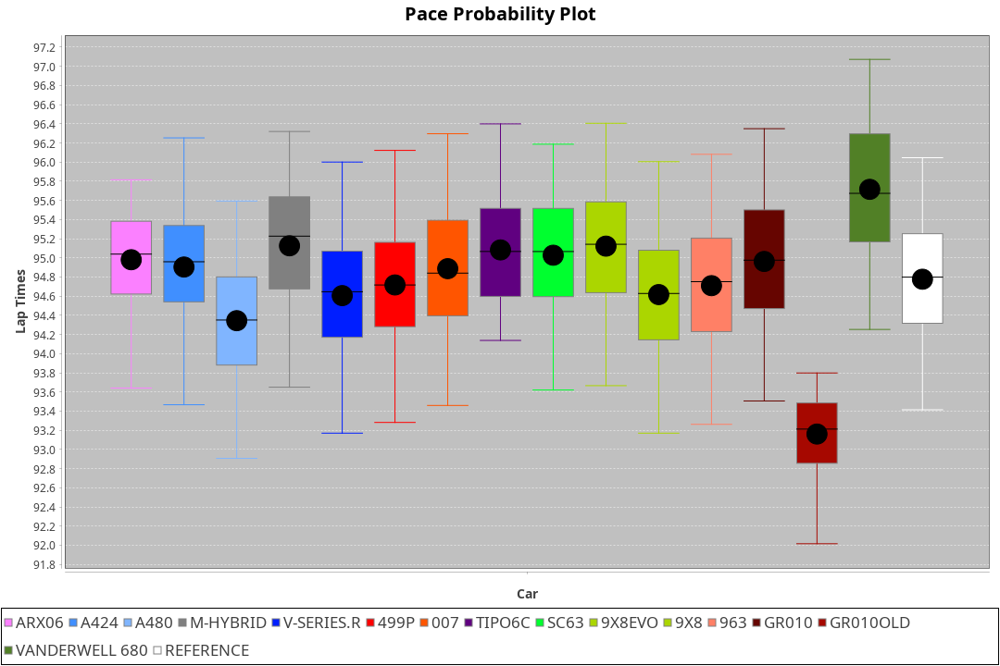
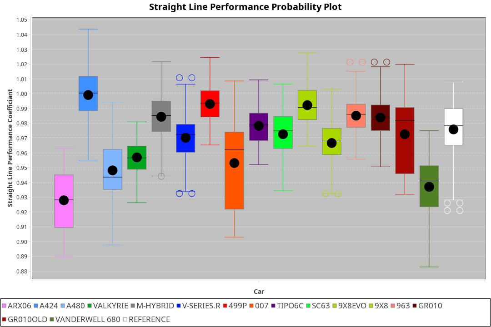
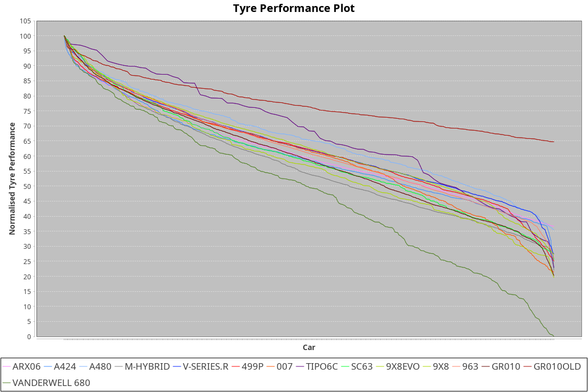

|Manufacturer|Car|Weight|Power|PINC|E/Stint|FDS|
|:-|:-|:-|:-|:-|:-|:-|
|Acura|ARX06|1077kg|510kw|1%|912MJ|-|
|Alpine|A424|1072kg|510kw|1%|911MJ|-|
|Alpine|A480|952kg|410kw|1%|748MJ|-|
|BMW|M Hybrid V8 LMDh|1050kg|507kw|1%|903MJ|-|
|Cadillac|V-Series.R|1034kg|501kw|-1%|888MJ|-|
|Ferrari|499P|1075kg|501kw|-1%|892MJ|190kph|
|Glickenhaus|007|1036kg|516kw|-|907MJ|-|
|Issotta Fraschini|Tipo6C|1034kg|515kw|-|912MJ|190kph|
|Lamborghini|SC63|1055kg|511kw|1%|906MJ|-|
|Peugeot|9X8|1035kg|512kw|-|898MJ|150kph|
|Porsche|963|1049kg|508kw|-1%|893MJ|-|
|Toyota|GR010|1088kg|507kw|-|901MJ|190kph|
|Toyota|GR010OLD|1077kg|510kw|-1%|902MJ|190kph|
|Vanwall|Vanderwell 680|1030kg|520kw|-|903MJ|-|

### BoP Accuracy: 91.00%; Overall BoP Grade: A2
|Manufacturer|Car|Type|RP|QP|Weight|Power¹|Threshhold|PINC|Power²|E/Stint|AVG Vmax|FDS|RDLC|L/Stint|BOP-Grade|ModelAccuracy|ModelPoints|Match%|
|:-|:-|:-|:-|:-|:-|:-|:-|:-|:-|:-|:-|:-|:-|:-|:-|:-|:-|:-|
|Acura|ARX06|LMDH|1:36.28|1:31.78|1077kg|510kw|210.0kph|1%|515kw|912MJ|292.76kph|-|0.99|37|+B2|100.00%|995|80.36%|
|Alpine|A424|LMDH|1:36.28|1:33.80|1072kg|510kw|210.0kph|1%|515kw|911MJ|292.57kph|-|0.99|37|~A1|81.15%|521|99.72%|
|Alpine|A480|LMP1|1:36.15|1:32.94|952kg|410kw|210.0kph|1%|414kw|748MJ|288.97kph|-|0.97|34|~A1|67.92%|957|100.00%|
|BMW|M Hybrid V8 LMDh|LMDH|1:36.06|1:32.38|1050kg|507kw|210.0kph|1%|512kw|903MJ|289.77kph|-|1.02|37|-B2|98.60%|1690|84.95%|
|Cadillac|V-Series.R|LMDH|1:36.28|1:32.35|1034kg|501kw|210.0kph|-1%|496kw|888MJ|293.36kph|-|1.03|37|+A2|91.10%|1770|94.71%|
|Ferrari|499P|LMHHU|1:36.47|1:32.66|1075kg|501kw|210.0kph|-1%|496kw|892MJ|293.50kph|190kph|1.02|37|~A1|84.26%|2292|100.00%|
|Glickenhaus|007|LMHNH|1:36.28|1:33.11|1036kg|516kw|210.0kph|-|516kw|907MJ|297.17kph|-|0.95|37|~A1|94.63%|1605|99.76%|
|Issotta Fraschini|Tipo6C|LMHHU|1:36.27|1:34.55|1034kg|515kw|210.0kph|-|515kw|912MJ|295.27kph|190kph|1.08|37|+B1|66.67%|96|86.52%|
|Lamborghini|SC63|LMDH|1:36.07|1:34.53|1055kg|511kw|210.0kph|1%|516kw|906MJ|291.59kph|-|1.04|37|-B1|96.77%|419|86.71%|
|Peugeot|9X8|LMHHE|1:36.28|1:32.72|1035kg|512kw|210.0kph|-|512kw|898MJ|293.75kph|150kph|1.03|37|~A1|83.63%|2468|100.00%|
|Porsche|963|LMDH|1:36.28|1:32.29|1049kg|508kw|210.0kph|-1%|503kw|893MJ|293.48kph|-|1.01|37|~A1|93.14%|5746|100.00%|
|Toyota|GR010|LMHHU|1:36.28|1:32.49|1088kg|507kw|210.0kph|-|507kw|901MJ|293.93kph|190kph|1.01|37|~A1|87.37%|3154|100.00%|
|Toyota|GR010OLD|LMHHE|1:36.47|1:32.55|1077kg|510kw|210.0kph|-1%|505kw|902MJ|296.05kph|190kph|1.02|37|~A1|89.81%|1393|100.00%|
|Vanwall|Vanderwell 680|LMHNH|1:37.67|1:33.30|1030kg|520kw|210.0kph|-|520kw|903MJ|291.45kph|-|1.01|37|+Ω1|90.28%|604|41.30%|

## Power below Threshhold
|N/Nmax|ARX06|A424|MHYBRIDV8LMDH|VSERIES.R|499P|007|TIPO6C|SC63|9X8|963|GR010|GR010OLD|VANDERWELL680|​|RPM|A480|
|:-|:-|:-|:-|:-|:-|:-|:-|:-|:-|:-|:-|:-|:-|:-|:-|:-|
|0.550|251|251|250|247|247|254|254|252|252|250|250|251|256|​|--|-|
|0.575|274|274|273|270|270|277|277|275|275|273|273|274|279|​|--|-|
|0.600|295|295|293|290|290|298|297|295|296|293|293|295|300|​|--|-|
|0.625|316|316|314|310|310|319|319|316|317|314|314|316|322|​|--|-|
|0.650|337|337|335|331|331|340|340|337|338|335|335|337|343|​|--|-|
|0.675|358|358|356|352|352|362|362|359|359|357|356|358|365|​|--|-|
|0.700|380|380|377|373|373|384|383|380|381|378|377|380|387|​|--|-|
|0.725|401|401|399|394|394|406|405|402|403|399|399|401|409|​|--|-|
|0.750|422|422|419|414|414|427|426|422|423|420|419|422|430|​|--|-|
|0.775|441|441|438|433|433|446|445|441|442|439|438|441|449|​|5000|242|
|0.800|458|458|455|450|450|463|463|459|460|456|455|458|467|​|5500|286|
|0.825|473|473|470|465|465|478|478|474|475|471|470|473|482|​|6000|319|
|0.850|485|485|482|476|476|490|489|485|486|483|482|485|494|​|6500|361|
|0.875|495|495|492|486|486|501|500|496|497|493|492|495|505|​|7000|403|
|0.900|502|502|499|493|493|508|507|503|504|500|499|502|512|​|7500|413|
|0.925|507|507|504|498|498|513|512|508|509|505|504|507|517|​|8000|409|
|**0.950**|**510**|**510**|**507**|**501**|**501**|**516**|**515**|**511**|**512**|**508**|**507**|**510**|**520**|**​**|**8500**|**412**|
|0.975|508|508|505|499|499|514|513|509|510|506|505|508|518|​|9000|206|
|1.000|505|505|502|496|496|510|509|505|506|503|502|505|514|​|--|-|
|1.025|436|436|433|428|428|441|440|436|437|434|433|436|444|​|--|-|

## Power above Threshhold
|N/Nmax|ARX06|A424|MHYBRIDV8LMDH|VSERIES.R|499P|007|TIPO6C|SC63|9X8|963|GR010|GR010OLD|VANDERWELL680|​|RPM|A480|
|:-|:-|:-|:-|:-|:-|:-|:-|:-|:-|:-|:-|:-|:-|:-|:-|:-|
|0.550|254|254|252|244|244|254|254|254|252|248|250|249|256|​|--|-|
|0.575|277|277|275|267|267|277|277|277|275|271|273|272|279|​|--|-|
|0.600|297|297|296|287|287|298|297|298|296|291|293|292|300|​|--|-|
|0.625|319|319|317|307|307|319|319|319|317|311|314|312|322|​|--|-|
|0.650|340|340|338|327|327|340|340|340|338|332|335|333|343|​|--|-|
|0.675|362|362|359|348|348|362|362|362|359|353|356|355|365|​|--|-|
|0.700|383|383|381|369|369|384|383|384|381|374|377|376|387|​|--|-|
|0.725|405|405|403|390|390|406|405|406|403|395|399|397|409|​|--|-|
|0.750|426|426|423|410|410|427|426|427|423|416|419|417|430|​|--|-|
|0.775|445|445|442|429|429|446|445|446|442|435|438|436|449|​|5000|242|
|0.800|463|463|460|445|445|463|463|463|460|452|455|454|467|​|5500|286|
|0.825|478|478|475|460|460|478|478|478|475|467|470|469|482|​|6000|319|
|0.850|489|489|486|471|471|490|489|490|486|478|482|480|494|​|6500|361|
|0.875|500|500|497|481|481|501|500|501|497|488|492|490|505|​|7000|403|
|0.900|507|507|504|488|488|508|507|508|504|495|499|497|512|​|7500|413|
|0.925|512|512|509|493|493|513|512|513|509|500|504|502|517|​|8000|409|
|**0.950**|**515**|**515**|**512**|**496**|**496**|**516**|**515**|**516**|**512**|**503**|**507**|**505**|**520**|**​**|**8500**|**412**|
|0.975|513|513|510|494|494|514|513|514|510|501|505|503|518|​|9000|206|
|1.000|509|509|506|491|491|510|509|510|506|498|502|500|514|​|--|-|
|1.025|440|440|437|424|424|441|440|441|437|430|433|431|444|​|--|-|
