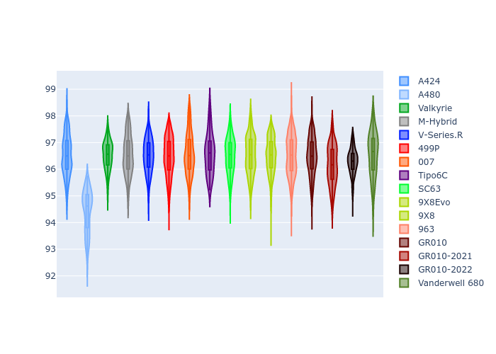
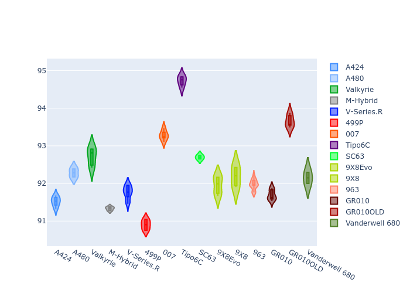
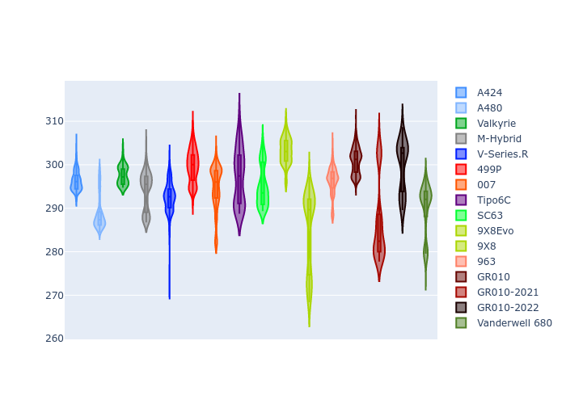
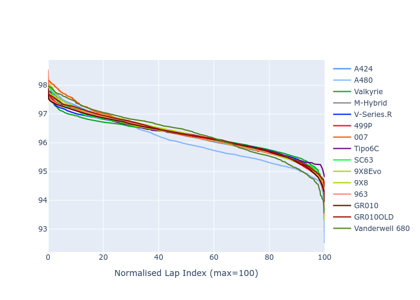

# Combined Plots

## Metadata

- BoP Accuracy: 99.53%
- Overall BoP Grade: A1
- Track: IMOLA
- Threshhold: 210.0kph

## BoP Table
| Manufacturer     | Car            | Weight   | Power   | PINC   | E/Stint   | FDS    |
|:-----------------|:---------------|:---------|:--------|:-------|:----------|:-------|
| Alpine           | A424           | 1059kg   | 480.0kw | -      | 887MJ     | -      |
| Alpine           | A480           | 1052kg   | 410.0kw | +0.10% | 747MJ     | -      |
| Aston Martin     | Valkyrie       | 1033kg   | 489.0kw | -1.80% | 880MJ     | -      |
| BMW              | M-Hybrid       | 1065kg   | 480.0kw | +1.70% | 887MJ     | -      |
| Cadillac         | V-Series.R     | 1079kg   | 480.0kw | +5.90% | 891MJ     | -      |
| Ferrari          | 499P           | 1082kg   | 480.0kw | +0.20% | 883MJ     | 190kph |
| Glickenhaus      | 007            | 1050kg   | 490.0kw | +2.80% | 891MJ     | -      |
| Isotta Fraschini | Tipo6C         | 1081kg   | 520.0kw | -2.30% | 918MJ     | 190kph |
| Lamborghini      | SC63           | 1076kg   | 510.0kw | -2.30% | 902MJ     | -      |
| Peugeot          | 9X8Evo         | 1045kg   | 482.0kw | -0.40% | 883MJ     | 190kph |
| Peugeot          | 9X8            | 1076kg   | 490.0kw | +6.10% | 895MJ     | 150kph |
| Porsche          | 963            | 1065kg   | 480.0kw | +1.30% | 884MJ     | -      |
| Toyota           | GR010          | 1078kg   | 480.0kw | -      | 881MJ     | 190kph |
| Toyota           | GR010OLD       | 1100kg   | 480.0kw | +1.20% | 935MJ     | 170kph |
| Vanwall          | Vanderwell 680 | 1035kg   | 520.0kw | -      | 904MJ     | -      |

## Performance Table
| Manufacturer     | Car            | RP      | QP      | Vavg      |   RDLC | BOP-Grade   | Match   |
|:-----------------|:---------------|:--------|:--------|:----------|-------:|:------------|:--------|
| Alpine           | A424           | 1:36.25 | 1:31.89 | 302.68kph |   1.05 | ~A1         | 99.46%  |
| Alpine           | A480           | 1:36.00 | 1:32.62 | 295.75kph |   1.04 | ~A1         | 98.99%  |
| Aston Martin     | Valkyrie       | 1:36.24 | 1:31.22 | 304.99kph |   1.06 | ~A1         | 100.00% |
| BMW              | M-Hybrid       | 1:36.25 | 1:31.57 | 302.33kph |   1.05 | ~A1         | 100.00% |
| Cadillac         | V-Series.R     | 1:36.25 | 1:31.66 | 300.81kph |   1.05 | ~A1         | 99.96%  |
| Ferrari          | 499P           | 1:36.26 | 1:31.51 | 303.11kph |   1.05 | ~A1         | 99.98%  |
| Glickenhaus      | 007            | 1:36.25 | 1:32.59 | 303.02kph |   1.04 | ~A1         | 97.42%  |
| Isotta Fraschini | Tipo6C         | 1:36.25 | 1:33.50 | 305.10kph |   1.03 | ~A1         | 100.00% |
| Lamborghini      | SC63           | 1:36.24 | 1:32.36 | 303.49kph |   1.04 | ~A1         | 99.52%  |
| Peugeot          | 9X8Evo         | 1:36.26 | 1:31.61 | 306.20kph |   1.05 | ~A1         | 98.74%  |
| Peugeot          | 9X8            | 1:36.24 | 1:31.93 | 299.06kph |   1.05 | ~A1         | 99.96%  |
| Porsche          | 963            | 1:36.25 | 1:31.65 | 302.19kph |   1.05 | ~A1         | 99.89%  |
| Toyota           | GR010          | 1:36.25 | 1:31.42 | 303.88kph |   1.05 | ~A1         | 99.97%  |
| Toyota           | GR010OLD       | 1:36.30 | 1:32.62 | 296.95kph |   1.04 | ~A1         | 100.00% |
| Vanwall          | Vanderwell 680 | 1:36.26 | 1:31.42 | 302.87kph |   1.05 | ~A1         | 99.11%  |

## Race Laptimes

## Quali Laptimes

## Topspeeds

## Laptimes Lineplot

