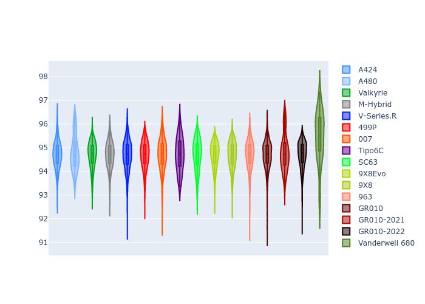
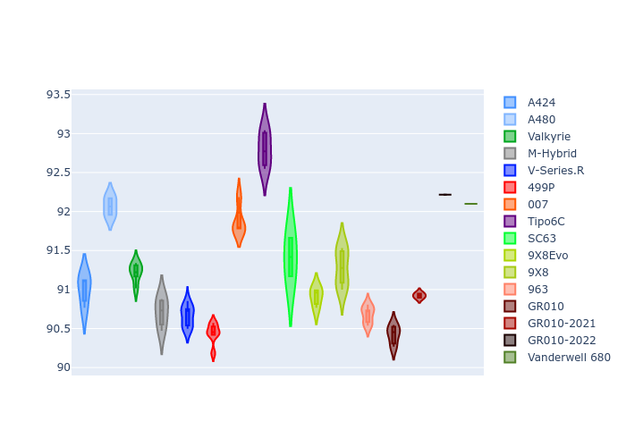
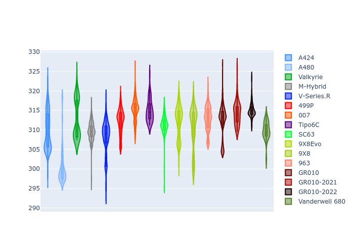
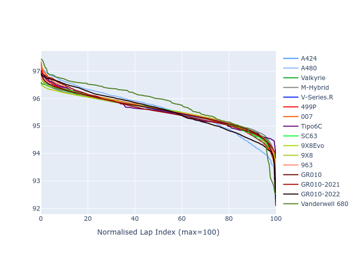

# Combined Plots

## Metadata

- BoP Accuracy: 99.38%
- Overall BoP Grade: A1
- Track: IMOLA
- Threshhold: 250.0kph
- Average Laptime: 1:35.47
- Average Quali Laptime: 1:31.93
- Laptime Std Dev: 0.11 seconds
- Filtered Average Topspeed: 311.49kph

## BoP Table
| Manufacturer     | Car            | Weight   | Power   | PINC   | E/Stint   | FDS    | RDP    | QDP    | TDP    |
|:-----------------|:---------------|:---------|:--------|:-------|:----------|:-------|:-------|:-------|:-------|
| Alpine           | A424           | 1045kg   | 480.0kw | +5.60% | 900MJ     | -      | 51.45% | 55.09% | 24.89% |
| Alpine           | A480           | 932kg    | 410.0kw | +0.70% | 762MJ     | -      | 54.77% | 76.19% | 54.04% |
| Aston Martin     | Valkyrie       | 1060kg   | 520.0kw | -      | 914MJ     | -      | 53.07% | 48.70% | 24.00% |
| BMW              | M-Hybrid       | 1047kg   | 480.0kw | +6.10% | 897MJ     | -      | 52.63% | 52.34% | 34.06% |
| Cadillac         | V-Series.R     | 1049kg   | 480.0kw | +8.30% | 896MJ     | -      | 48.80% | 57.26% | 18.10% |
| Ferrari          | 499P           | 1066kg   | 506.0kw | -3.20% | 897MJ     | 190kph | 51.39% | 44.34% | 9.89%  |
| Glickenhaus      | 007            | 1049kg   | 520.0kw | -      | 912MJ     | -      | 46.14% | 49.30% | 41.45% |
| Isotta Fraschini | Tipo6C         | 1062kg   | 520.0kw | -      | 920MJ     | 190kph | 43.95% | 47.22% | 31.53% |
| Lamborghini      | SC63           | 1067kg   | 520.0kw | -      | 915MJ     | -      | 48.32% | 60.95% | 28.65% |
| Peugeot          | 9X8Evo         | 1031kg   | 495.0kw | -1.10% | 892MJ     | 200kph | 49.16% | 50.25% | 18.00% |
| Peugeot          | 9X8            | 1039kg   | 480.0kw | +8.00% | 889MJ     | 200kph | 54.54% | 58.39% | 9.69%  |
| Porsche          | 963            | 1040kg   | 480.0kw | +3.80% | 888MJ     | -      | 50.61% | 41.90% | 27.68% |
| Toyota           | GR010          | 1067kg   | 510.0kw | -4.40% | 896MJ     | 200kph | 51.33% | 51.71% | 14.89% |
| Toyota           | GR010-2021     | 1063kg   | 520.0kw | -7.60% | 892MJ     | 200kph | 54.02% | 52.67% | 26.37% |
| Toyota           | GR010-2022     | 1059kg   | 519.0kw | -7.50% | 889MJ     | 190kph | 53.24% | 64.49% | 9.72%  |
| Vanwall          | Vanderwell 680 | 1030kg   | 520.0kw | -      | 903MJ     | -      | 50.86% | 59.83% | 31.84% |

## Performance Table
| Manufacturer     | Car            | RP      | QP      | Vavg      |   RDLC | BOP-Grade   | Match   |
|:-----------------|:---------------|:--------|:--------|:----------|-------:|:------------|:--------|
| Alpine           | A424           | 1:35.43 | 1:31.56 | 310.74kph |   1.04 | ~A1         | 99.88%  |
| Alpine           | A480           | 1:35.43 | 1:32.29 | 307.67kph |   1.03 | ~A1         | 99.80%  |
| Aston Martin     | Valkyrie       | 1:35.45 | 1:31.74 | 311.81kph |   1.04 | ~A1         | 100.00% |
| BMW              | M-Hybrid       | 1:35.45 | 1:31.36 | 310.39kph |   1.04 | ~A1         | 100.00% |
| Cadillac         | V-Series.R     | 1:35.45 | 1:31.33 | 309.82kph |   1.05 | ~A1         | 99.85%  |
| Ferrari          | 499P           | 1:35.45 | 1:31.23 | 311.76kph |   1.05 | ~A1         | 99.78%  |
| Glickenhaus      | 007            | 1:35.42 | 1:32.58 | 313.96kph |   1.03 | ~A1         | 99.02%  |
| Isotta Fraschini | Tipo6C         | 1:35.44 | 1:33.50 | 313.58kph |   1.02 | ~A1         | 98.51%  |
| Lamborghini      | SC63           | 1:35.43 | 1:32.10 | 310.72kph |   1.04 | ~A1         | 100.00% |
| Peugeot          | 9X8Evo         | 1:35.44 | 1:31.56 | 311.75kph |   1.04 | ~A1         | 100.00% |
| Peugeot          | 9X8            | 1:35.43 | 1:31.98 | 311.11kph |   1.04 | ~A1         | 100.00% |
| Porsche          | 963            | 1:35.44 | 1:31.58 | 311.76kph |   1.04 | ~A1         | 99.92%  |
| Toyota           | GR010          | 1:35.43 | 1:31.03 | 311.65kph |   1.05 | ~A1         | 99.47%  |
| Toyota           | GR010-2021     | 1:35.43 | 1:31.81 | 312.19kph |   1.04 | ~A1         | 97.05%  |
| Toyota           | GR010-2022     | 1:35.44 | 1:32.95 | 314.63kph |   1.03 | ~A1         | 99.55%  |
| Vanwall          | Vanderwell 680 | 1:35.90 | 1:32.29 | 310.28kph |   1.04 | ~A1         | 97.21%  |

## Race Laptimes

## Quali Laptimes

## Topspeeds

## Laptimes Lineplot

