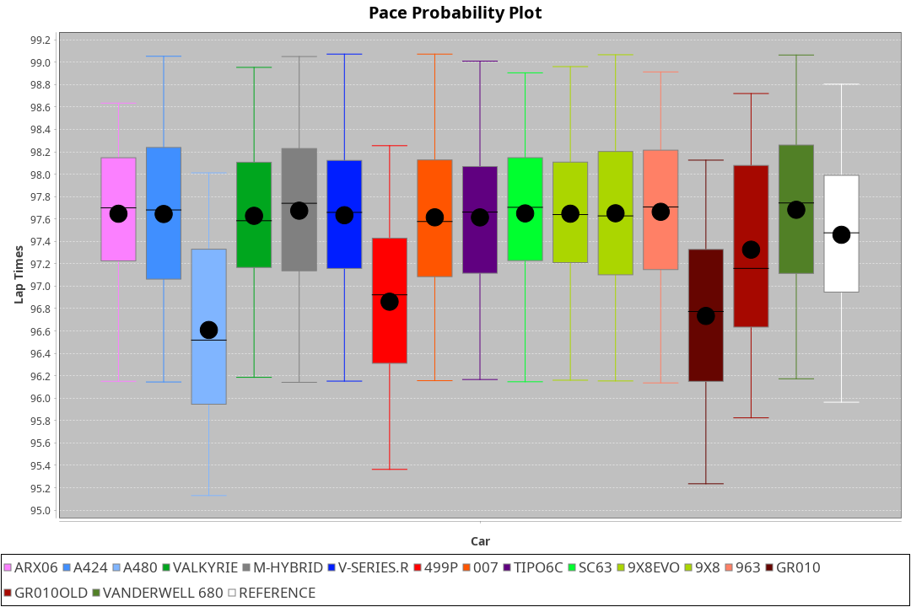
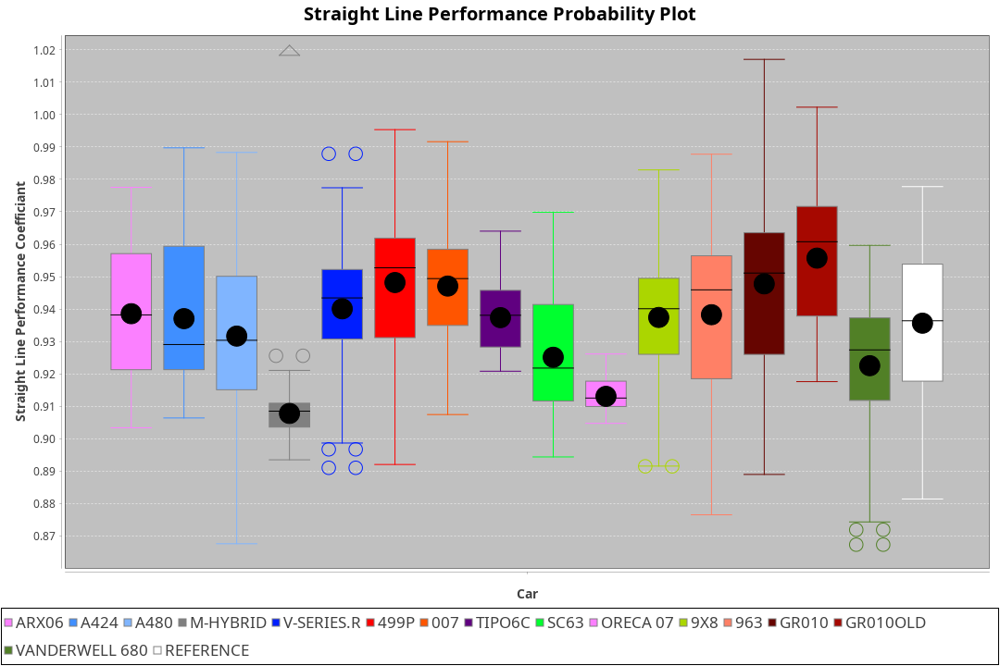
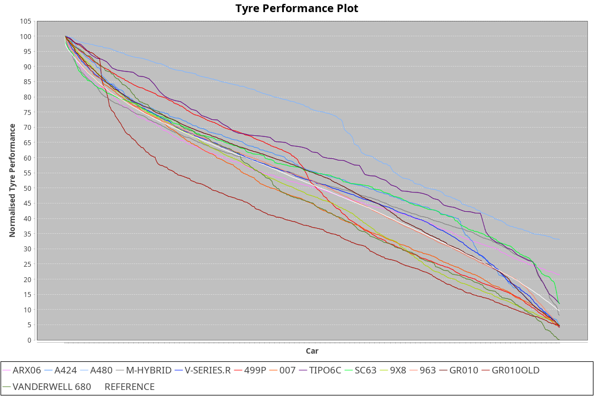

|Manufacturer|Car|Weight|Power|PINC|E/Stint|FDS|
|:-|:-|:-|:-|:-|:-|:-|
|Acura|ARX06|1037kg|506kw|1%|904MJ|-|
|Alpine|A424|1032kg|504kw|2%|903MJ|-|
|Alpine|A480|933kg|410kw|1%|747MJ|-|
|BMW|M Hybrid V8 LMDh|1047kg|509kw|2%|906MJ|-|
|Cadillac|V-Series.R|1038kg|503kw|2%|896MJ|-|
|Ferrari|499P|1063kg|509kw|-2%|896MJ|190kph|
|Glickenhaus|007|1030kg|520kw|-|910MJ|-|
|Issotta Fraschini|Tipo6C|1030kg|520kw|-|916MJ|180kph|
|Lamborghini|SC63|1062kg|520kw|-|913MJ|-|
|Peugeot|9X8|1038kg|520kw|-|905MJ|150kph|
|Porsche|963|1037kg|512kw|-1%|896MJ|-|
|Toyota|GR010|1062kg|516kw|-4%|898MJ|190kph|
|Toyota|GR010OLD|1058kg|519kw|-3%|904MJ|190kph|
|Vanwall|Vanderwell 680|1030kg|520kw|-|903MJ|-|

### BoP Accuracy: 88.77%; Overall BoP Grade: B1
|Manufacturer|Car|Type|RP|QP|Weight|Power¹|Threshhold|PINC|Power²|E/Stint|AVG Vmax|FDS|RDLC|L/Stint|BOP-Grade|ModelAccuracy|ModelPoints|Match%|
|:-|:-|:-|:-|:-|:-|:-|:-|:-|:-|:-|:-|:-|:-|:-|:-|:-|:-|:-|
|Acura|ARX06|LMDH|1:35.60|1:31.15|1037kg|506kw|210.0kph|1%|511kw|904MJ|294.97kph|-|1.02|37|-C1|100.00%|995|79.49%|
|Alpine|A424|LMDH|1:35.62|1:33.17|1032kg|504kw|210.0kph|2%|514kw|903MJ|294.94kph|-|1.03|37|~A1|81.15%|521|99.63%|
|Alpine|A480|LMP1|1:35.62|1:32.44|933kg|410kw|210.0kph|1%|414kw|747MJ|290.43kph|-|0.99|34|~A1|67.92%|957|100.00%|
|BMW|M Hybrid V8 LMDh|LMDH|1:35.61|1:31.96|1047kg|509kw|210.0kph|2%|519kw|906MJ|290.68kph|-|1.02|37|-A2|98.60%|1690|93.09%|
|Cadillac|V-Series.R|LMDH|1:35.61|1:31.72|1038kg|503kw|210.0kph|2%|513kw|896MJ|294.83kph|-|1.02|37|+A2|91.10%|1770|94.62%|
|Ferrari|499P|LMHHU|1:35.60|1:31.84|1063kg|509kw|210.0kph|-2%|499kw|896MJ|294.91kph|190kph|1.03|37|~A1|84.26%|2292|100.00%|
|Glickenhaus|007|LMHNH|1:35.77|1:32.63|1030kg|520kw|0.0kph|-|520kw|910MJ|298.18kph|-|0.96|37|~A1|94.63%|1605|100.00%|
|Issotta Fraschini|Tipo6C|LMHHU|1:35.59|1:33.89|1030kg|520kw|0.0kph|-|520kw|916MJ|296.28kph|180kph|1.08|37|+B1|66.67%|96|86.44%|
|Lamborghini|SC63|LMDH|1:35.60|1:34.07|1062kg|520kw|210.0kph|-|520kw|913MJ|291.81kph|-|1.03|37|+B1|96.77%|419|88.34%|
|Peugeot|9X8|LMHHE|1:35.61|1:32.10|1038kg|520kw|0.0kph|-|520kw|905MJ|294.68kph|150kph|1.03|37|~A1|83.63%|2468|100.00%|
|Porsche|963|LMDH|1:35.60|1:31.66|1037kg|512kw|210.0kph|-1%|507kw|896MJ|294.90kph|-|1.02|37|~A1|93.14%|5746|96.17%|
|Toyota|GR010|LMHHU|1:35.61|1:31.86|1062kg|516kw|210.0kph|-4%|495kw|898MJ|294.84kph|190kph|1.03|37|~A1|87.37%|3154|99.49%|
|Toyota|GR010OLD|LMHHE|1:35.60|1:31.74|1058kg|519kw|210.0kph|-3%|503kw|904MJ|297.52kph|190kph|1.03|37|~A1|89.81%|1393|97.92%|
|Vanwall|Vanderwell 680|LMHNH|1:37.67|1:33.30|1030kg|520kw|0.0kph|-|520kw|903MJ|291.45kph|-|1.01|37|+Ω1|90.28%|604|7.55%|

## Power below Threshhold
|N/Nmax|ARX06|A424|MHYBRIDV8LMDH|VSERIES.R|499P|007|TIPO6C|SC63|9X8|963|GR010|GR010OLD|VANDERWELL680|​|RPM|A480|
|:-|:-|:-|:-|:-|:-|:-|:-|:-|:-|:-|:-|:-|:-|:-|:-|:-|
|0.550|249|248|251|248|251|256|256|256|256|252|254|256|256|​|--|-|
|0.575|272|271|274|271|274|279|279|279|279|275|277|279|279|​|--|-|
|0.600|292|291|294|291|294|300|300|300|300|296|298|299|300|​|--|-|
|0.625|313|312|315|311|315|322|322|322|322|317|319|321|322|​|--|-|
|0.650|334|333|336|332|336|343|343|343|343|338|340|342|343|​|--|-|
|0.675|355|354|357|353|357|365|365|365|365|359|362|364|365|​|--|-|
|0.700|377|375|379|374|379|387|387|387|387|381|384|386|387|​|--|-|
|0.725|398|396|400|395|400|409|409|409|409|403|406|408|409|​|--|-|
|0.750|418|416|421|416|421|430|430|430|430|423|427|429|430|​|--|-|
|0.775|437|435|440|435|440|449|449|449|449|442|446|448|449|​|5000|242|
|0.800|454|453|457|452|457|467|467|467|467|460|463|466|467|​|5500|286|
|0.825|469|468|472|467|472|482|482|482|482|475|478|481|482|​|6000|319|
|0.850|481|479|484|478|484|494|494|494|494|486|490|493|494|​|6500|361|
|0.875|491|489|494|488|494|505|505|505|505|497|501|504|505|​|7000|403|
|0.900|498|496|501|495|501|512|512|512|512|504|508|511|512|​|7500|413|
|0.925|503|501|506|500|506|517|517|517|517|509|513|516|517|​|8000|409|
|**0.950**|**506**|**504**|**509**|**503**|**509**|**520**|**520**|**520**|**520**|**512**|**516**|**519**|**520**|**​**|**8500**|**412**|
|0.975|504|502|507|501|507|518|518|518|518|510|514|517|518|​|9000|206|
|1.000|501|499|504|498|504|514|514|514|514|506|510|513|514|​|--|-|
|1.025|432|430|435|430|435|444|444|444|444|437|441|443|444|​|--|-|

## Power above Threshhold
|N/Nmax|ARX06|A424|MHYBRIDV8LMDH|VSERIES.R|499P|007|TIPO6C|SC63|9X8|963|GR010|GR010OLD|VANDERWELL680|​|RPM|A480|
|:-|:-|:-|:-|:-|:-|:-|:-|:-|:-|:-|:-|:-|:-|:-|:-|:-|
|0.550|252|253|256|253|246|256|256|256|256|250|244|248|256|​|--|-|
|0.575|275|276|279|276|268|279|279|279|279|273|266|271|279|​|--|-|
|0.600|295|297|299|296|288|300|300|300|300|293|286|291|300|​|--|-|
|0.625|316|318|321|317|308|322|322|322|322|314|306|311|322|​|--|-|
|0.650|337|339|342|338|329|343|343|343|343|335|327|332|343|​|--|-|
|0.675|359|361|364|360|350|365|365|365|365|356|348|353|365|​|--|-|
|0.700|380|383|386|382|371|387|387|387|387|377|369|374|387|​|--|-|
|0.725|402|404|408|403|392|409|409|409|409|399|389|395|409|​|--|-|
|0.750|422|425|429|424|412|430|430|430|430|419|409|416|430|​|--|-|
|0.775|441|444|448|443|431|449|449|449|449|438|428|435|449|​|5000|242|
|0.800|459|462|466|461|448|467|467|467|467|455|445|452|467|​|5500|286|
|0.825|474|477|481|476|463|482|482|482|482|470|459|467|482|​|6000|319|
|0.850|485|488|493|487|474|494|494|494|494|482|470|478|494|​|6500|361|
|0.875|496|499|504|498|484|505|505|505|505|492|480|488|505|​|7000|403|
|0.900|503|506|511|505|491|512|512|512|512|499|487|495|512|​|7500|413|
|0.925|508|511|516|510|496|517|517|517|517|504|492|500|517|​|8000|409|
|**0.950**|**511**|**514**|**519**|**513**|**499**|**520**|**520**|**520**|**520**|**507**|**495**|**503**|**520**|**​**|**8500**|**412**|
|0.975|509|512|517|511|497|518|518|518|518|505|493|501|518|​|9000|206|
|1.000|505|508|513|507|494|514|514|514|514|502|490|498|514|​|--|-|
|1.025|436|439|443|438|426|444|444|444|444|433|423|430|444|​|--|-|
