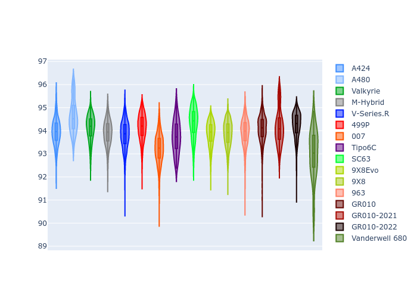
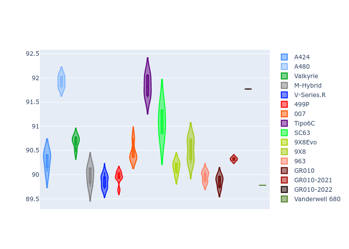
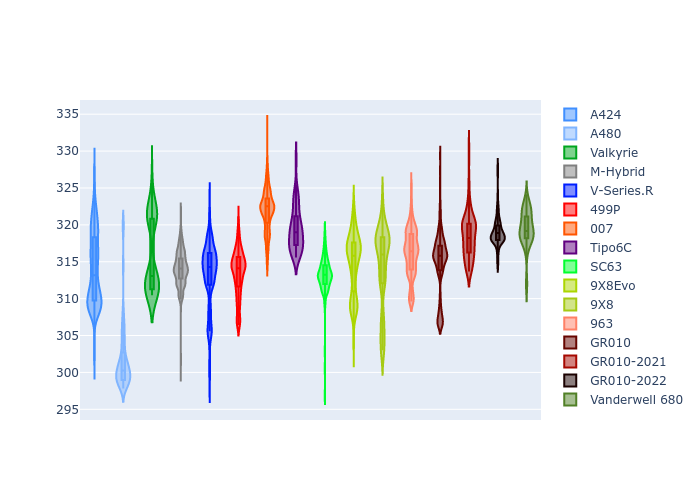
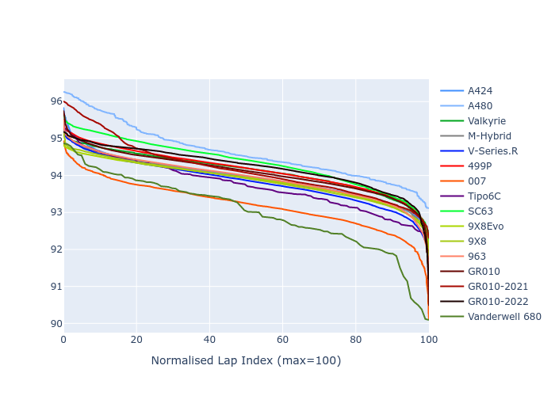

# Combined Plots

## Metadata

- BoP Accuracy: 97.61%
- Overall BoP Grade: A1
- Track: IMOLA
- Threshhold: 250.0kph
- Average Laptime: 1:33.93
- Average Quali Laptime: 1:30.53
- Laptime Std Dev: 0.38 seconds
- Filtered Average Topspeed: 315.37kph

## BoP Table
| Manufacturer     | Car            | Weight   | Power   | PINC   | E/Stint   | FDS    | RDP    | QDP    | TDP    |
|:-----------------|:---------------|:---------|:--------|:-------|:----------|:-------|:-------|:-------|:-------|
| Alpine           | A424           | 1046kg   | 511.0kw | +0.50% | 916MJ     | -      | 51.38% | 57.54% | 26.10% |
| Alpine           | A480           | 992kg    | 420.0kw | +0.10% | 776MJ     | -      | 54.81% | 80.56% | 55.69% |
| Aston Martin     | Valkyrie       | 1030kg   | 520.0kw | -      | 911MJ     | -      | 52.56% | 51.11% | 27.23% |
| BMW              | M-Hybrid       | 1040kg   | 513.0kw | -      | 911MJ     | -      | 52.62% | 53.36% | 32.99% |
| Cadillac         | V-Series.R     | 1037kg   | 519.0kw | -      | 909MJ     | -      | 48.29% | 59.47% | 18.65% |
| Ferrari          | 499P           | 1052kg   | 503.0kw | -0.60% | 899MJ     | 190kph | 51.25% | 43.28% | 10.17% |
| Glickenhaus      | 007            | 1003kg   | 533.0kw | -      | 918MJ     | -      | 46.15% | 49.30% | 41.45% |
| Isotta Fraschini | Tipo6C         | 1015kg   | 523.0kw | -      | 918MJ     | 190kph | 43.95% | 47.22% | 31.53% |
| Lamborghini      | SC63           | 1030kg   | 520.0kw | -1.60% | 907MJ     | -      | 48.33% | 60.95% | 28.65% |
| Peugeot          | 9X8Evo         | 1042kg   | 518.0kw | -      | 917MJ     | 190kph | 48.70% | 50.83% | 18.68% |
| Peugeot          | 9X8            | 1036kg   | 524.0kw | -      | 908MJ     | 150kph | 54.54% | 58.39% | 9.69%  |
| Porsche          | 963            | 1046kg   | 511.0kw | +0.60% | 909MJ     | -      | 50.57% | 42.80% | 29.05% |
| Toyota           | GR010          | 1061kg   | 502.0kw | +1.50% | 903MJ     | 190kph | 51.03% | 51.78% | 14.64% |
| Toyota           | GR010-2021     | 1045kg   | 509.0kw | +0.10% | 900MJ     | 150kph | 53.89% | 50.91% | 25.87% |
| Toyota           | GR010-2022     | 1050kg   | 503.0kw | +0.10% | 893MJ     | 190kph | 53.24% | 64.49% | 9.72%  |
| Vanwall          | Vanderwell 680 | 980kg    | 539.0kw | -      | 919MJ     | -      | 35.83% | 59.29% | 34.15% |

## Performance Table
| Manufacturer     | Car            | RP      | QP      | Vavg      |   RDLC | BOP-Grade   | Match   |
|:-----------------|:---------------|:--------|:--------|:----------|-------:|:------------|:--------|
| Alpine           | A424           | 1:33.94 | 1:30.29 | 313.26kph |   1.04 | ~A1         | 99.02%  |
| Alpine           | A480           | 1:34.56 | 1:31.93 | 301.81kph |   1.03 | +B2         | 82.75%  |
| Aston Martin     | Valkyrie       | 1:34.12 | 1:30.68 | 315.37kph |   1.04 | ~A1         | 100.00% |
| BMW              | M-Hybrid       | 1:33.92 | 1:29.98 | 313.39kph |   1.04 | ~A1         | 100.00% |
| Cadillac         | V-Series.R     | 1:33.83 | 1:29.86 | 312.66kph |   1.04 | ~A1         | 99.90%  |
| Ferrari          | 499P           | 1:34.16 | 1:29.94 | 314.88kph |   1.05 | ~A1         | 100.00% |
| Glickenhaus      | 007            | 1:33.21 | 1:30.46 | 321.97kph |   1.03 | ~A1         | 98.87%  |
| Isotta Fraschini | Tipo6C         | 1:33.71 | 1:31.84 | 319.43kph |   1.02 | ~A1         | 100.00% |
| Lamborghini      | SC63           | 1:34.34 | 1:31.09 | 313.28kph |   1.04 | ~A1         | 98.94%  |
| Peugeot          | 9X8Evo         | 1:33.88 | 1:30.16 | 316.52kph |   1.04 | ~A1         | 100.00% |
| Peugeot          | 9X8            | 1:33.87 | 1:30.51 | 314.49kph |   1.04 | ~A1         | 99.94%  |
| Porsche          | 963            | 1:33.94 | 1:29.96 | 315.49kph |   1.04 | ~A1         | 99.90%  |
| Toyota           | GR010          | 1:34.09 | 1:29.86 | 316.10kph |   1.05 | ~A1         | 99.34%  |
| Toyota           | GR010-2021     | 1:34.05 | 1:30.32 | 318.54kph |   1.04 | +A2         | 91.18%  |
| Toyota           | GR010-2022     | 1:34.23 | 1:31.77 | 319.05kph |   1.03 | ~A1         | 99.70%  |
| Vanwall          | Vanderwell 680 | 1:32.95 | 1:29.78 | 319.60kph |   1.04 | -A2         | 92.16%  |

## Race Laptimes

## Quali Laptimes

## Topspeeds

## Laptimes Lineplot

