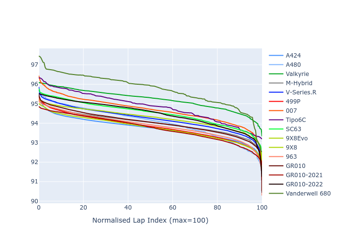

# Combined Plots

## Metadata

- BoP Accuracy: 93.33%
- Overall BoP Grade: A2
- Track: IMOLA
- Threshhold: 210.0kph

## BoP Table
| Manufacturer     | Car            | Weight   | Power   | PINC   | E/Stint   | FDS    |
|:-----------------|:---------------|:---------|:--------|:-------|:----------|:-------|
| Alpine           | A424           | 1047kg   | 520.0kw | -      | 922MJ     | -      |
| Alpine           | A480           | 1052kg   | 432.0kw | -      | 766MJ     | -      |
| Aston Martin     | Valkyrie       | 1042kg   | 504.0kw | +0.40% | 899MJ     | -      |
| BMW              | M-Hybrid       | 1041kg   | 512.0kw | -      | 910MJ     | -      |
| Cadillac         | V-Series.R     | 1034kg   | 510.0kw | -      | 901MJ     | -      |
| Ferrari          | 499P           | 1063kg   | 508.0kw | -      | 906MJ     | 190kph |
| Glickenhaus      | 007            | 1030kg   | 520.0kw | -      | 910MJ     | -      |
| Isotta Fraschini | Tipo6C         | 1059kg   | 520.0kw | -      | 920MJ     | 190kph |
| Lamborghini      | SC63           | 1042kg   | 519.0kw | -      | 912MJ     | -      |
| Peugeot          | 9X8Evo         | 1050kg   | 510.0kw | -      | 910MJ     | 190kph |
| Peugeot          | 9X8            | 1030kg   | 520.0kw | -      | 904MJ     | 150kph |
| Porsche          | 963            | 1047kg   | 516.0kw | -      | 912MJ     | -      |
| Toyota           | GR010          | 1080kg   | 512.0kw | -      | 910MJ     | 190kph |
| Toyota           | GR010OLD       | 1065kg   | 513.0kw | -      | 960MJ     | 150kph |
| Vanwall          | Vanderwell 680 | 1030kg   | 520.0kw | -      | 903MJ     | -      |

## Performance Table
| Manufacturer     | Car            | RP      | QP      | Vavg      |   RDLC | BOP-Grade   | Match   |
|:-----------------|:---------------|:--------|:--------|:----------|-------:|:------------|:--------|
| Alpine           | A424           | 1:33.43 | 1:29.28 | 312.88kph |   1.05 | ~A1         | 97.39%  |
| Alpine           | A480           | 1:34.38 | 1:31.10 | 301.32kph |   1.04 | ~A1         | 95.97%  |
| Aston Martin     | Valkyrie       | 1:35.10 | 1:30.18 | 309.21kph |   1.05 | ~A1         | 96.39%  |
| BMW              | M-Hybrid       | 1:33.89 | 1:29.41 | 310.66kph |   1.05 | ~A1         | 99.49%  |
| Cadillac         | V-Series.R     | 1:34.17 | 1:29.74 | 307.53kph |   1.05 | ~A1         | 99.96%  |
| Ferrari          | 499P           | 1:34.04 | 1:29.48 | 311.23kph |   1.05 | ~A1         | 99.74%  |
| Glickenhaus      | 007            | 1:34.33 | 1:30.79 | 309.49kph |   1.04 | ~A1         | 97.68%  |
| Isotta Fraschini | Tipo6C         | 1:35.40 | 1:32.68 | 309.28kph |   1.03 | +B2         | 80.60%  |
| Lamborghini      | SC63           | 1:34.55 | 1:30.78 | 310.90kph |   1.04 | ~A1         | 98.55%  |
| Peugeot          | 9X8Evo         | 1:34.49 | 1:29.98 | 312.32kph |   1.05 | ~A1         | 98.08%  |
| Peugeot          | 9X8            | 1:34.17 | 1:30.01 | 305.57kph |   1.05 | ~A1         | 99.96%  |
| Porsche          | 963            | 1:33.73 | 1:29.32 | 311.07kph |   1.05 | ~A1         | 99.43%  |
| Toyota           | GR010          | 1:34.20 | 1:29.54 | 310.86kph |   1.05 | ~A1         | 99.93%  |
| Toyota           | GR010OLD       | 1:33.36 | 1:29.86 | 306.80kph |   1.04 | ~A1         | 96.57%  |
| Vanwall          | Vanderwell 680 | 1:36.14 | 1:31.31 | 303.40kph |   1.05 | +Ω1         | 40.18%  |

## Race Laptimes

## Quali Laptimes

## Topspeeds

## Laptimes Lineplot

