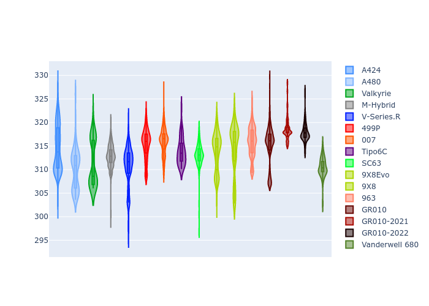

# Combined Plots

## Metadata

- BoP Accuracy: 93.93%
- Overall BoP Grade: A2
- Track: IMOLA
- Threshhold: 210.0kph
- Average Laptime: 1:34.31
- Average Quali Laptime: 1:30.80
- Average Topspeed: 314.03kph

## BoP Table
| Manufacturer     | Car            | Weight   | Power   | PINC   | E/Stint   | FDS    | RDP    | QDP    | TDP    |
|:-----------------|:---------------|:---------|:--------|:-------|:----------|:-------|:-------|:-------|:-------|
| Alpine           | A424           | 1047kg   | 520.0kw | -      | 923MJ     | -      | 51.64% | 59.31% | 26.80% |
| Alpine           | A480           | 952kg    | 432.0kw | -      | 766MJ     | -      | 53.05% | 74.07% | 48.97% |
| Aston Martin     | Valkyrie       | 1042kg   | 504.0kw | +0.40% | 899MJ     | -      | 53.50% | 53.33% | 21.51% |
| BMW              | M-Hybrid       | 1041kg   | 512.0kw | -      | 910MJ     | -      | 52.89% | 56.22% | 33.41% |
| Cadillac         | V-Series.R     | 1034kg   | 510.0kw | -      | 901MJ     | -      | 48.63% | 60.80% | 19.01% |
| Ferrari          | 499P           | 1063kg   | 508.0kw | -      | 907MJ     | 190kph | 51.38% | 44.98% | 9.83%  |
| Glickenhaus      | 007            | 1030kg   | 520.0kw | -      | 910MJ     | -      | 46.15% | 49.30% | 41.45% |
| Isotta Fraschini | Tipo6C         | 1059kg   | 520.0kw | -      | 920MJ     | 190kph | 43.95% | 47.22% | 31.53% |
| Lamborghini      | SC63           | 1042kg   | 519.0kw | -      | 912MJ     | -      | 48.33% | 60.95% | 28.65% |
| Peugeot          | 9X8Evo         | 1050kg   | 510.0kw | -      | 910MJ     | 190kph | 48.87% | 52.78% | 15.41% |
| Peugeot          | 9X8            | 1030kg   | 520.0kw | -      | 904MJ     | 150kph | 54.54% | 58.39% | 9.69%  |
| Porsche          | 963            | 1047kg   | 516.0kw | -      | 912MJ     | -      | 50.70% | 44.30% | 29.51% |
| Toyota           | GR010          | 1080kg   | 512.0kw | -      | 910MJ     | 190kph | 51.09% | 52.71% | 11.46% |
| Toyota           | GR010-2021     | 1065kg   | 513.0kw | -      | 906MJ     | 150kph | 54.08% | 54.81% | 9.72%  |
| Toyota           | GR010-2022     | 1080kg   | 512.0kw | -      | 904MJ     | 190kph | 53.45% | 68.83% | 9.58%  |
| Vanwall          | Vanderwell 680 | 1030kg   | 520.0kw | -      | 908MJ     | -      | 49.68% | 60.93% | 34.43% |

## Performance Table
| Manufacturer     | Car            | RP      | QP      | Vavg      |   RDLC | BOP-Grade   | Match   |
|:-----------------|:---------------|:--------|:--------|:----------|-------:|:------------|:--------|
| Alpine           | A424           | 1:33.73 | 1:29.94 | 314.62kph |   1.04 | ~A1         | 99.94%  |
| Alpine           | A480           | 1:34.03 | 1:31.45 | 310.16kph |   1.03 | ~A1         | 99.73%  |
| Aston Martin     | Valkyrie       | 1:35.22 | 1:30.91 | 311.42kph |   1.05 | +B2         | 81.32%  |
| BMW              | M-Hybrid       | 1:34.01 | 1:29.88 | 312.90kph |   1.05 | ~A1         | 100.00% |
| Cadillac         | V-Series.R     | 1:34.22 | 1:30.12 | 310.65kph |   1.05 | ~A1         | 99.75%  |
| Ferrari          | 499P           | 1:33.81 | 1:29.66 | 315.35kph |   1.05 | ~A1         | 99.85%  |
| Glickenhaus      | 007            | 1:34.68 | 1:31.84 | 316.04kph |   1.03 | -A2         | 94.86%  |
| Isotta Fraschini | Tipo6C         | 1:34.82 | 1:32.85 | 313.90kph |   1.02 | +B1         | 86.57%  |
| Lamborghini      | SC63           | 1:34.51 | 1:31.22 | 313.18kph |   1.04 | ~A1         | 99.62%  |
| Peugeot          | 9X8Evo         | 1:34.27 | 1:30.33 | 313.86kph |   1.04 | ~A1         | 100.00% |
| Peugeot          | 9X8            | 1:33.75 | 1:30.43 | 314.28kph |   1.04 | ~A1         | 99.92%  |
| Porsche          | 963            | 1:33.88 | 1:30.09 | 315.88kph |   1.04 | ~A1         | 99.70%  |
| Toyota           | GR010          | 1:34.03 | 1:29.75 | 315.20kph |   1.05 | ~A1         | 99.74%  |
| Toyota           | GR010-2021     | 1:33.74 | 1:30.30 | 318.68kph |   1.04 | ~A1         | 100.00% |
| Toyota           | GR010-2022     | 1:34.48 | 1:31.93 | 317.92kph |   1.03 | ~A1         | 99.75%  |
| Vanwall          | Vanderwell 680 | 1:35.74 | 1:32.04 | 310.47kph |   1.04 | +Ω1         | 42.18%  |

## Race Laptimes

## Quali Laptimes

## Topspeeds

## Laptimes Lineplot

