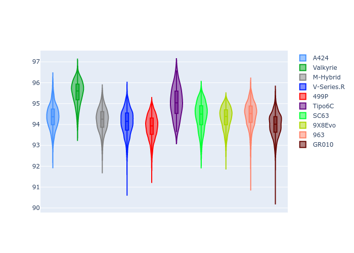
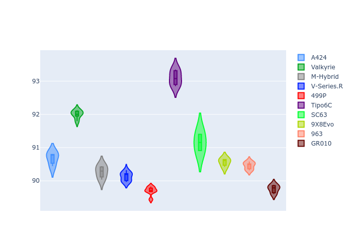
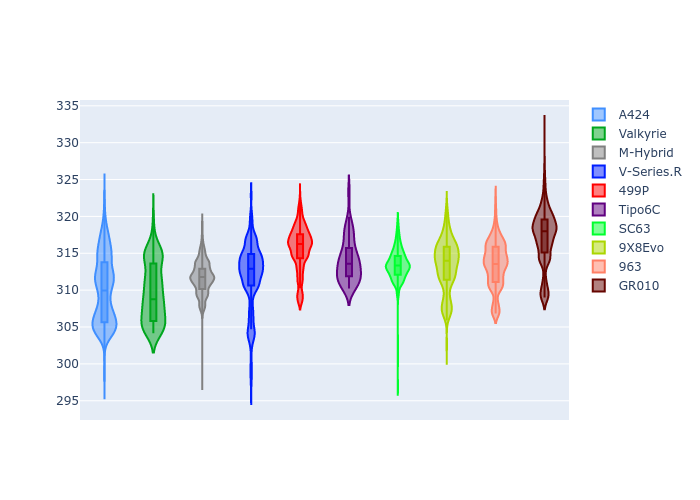
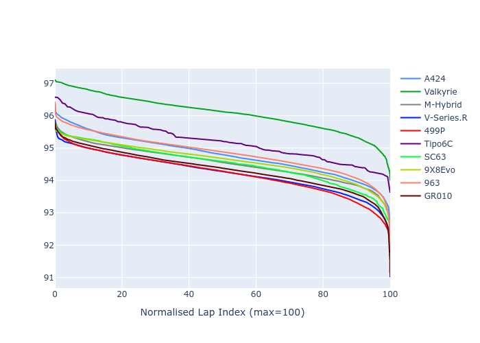

# Combined Plots

## Metadata

- BoP Accuracy: 94.02%
- Overall BoP Grade: A2
- Track: IMOLA
- Threshhold: 250.0kph
- Average Laptime: 1:34.73
- Average Quali Laptime: 1:31.02
- Laptime Std Dev: 0.53 seconds
- Filtered Average Topspeed: 312.90kph

## BoP Table
| Manufacturer     | Car        | Weight   | Power   | PINC   | E/Stint   | FDS    | RDP    | QDP    | TDP    |
|:-----------------|:-----------|:---------|:--------|:-------|:----------|:-------|:-------|:-------|:-------|
| Alpine           | A424       | 1042kg   | 519.0kw | -5.40% | 907MJ     | -      | 52.20% | 54.51% | 24.58% |
| Aston Martin     | Valkyrie   | 1051kg   | 505.0kw | -      | 900MJ     | -      | 53.39% | 54.11% | 23.71% |
| BMW              | M-Hybrid   | 1042kg   | 513.0kw | -1.60% | 907MJ     | -      | 53.47% | 52.95% | 33.73% |
| Cadillac         | V-Series.R | 1041kg   | 510.0kw | +2.00% | 907MJ     | -      | 49.22% | 60.31% | 18.04% |
| Ferrari          | 499P       | 1045kg   | 508.0kw | -1.80% | 900MJ     | 190kph | 51.56% | 44.72% | 9.86%  |
| Isotta Fraschini | Tipo6C     | 1058kg   | 520.0kw | -      | 920MJ     | 190kph | 43.95% | 47.22% | 31.53% |
| Lamborghini      | SC63       | 1034kg   | 516.0kw | -      | 908MJ     | -      | 48.25% | 60.95% | 28.65% |
| Peugeot          | 9X8Evo     | 1030kg   | 520.0kw | -5.40% | 903MJ     | 190kph | 50.17% | 49.36% | 17.73% |
| Porsche          | 963        | 1053kg   | 503.0kw | +1.20% | 904MJ     | -      | 50.78% | 41.25% | 27.61% |
| Toyota           | GR010      | 1065kg   | 500.0kw | +3.60% | 907MJ     | 190kph | 51.68% | 51.25% | 14.48% |

## Performance Table
| Manufacturer     | Car        | RP      | QP      | Vavg      |   RDLC | BOP-Grade   | Match   |
|:-----------------|:-----------|:--------|:--------|:----------|-------:|:------------|:--------|
| Alpine           | A424       | 1:34.78 | 1:30.94 | 309.80kph |   1.04 | ~A1         | 99.70%  |
| Aston Martin     | Valkyrie   | 1:36.08 | 1:32.16 | 307.84kph |   1.04 | +Ω1         | 49.45%  |
| BMW              | M-Hybrid   | 1:34.53 | 1:30.48 | 311.68kph |   1.04 | ~A1         | 99.98%  |
| Cadillac         | V-Series.R | 1:34.24 | 1:30.22 | 312.37kph |   1.04 | ~A1         | 99.85%  |
| Ferrari          | 499P       | 1:34.21 | 1:30.15 | 315.80kph |   1.05 | ~A1         | 99.90%  |
| Isotta Fraschini | Tipo6C     | 1:35.21 | 1:33.22 | 314.01kph |   1.02 | +A2         | 91.79%  |
| Lamborghini      | SC63       | 1:34.51 | 1:31.29 | 313.40kph |   1.04 | ~A1         | 100.00% |
| Peugeot          | 9X8Evo     | 1:34.61 | 1:30.74 | 313.03kph |   1.04 | ~A1         | 100.00% |
| Porsche          | 963        | 1:34.83 | 1:30.85 | 313.65kph |   1.04 | ~A1         | 99.84%  |
| Toyota           | GR010      | 1:34.34 | 1:30.16 | 317.41kph |   1.05 | ~A1         | 99.69%  |

## Race Laptimes

## Quali Laptimes

## Topspeeds

## Laptimes Lineplot

