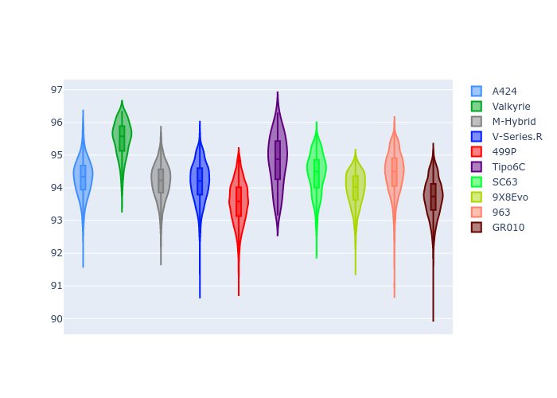
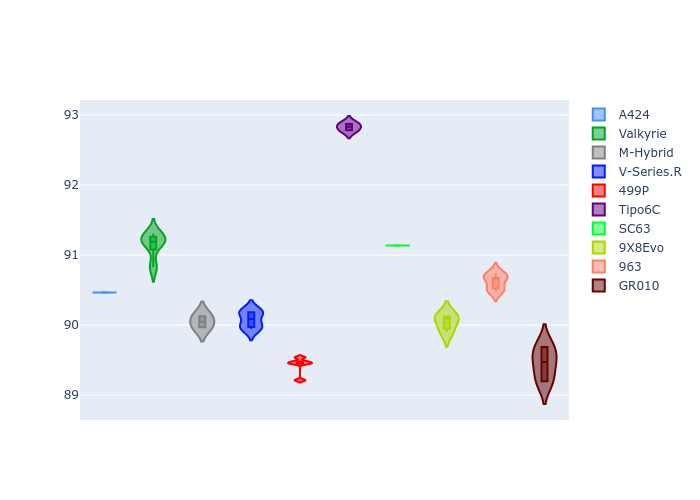
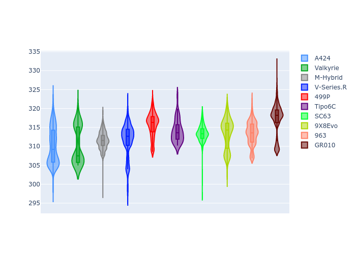
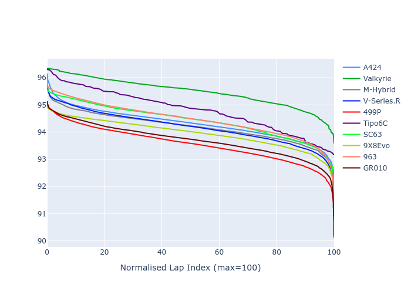

# Combined Plots

## Metadata

- BoP Accuracy: 94.63%
- Overall BoP Grade: A2
- Track: IMOLA
- Threshhold: 250.0kph
- Average Laptime: 1:34.30
- Average Quali Laptime: 1:30.53
- Average Topspeed: 313.07kph

## BoP Table
| Manufacturer     | Car        | Weight   | Power   | PINC   | E/Stint   | FDS    | RDP    | QDP    | TDP    |
|:-----------------|:-----------|:---------|:--------|:-------|:----------|:-------|:-------|:-------|:-------|
| Alpine           | A424       | 1042kg   | 519.0kw | -5.40% | 907MJ     | -      | 51.64% | 59.31% | 26.80% |
| Aston Martin     | Valkyrie   | 1051kg   | 505.0kw | -      | 900MJ     | -      | 53.50% | 53.33% | 21.51% |
| BMW              | M-Hybrid   | 1042kg   | 513.0kw | -1.60% | 907MJ     | -      | 52.89% | 56.22% | 33.41% |
| Cadillac         | V-Series.R | 1041kg   | 510.0kw | +2.00% | 907MJ     | -      | 48.63% | 60.80% | 19.01% |
| Ferrari          | 499P       | 1045kg   | 508.0kw | -1.80% | 900MJ     | 190kph | 51.38% | 44.98% | 9.83%  |
| Isotta Fraschini | Tipo6C     | 1058kg   | 520.0kw | -      | 920MJ     | 190kph | 43.95% | 47.22% | 31.53% |
| Lamborghini      | SC63       | 1034kg   | 516.0kw | -      | 908MJ     | -      | 48.33% | 60.95% | 28.65% |
| Peugeot          | 9X8Evo     | 1030kg   | 520.0kw | -5.40% | 903MJ     | 190kph | 48.87% | 52.78% | 15.41% |
| Porsche          | 963        | 1053kg   | 503.0kw | +1.20% | 904MJ     | -      | 50.70% | 44.30% | 29.51% |
| Toyota           | GR010      | 1065kg   | 500.0kw | +3.60% | 907MJ     | 190kph | 51.09% | 52.71% | 11.46% |

## Performance Table
| Manufacturer     | Car        | RP      | QP      | Vavg      |   RDLC | BOP-Grade   | Match   |
|:-----------------|:-----------|:--------|:--------|:----------|-------:|:------------|:--------|
| Alpine           | A424       | 1:34.29 | 1:30.47 | 310.06kph |   1.04 | ~A1         | 98.93%  |
| Aston Martin     | Valkyrie   | 1:35.48 | 1:31.15 | 310.32kph |   1.05 | +D2         | 62.32%  |
| BMW              | M-Hybrid   | 1:34.19 | 1:30.05 | 311.59kph |   1.05 | ~A1         | 100.00% |
| Cadillac         | V-Series.R | 1:34.17 | 1:30.08 | 311.64kph |   1.05 | ~A1         | 99.79%  |
| Ferrari          | 499P       | 1:33.55 | 1:29.43 | 315.68kph |   1.05 | ~A1         | 99.42%  |
| Isotta Fraschini | Tipo6C     | 1:34.79 | 1:32.83 | 314.01kph |   1.02 | +B1         | 86.57%  |
| Lamborghini      | SC63       | 1:34.42 | 1:31.13 | 313.40kph |   1.04 | ~A1         | 100.00% |
| Peugeot          | 9X8Evo     | 1:33.95 | 1:30.04 | 313.35kph |   1.04 | ~A1         | 99.93%  |
| Porsche          | 963        | 1:34.45 | 1:30.62 | 313.39kph |   1.04 | ~A1         | 99.70%  |
| Toyota           | GR010      | 1:33.71 | 1:29.45 | 317.27kph |   1.05 | ~A1         | 99.62%  |

## Race Laptimes

## Quali Laptimes

## Topspeeds

## Laptimes Lineplot

