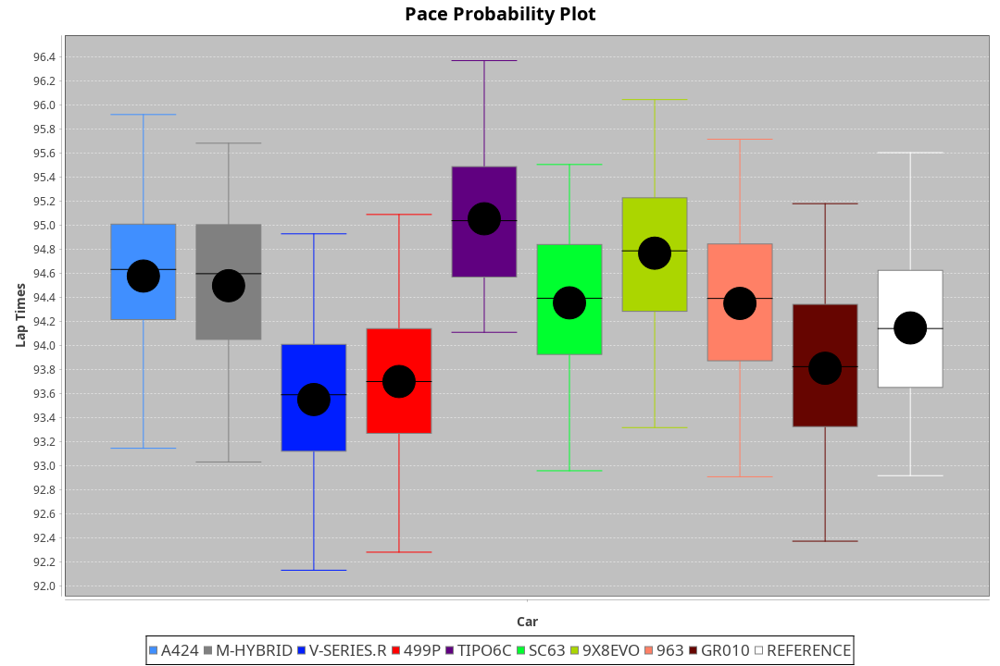
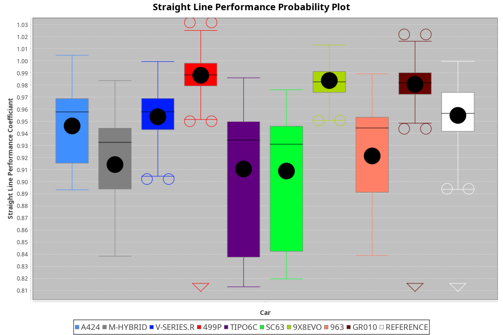
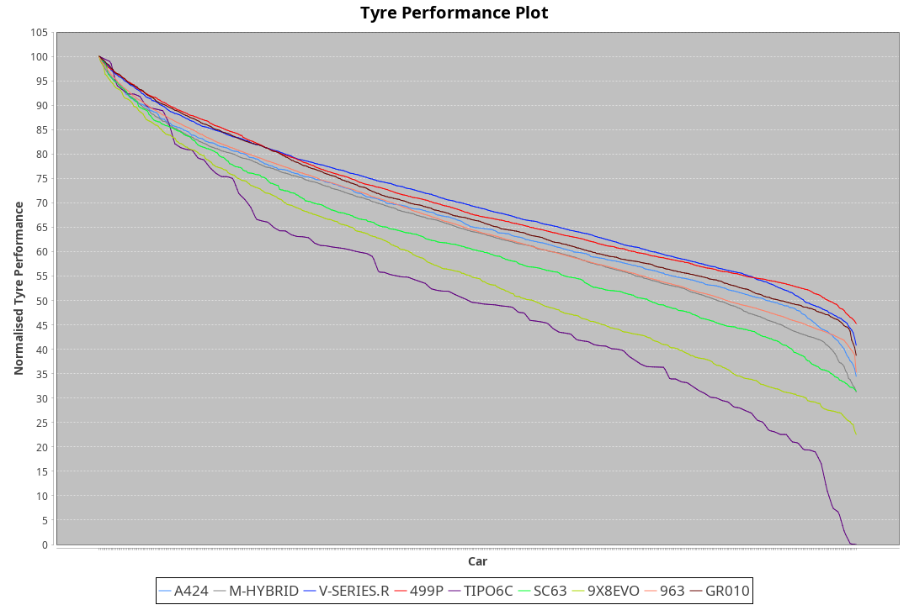

| Manufacturer     | Car        | Weight | Power   | PINC    | E/Stint | FDS     |
|:-|:-|:-|:-|:-|:-|:-|
| Alpine           | A424       | 1042kg | 514.0kw |    -    | 909MJ   |    -    |
| BMW              | M-Hybrid   | 1035kg | 511.0kw |    -    | 905MJ   |    -    |
| Cadillac         | V-Series.R | 1030kg | 517.0kw |    -    | 908MJ   |    -    |
| Ferrari          | 499P       | 1041kg | 510.0kw |    -    | 904MJ   | 190kph  |
| Isotta Fraschini | Tipo6C     | 1058kg | 520.0kw |    -    | 920MJ   | 190kph  |
| Lamborghini      | SC63       | 1034kg | 516.0kw |    -    | 908MJ   |    -    |
| Peugeot          | 9X8Evo     | 1061kg | 510.0kw |    -    | 906MJ   | 190kph  |
| Porsche          | 963        | 1033kg | 508.0kw |    -    | 901MJ   |    -    |
| Toyota           | GR010      | 1060kg | 516.0kw |    -    | 916MJ   | 190kph  |

### BoP Accuracy: 72.44%; Overall BoP Grade: C2
| Manufacturer     | Car        | Type  | RP      | QP      | Weight | Power¹  | Threshhold | PINC    | Power²   | E/Stint | AVG Vmax  | FDS     | RDLC | L/Stint | BOP-Grade | Model Accuracy | Model Points | Match%  | SimDiff |
|:-|:-|:-|:-|:-|:-|:-|:-|:-|:-|:-|:-|:-|:-|:-|:-|:-|:-|:-|:-|
| Alpine           | A424       | LMDH  | 1:34.24 | 1:30.20 | 1042kg | 514.0kw | 0.0kph     |    -    | 514.00kw |  909MJ  | 299.30kph |    -    | 1.04 | 37      | ~A1       | 99.37%         | 2056         | 97.71%  | #       |
| BMW              | M-Hybrid   | LMDH  | 1:34.29 | 1:29.88 | 1035kg | 511.0kw | 0.0kph     |    -    | 511.00kw |  905MJ  | 301.98kph |    -    | 1.04 | 37      | ~A1       | 99.20%         | 3081         | 100.00% | #       |
| Cadillac         | V-Series.R | LMDH  | 1:33.61 | 1:29.39 | 1030kg | 517.0kw | 0.0kph     |    -    | 517.00kw |  908MJ  | 305.43kph |    -    | 1.05 | 37      | -D2       | 99.22%         | 5358         | 63.74%  | #       |
| Ferrari          | 499P       | LMHHU | 1:33.57 | 1:29.15 | 1041kg | 510.0kw | 0.0kph     |    -    | 510.00kw |  904MJ  | 303.57kph | 190kph  | 1.06 | 37      | -D2       | 99.93%         | 6954         | 61.37%  | #       |
| Isotta Fraschini | Tipo6C     | LMHHU | 1:35.40 | 1:32.74 | 1058kg | 520.0kw | 0.0kph     |    -    | 520.00kw |  920MJ  | 298.06kph | 190kph  | 1.07 | 37      | +Ω1       | 97.73%         | 129          | 14.45%  | +0.29   |
| Lamborghini      | SC63       | LMDH  | 1:34.53 | 1:31.14 | 1034kg | 516.0kw | 0.0kph     |    -    | 516.00kw |  908MJ  | 298.60kph |    -    | 1.07 | 37      | +A2       | 100.00%        | 784          | 90.13%  | +0.01   |
| Peugeot          | 9X8Evo     | LMHHU | 1:35.03 | 1:30.89 | 1061kg | 510.0kw | 0.0kph     |    -    | 510.00kw |  906MJ  | 311.06kph | 190kph  | 1.00 | 37      | +E1       | 100.00%        | 1458         | 58.08%  | +0.44   |
| Porsche          | 963        | LMDH  | 1:34.18 | 1:29.85 | 1033kg | 508.0kw | 0.0kph     |    -    | 508.00kw |  901MJ  | 301.05kph |    -    | 1.05 | 37      | -A2       | 99.87%         | 14199        | 94.57%  | #       |
| Toyota           | GR010      | LMHHU | 1:33.77 | 1:29.15 | 1060kg | 516.0kw | 0.0kph     |    -    | 516.00kw |  916MJ  | 299.90kph | 190kph  | 1.05 | 37      | -C2       | 99.92%         | 5012         | 71.90%  | #       |

## Power below Threshhold
| N/Nmax    | A424    | M-HYBRID | V-SERIES.R | 499P    | TIPO6C  | SC63    | 9X8EVO  | 963     | GR010   |
|:-|:-|:-|:-|:-|:-|:-|:-|:-|:-|
|  0.550    |  253    |  252     |  255       |  251    |  256    |  254    |  251    |  250    |  254    |
|  0.575    |  276    |  275     |  278       |  274    |  279    |  277    |  274    |  273    |  277    |
|  0.600    |  297    |  295     |  298       |  295    |  300    |  298    |  295    |  293    |  298    |
|  0.625    |  318    |  316     |  320       |  316    |  322    |  319    |  316    |  314    |  319    |
|  0.650    |  339    |  337     |  341       |  337    |  343    |  340    |  337    |  335    |  340    |
|  0.675    |  361    |  359     |  363       |  358    |  365    |  362    |  358    |  357    |  362    |
|  0.700    |  383    |  380     |  385       |  380    |  387    |  384    |  380    |  378    |  384    |
|  0.725    |  404    |  402     |  407       |  401    |  409    |  406    |  401    |  399    |  406    |
|  0.750    |  425    |  422     |  427       |  422    |  430    |  427    |  422    |  420    |  427    |
|  0.775    |  444    |  441     |  446       |  441    |  449    |  446    |  441    |  439    |  446    |
|  0.800    |  462    |  459     |  464       |  458    |  467    |  463    |  458    |  456    |  463    |
|  0.825    |  477    |  474     |  479       |  473    |  482    |  478    |  473    |  471    |  478    |
|  0.850    |  488    |  485     |  491       |  485    |  494    |  490    |  485    |  483    |  490    |
|  0.875    |  499    |  496     |  502       |  495    |  505    |  501    |  495    |  493    |  501    |
|  0.900    |  506    |  503     |  509       |  502    |  512    |  508    |  502    |  500    |  508    |
|  0.925    |  511    |  508     |  514       |  507    |  517    |  513    |  507    |  505    |  513    |
| **0.950** | **514** | **511**  | **517**    | **510** | **520** | **516** | **510** | **508** | **516** |
|  0.975    |  512    |  509     |  515       |  508    |  518    |  514    |  508    |  506    |  514    |
|  1.000    |  508    |  505     |  511       |  505    |  514    |  510    |  505    |  503    |  510    |
|  1.025    |  439    |  436     |  441       |  436    |  444    |  441    |  436    |  434    |  441    |

## Power above Threshhold
| N/Nmax    | A424    | M-HYBRID | V-SERIES.R | 499P    | TIPO6C  | SC63    | 9X8EVO  | 963     | GR010   |
|:-|:-|:-|:-|:-|:-|:-|:-|:-|:-|
|  0.550    |  253    |  252     |  255       |  251    |  256    |  254    |  251    |  250    |  254    |
|  0.575    |  276    |  275     |  278       |  274    |  279    |  277    |  274    |  273    |  277    |
|  0.600    |  297    |  295     |  298       |  295    |  300    |  298    |  295    |  293    |  298    |
|  0.625    |  318    |  316     |  320       |  316    |  322    |  319    |  316    |  314    |  319    |
|  0.650    |  339    |  337     |  341       |  337    |  343    |  340    |  337    |  335    |  340    |
|  0.675    |  361    |  359     |  363       |  358    |  365    |  362    |  358    |  357    |  362    |
|  0.700    |  383    |  380     |  385       |  380    |  387    |  384    |  380    |  378    |  384    |
|  0.725    |  404    |  402     |  407       |  401    |  409    |  406    |  401    |  399    |  406    |
|  0.750    |  425    |  422     |  427       |  422    |  430    |  427    |  422    |  420    |  427    |
|  0.775    |  444    |  441     |  446       |  441    |  449    |  446    |  441    |  439    |  446    |
|  0.800    |  462    |  459     |  464       |  458    |  467    |  463    |  458    |  456    |  463    |
|  0.825    |  477    |  474     |  479       |  473    |  482    |  478    |  473    |  471    |  478    |
|  0.850    |  488    |  485     |  491       |  485    |  494    |  490    |  485    |  483    |  490    |
|  0.875    |  499    |  496     |  502       |  495    |  505    |  501    |  495    |  493    |  501    |
|  0.900    |  506    |  503     |  509       |  502    |  512    |  508    |  502    |  500    |  508    |
|  0.925    |  511    |  508     |  514       |  507    |  517    |  513    |  507    |  505    |  513    |
| **0.950** | **514** | **511**  | **517**    | **510** | **520** | **516** | **510** | **508** | **516** |
|  0.975    |  512    |  509     |  515       |  508    |  518    |  514    |  508    |  506    |  514    |
|  1.000    |  508    |  505     |  511       |  505    |  514    |  510    |  505    |  503    |  510    |
|  1.025    |  439    |  436     |  441       |  436    |  444    |  441    |  436    |  434    |  441    |
