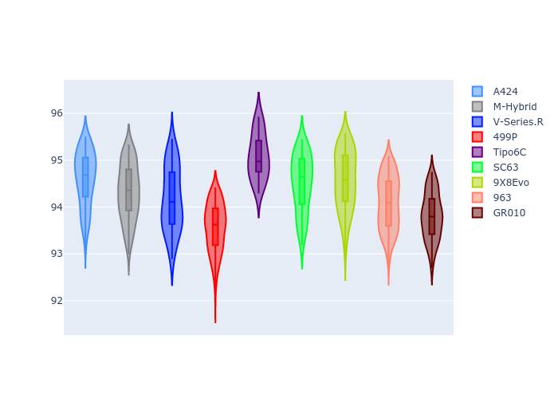
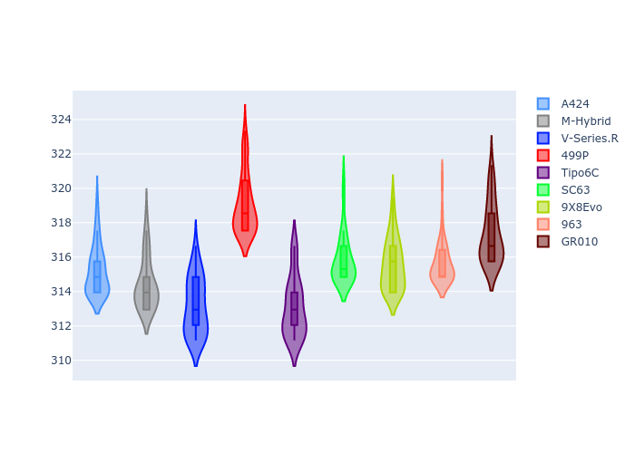
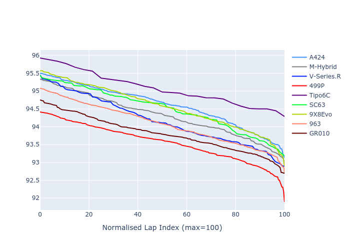

# Combined Plots

## Metadata

- BoP Accuracy: 88.73%
- Overall BoP Grade: B1
- Track: IMOLA
- Threshhold: 0.0kph

## BoP Table
| Manufacturer     | Car        | Weight   | Power   | PINC   | E/Stint   | FDS    |
|:-----------------|:-----------|:---------|:--------|:-------|:----------|:-------|
| Alpine           | A424       | 1042kg   | 514.0kw | -      | 909MJ     | -      |
| BMW              | M-Hybrid   | 1035kg   | 511.0kw | -      | 905MJ     | -      |
| Cadillac         | V-Series.R | 1030kg   | 517.0kw | -      | 908MJ     | -      |
| Ferrari          | 499P       | 1041kg   | 510.0kw | -      | 904MJ     | 190kph |
| Isotta Fraschini | Tipo6C     | 1058kg   | 520.0kw | -      | 920MJ     | 190kph |
| Lamborghini      | SC63       | 1034kg   | 516.0kw | -      | 908MJ     | -      |
| Peugeot          | 9X8Evo     | 1061kg   | 510.0kw | -      | 906MJ     | 190kph |
| Porsche          | 963        | 1033kg   | 508.0kw | -      | 901MJ     | -      |
| Toyota           | GR010      | 1060kg   | 516.0kw | -      | 916MJ     | 190kph |

## Performance Table
| Manufacturer     | Car        | RP      | QP      | Vavg      |   RDLC | BOP-Grade   | Match   |
|:-----------------|:-----------|:--------|:--------|:----------|-------:|:------------|:--------|
| Alpine           | A424       | 1:34.53 | 1:32.27 | 315.30kph |   1.02 | +B1         | 87.57%  |
| BMW              | M-Hybrid   | 1:34.24 | 1:31.12 | 314.53kph |   1.03 | ~A1         | 96.98%  |
| Cadillac         | V-Series.R | 1:34.10 | 1:31.77 | 313.24kph |   1.03 | -A2         | 93.52%  |
| Ferrari          | 499P       | 1:33.48 | 1:29.91 | 319.18kph |   1.04 | -B2         | 84.97%  |
| Isotta Fraschini | Tipo6C     | 1:35.01 | 1:33.92 | 313.17kph |   1.01 | +D1         | 65.52%  |
| Lamborghini      | SC63       | 1:34.42 | 1:32.33 | 315.95kph |   1.02 | +B1         | 89.91%  |
| Peugeot          | 9X8Evo     | 1:34.48 | 1:32.18 | 315.66kph |   1.02 | -B1         | 85.86%  |
| Porsche          | 963        | 1:34.01 | 1:30.59 | 315.77kph |   1.04 | ~A1         | 98.24%  |
| Toyota           | GR010      | 1:33.73 | 1:30.76 | 317.43kph |   1.03 | ~A1         | 95.98%  |

## Race Laptimes

## Quali Laptimes

## Topspeeds

## Laptimes Lineplot

