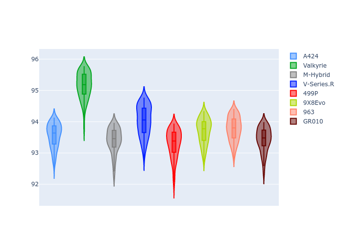
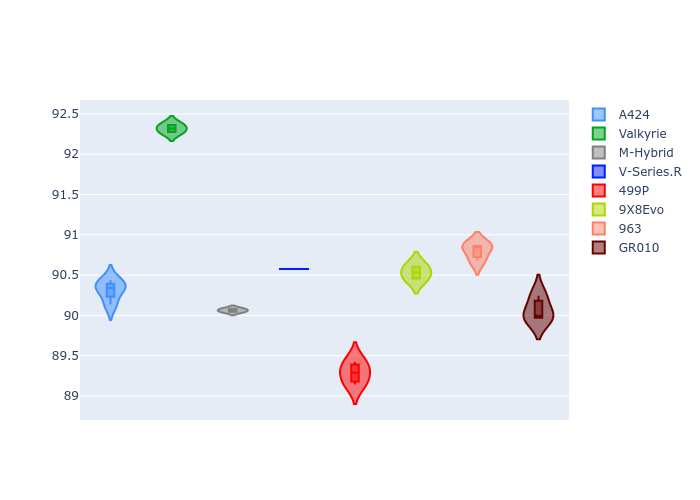
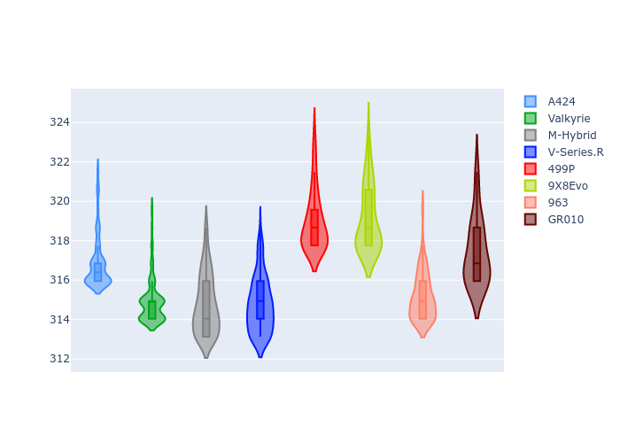
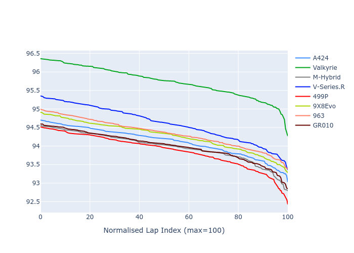

# Combined Plots

## Metadata

- BoP Accuracy: 82.31%
- Overall BoP Grade: B2
- Track: IMOLA
- Threshhold: 250.0kph

## BoP Table
| Manufacturer   | Car        | Weight   | Power   | PINC   | E/Stint   | FDS    | RDP    | QDP    | TDP    |
|:---------------|:-----------|:---------|:--------|:-------|:----------|:-------|:-------|:-------|:-------|
| Alpine         | A424       | 1042kg   | 519.0kw | -5.40% | 907MJ     | -      | 50.24% | 66.67% | 11.49% |
| Aston Martin   | Valkyrie   | 1051kg   | 505.0kw | -      | 900MJ     | -      | 53.85% | 66.67% | 18.16% |
| BMW            | M-Hybrid   | 1042kg   | 513.0kw | -1.60% | 907MJ     | -      | 50.24% | 18.18% | 45.69% |
| Cadillac       | V-Series.R | 1041kg   | 510.0kw | +2.00% | 907MJ     | -      | 48.82% | 25.00% | 34.93% |
| Ferrari        | 499P       | 1045kg   | 508.0kw | -1.80% | 900MJ     | 190kph | 47.24% | 60.00% | 6.77%  |
| Peugeot        | 9X8Evo     | 1030kg   | 520.0kw | -5.40% | 903MJ     | 190kph | 50.94% | 40.00% | 10.63% |
| Porsche        | 963        | 1053kg   | 503.0kw | +1.20% | 904MJ     | -      | 51.26% | 50.00% | 19.00% |
| Toyota         | GR010      | 1065kg   | 500.0kw | +3.60% | 907MJ     | 190kph | 50.00% | 42.86% | 4.49%  |

## Performance Table
| Manufacturer   | Car        | RP      | QP      | Vavg      |   RDLC | BOP-Grade   | Match   |
|:---------------|:-----------|:--------|:--------|:----------|-------:|:------------|:--------|
| Alpine         | A424       | 1:33.56 | 1:29.62 | 312.98kph |   1.04 | ~A1         | 99.53%  |
| Aston Martin   | Valkyrie   | 1:35.16 | 1:31.52 | 311.03kph |   1.04 | +Ω1         | 3.57%   |
| BMW            | M-Hybrid   | 1:33.40 | 1:29.31 | 310.90kph |   1.05 | -A2         | 94.37%  |
| Cadillac       | V-Series.R | 1:34.03 | 1:29.76 | 310.88kph |   1.05 | +C2         | 72.33%  |
| Ferrari        | 499P       | 1:33.30 | 1:28.56 | 315.04kph |   1.05 | -A2         | 92.00%  |
| Peugeot        | 9X8Evo     | 1:33.70 | 1:29.81 | 315.18kph |   1.04 | ~A1         | 100.00% |
| Porsche        | 963        | 1:33.77 | 1:30.12 | 311.28kph |   1.04 | ~A1         | 100.00% |
| Toyota         | GR010      | 1:33.43 | 1:29.39 | 313.48kph |   1.05 | ~A1         | 96.70%  |

## Race Laptimes

## Quali Laptimes

## Topspeeds

## Laptimes Lineplot

