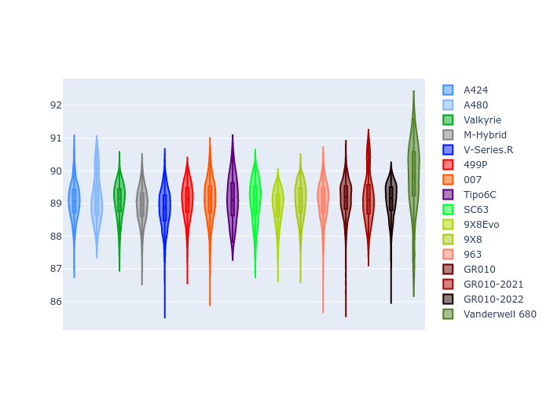
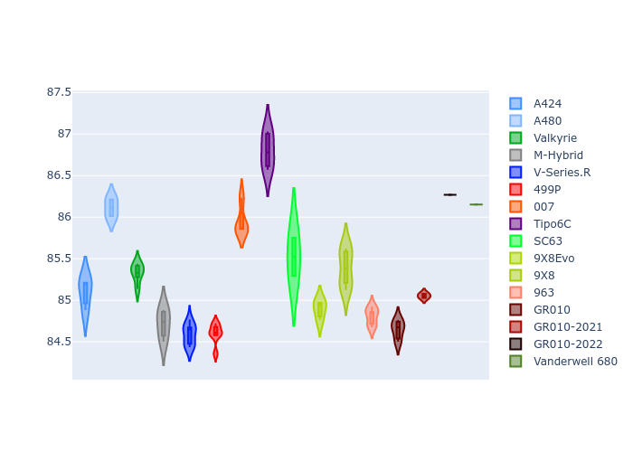
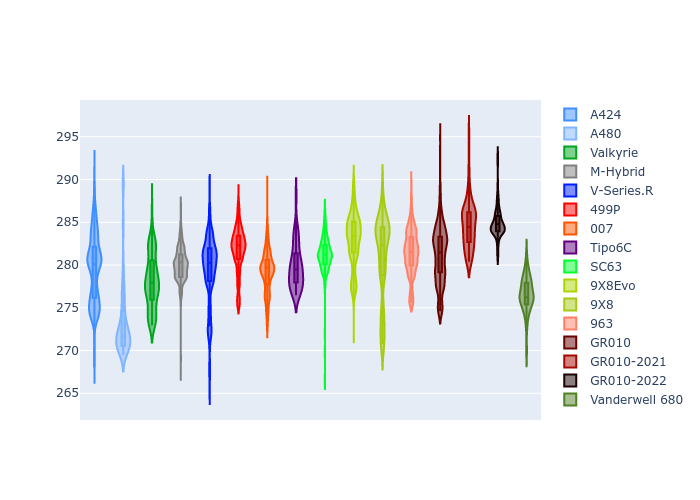
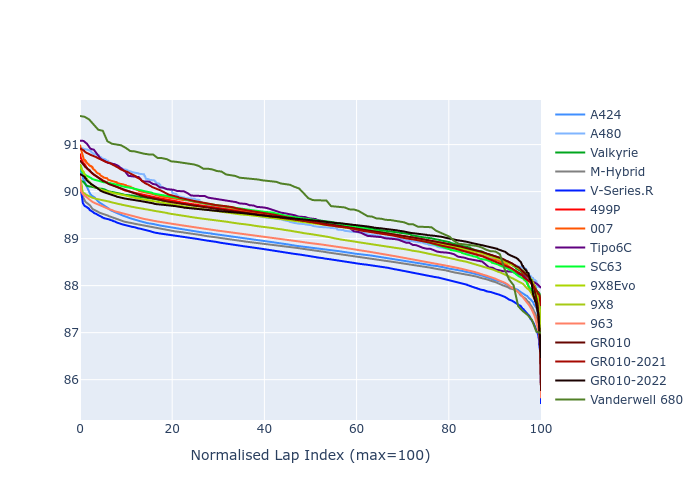

# Combined Plots

## Metadata

- BoP Accuracy: 97.44%
- Overall BoP Grade: A1
- Track: INTERLAGOS
- Threshhold: 250.0kph
- Average Laptime: 1:29.09
- Average Quali Laptime: 1:25.37
- Laptime Std Dev: 0.19 seconds
- Filtered Average Topspeed: 281.32kph

## BoP Table
| Manufacturer     | Car            | Weight   | Power   | PINC   | E/Stint   | FDS    | RDP    | QDP    | TDP    |
|:-----------------|:---------------|:---------|:--------|:-------|:----------|:-------|:-------|:-------|:-------|
| Alpine           | A424           | 1066kg   | 511.0kw | +0.10% | 912MJ     | -      | 51.38% | 57.54% | 26.10% |
| Alpine           | A480           | 988kg    | 422.0kw | +0.10% | 777MJ     | -      | 54.81% | 80.56% | 55.69% |
| Aston Martin     | Valkyrie       | 1039kg   | 515.0kw | -      | 907MJ     | -      | 52.56% | 51.11% | 27.23% |
| BMW              | M-Hybrid       | 1060kg   | 513.0kw | +0.10% | 911MJ     | -      | 52.62% | 53.36% | 32.99% |
| Cadillac         | V-Series.R     | 1057kg   | 519.0kw | -      | 913MJ     | -      | 48.29% | 59.47% | 18.65% |
| Ferrari          | 499P           | 1070kg   | 503.0kw | +0.10% | 902MJ     | 190kph | 51.25% | 43.28% | 10.17% |
| Glickenhaus      | 007            | 1031kg   | 520.0kw | -      | 910MJ     | -      | 46.15% | 49.30% | 41.45% |
| Isotta Fraschini | Tipo6C         | 1038kg   | 517.0kw | -      | 912MJ     | 190kph | 43.95% | 47.22% | 31.53% |
| Lamborghini      | SC63           | 1034kg   | 512.0kw | -      | 905MJ     | -      | 48.33% | 60.95% | 28.65% |
| Peugeot          | 9X8Evo         | 1062kg   | 518.0kw | -0.10% | 917MJ     | 190kph | 48.70% | 50.83% | 18.68% |
| Peugeot          | 9X8            | 1033kg   | 509.0kw | -      | 895MJ     | 150kph | 54.54% | 58.39% | 9.69%  |
| Porsche          | 963            | 1066kg   | 511.0kw | +0.10% | 909MJ     | -      | 50.57% | 42.80% | 29.05% |
| Toyota           | GR010          | 1071kg   | 502.0kw | +0.10% | 903MJ     | 190kph | 51.03% | 51.78% | 14.64% |
| Toyota           | GR010-2021     | 1063kg   | 509.0kw | -0.10% | 902MJ     | 150kph | 53.89% | 50.91% | 25.87% |
| Toyota           | GR010-2022     | 1060kg   | 503.0kw | -0.10% | 894MJ     | 190kph | 53.24% | 64.49% | 9.72%  |
| Vanwall          | Vanderwell 680 | 1030kg   | 520.0kw | -      | 908MJ     | -      | 35.83% | 59.29% | 34.15% |

## Performance Table
| Manufacturer     | Car            | RP      | QP      | Vavg      |   RDLC | BOP-Grade   | Match   |
|:-----------------|:---------------|:--------|:--------|:----------|-------:|:------------|:--------|
| Alpine           | A424           | 1:29.06 | 1:25.10 | 279.60kph |   1.05 | ~A1         | 99.23%  |
| Alpine           | A480           | 1:29.08 | 1:26.11 | 272.41kph |   1.03 | ~A1         | 96.00%  |
| Aston Martin     | Valkyrie       | 1:29.08 | 1:25.33 | 281.87kph |   1.04 | ~A1         | 100.00% |
| BMW              | M-Hybrid       | 1:28.94 | 1:24.72 | 280.11kph |   1.05 | ~A1         | 100.00% |
| Cadillac         | V-Series.R     | 1:28.84 | 1:24.59 | 279.37kph |   1.05 | ~A1         | 99.85%  |
| Ferrari          | 499P           | 1:29.08 | 1:24.60 | 282.13kph |   1.05 | ~A1         | 99.97%  |
| Glickenhaus      | 007            | 1:29.09 | 1:25.95 | 284.25kph |   1.04 | ~A1         | 99.17%  |
| Isotta Fraschini | Tipo6C         | 1:29.09 | 1:26.80 | 283.89kph |   1.03 | ~A1         | 98.51%  |
| Lamborghini      | SC63           | 1:29.08 | 1:25.52 | 281.18kph |   1.04 | ~A1         | 100.00% |
| Peugeot          | 9X8Evo         | 1:28.92 | 1:24.89 | 282.75kph |   1.05 | ~A1         | 100.00% |
| Peugeot          | 9X8            | 1:29.08 | 1:25.39 | 280.29kph |   1.04 | ~A1         | 100.00% |
| Porsche          | 963            | 1:29.08 | 1:24.81 | 281.52kph |   1.05 | ~A1         | 99.89%  |
| Toyota           | GR010          | 1:29.16 | 1:24.65 | 282.32kph |   1.05 | ~A1         | 99.45%  |
| Toyota           | GR010-2021     | 1:29.09 | 1:25.05 | 284.67kph |   1.05 | +A2         | 93.82%  |
| Toyota           | GR010-2022     | 1:29.09 | 1:26.27 | 285.91kph |   1.03 | ~A1         | 99.55%  |
| Vanwall          | Vanderwell 680 | 1:29.75 | 1:26.15 | 278.77kph |   1.04 | +C2         | 73.53%  |

## Race Laptimes

## Quali Laptimes

## Topspeeds

## Laptimes Lineplot

