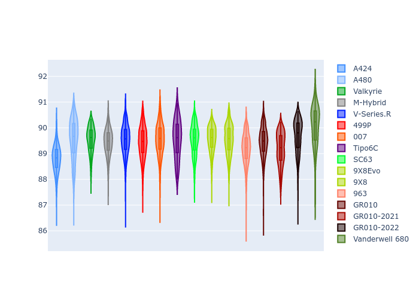
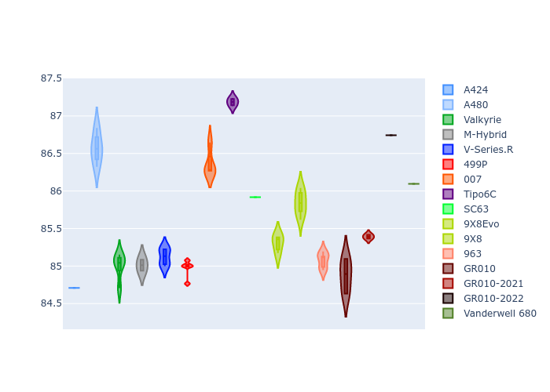
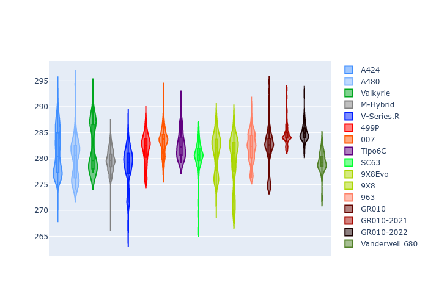

# Combined Plots

## Metadata

- BoP Accuracy: 92.01%
- Overall BoP Grade: A2
- Track: INTERLAGOS
- Threshhold: 210.0kph

## BoP Table
| Manufacturer     | Car            | Weight   | Power   | PINC   | E/Stint   | FDS    |
|:-----------------|:---------------|:---------|:--------|:-------|:----------|:-------|
| Alpine           | A424           | 1067kg   | 520.0kw | -1.00% | 917MJ     | -      |
| Alpine           | A480           | 1052kg   | 432.0kw | +1.00% | 768MJ     | -      |
| Aston Martin     | Valkyrie       | 1040kg   | 504.0kw | +0.40% | 899MJ     | -      |
| BMW              | M-Hybrid       | 1061kg   | 512.0kw | -1.00% | 908MJ     | -      |
| Cadillac         | V-Series.R     | 1054kg   | 510.0kw | +1.00% | 906MJ     | -      |
| Ferrari          | 499P           | 1083kg   | 508.0kw | -1.00% | 905MJ     | 190kph |
| Glickenhaus      | 007            | 1050kg   | 520.0kw | -      | 912MJ     | -      |
| Isotta Fraschini | Tipo6C         | 1079kg   | 520.0kw | -      | 919MJ     | 190kph |
| Lamborghini      | SC63           | 1062kg   | 519.0kw | -1.00% | 912MJ     | -      |
| Peugeot          | 9X8Evo         | 1066kg   | 510.0kw | -1.00% | 909MJ     | 190kph |
| Peugeot          | 9X8            | 1050kg   | 520.0kw | -      | 906MJ     | 150kph |
| Porsche          | 963            | 1067kg   | 516.0kw | -1.00% | 911MJ     | -      |
| Toyota           | GR010          | 1100kg   | 512.0kw | -1.00% | 913MJ     | 190kph |
| Toyota           | GR010OLD       | 1085kg   | 513.0kw | +1.00% | 964MJ     | 150kph |
| Vanwall          | Vanderwell 680 | 1030kg   | 520.0kw | -      | 903MJ     | -      |

## Performance Table
| Manufacturer     | Car            | RP      | QP      | Vavg      |   RDLC | BOP-Grade   | Match   |
|:-----------------|:---------------|:--------|:--------|:----------|-------:|:------------|:--------|
| Alpine           | A424           | 1:26.09 | 1:22.97 | 278.84kph |   1.04 | ~A1         | 95.47%  |
| Alpine           | A480           | 1:27.56 | 1:25.23 | 271.82kph |   1.03 | -B1         | 88.30%  |
| Aston Martin     | Valkyrie       | 1:28.22 | 1:24.36 | 278.40kph |   1.05 | +B2         | 80.56%  |
| BMW              | M-Hybrid       | 1:27.04 | 1:23.58 | 276.85kph |   1.04 | ~A1         | 99.96%  |
| Cadillac         | V-Series.R     | 1:27.02 | 1:23.64 | 275.50kph |   1.04 | ~A1         | 100.00% |
| Ferrari          | 499P           | 1:27.04 | 1:23.52 | 277.40kph |   1.04 | ~A1         | 99.98%  |
| Glickenhaus      | 007            | 1:26.99 | 1:24.45 | 276.53kph |   1.03 | ~A1         | 99.10%  |
| Isotta Fraschini | Tipo6C         | 1:27.48 | 1:25.73 | 276.39kph |   1.02 | ~A1         | 96.27%  |
| Lamborghini      | SC63           | 1:27.29 | 1:24.52 | 277.07kph |   1.03 | ~A1         | 98.55%  |
| Peugeot          | 9X8Evo         | 1:27.55 | 1:24.08 | 278.73kph |   1.04 | ~A1         | 95.02%  |
| Peugeot          | 9X8            | 1:26.87 | 1:23.75 | 273.02kph |   1.04 | ~A1         | 99.93%  |
| Porsche          | 963            | 1:26.56 | 1:23.20 | 277.23kph |   1.04 | ~A1         | 99.55%  |
| Toyota           | GR010          | 1:26.66 | 1:23.09 | 277.10kph |   1.04 | ~A1         | 99.46%  |
| Toyota           | GR010OLD       | 1:25.60 | 1:23.12 | 274.91kph |   1.03 | -B2         | 82.08%  |
| Vanwall          | Vanderwell 680 | 1:28.60 | 1:24.88 | 272.98kph |   1.04 | +Ω1         | 45.98%  |

## Race Laptimes

## Quali Laptimes

## Topspeeds

## Laptimes Lineplot

