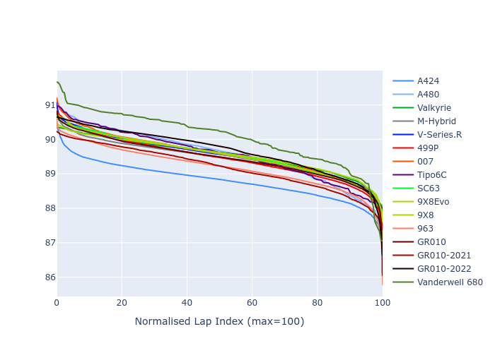

# Combined Plots

## Metadata

- BoP Accuracy: 98.62%
- Overall BoP Grade: A1
- Track: INTERLAGOS
- Threshhold: 250.0kph
- Average Laptime: 1:29.47
- Average Quali Laptime: 1:25.64
- Average Topspeed: 281.49kph

## BoP Table
| Manufacturer     | Car            | Weight   | Power   | PINC   | E/Stint   | FDS    | RDP    | QDP    | TDP    |
|:-----------------|:---------------|:---------|:--------|:-------|:----------|:-------|:-------|:-------|:-------|
| Alpine           | A424           | 1067kg   | 520.0kw | -      | 919MJ     | -      | 51.64% | 59.31% | 26.80% |
| Alpine           | A480           | 948kg    | 434.0kw | -      | 768MJ     | -      | 53.05% | 74.07% | 48.97% |
| Aston Martin     | Valkyrie       | 1037kg   | 513.0kw | -      | 905MJ     | -      | 53.50% | 53.33% | 21.51% |
| BMW              | M-Hybrid       | 1061kg   | 512.0kw | +0.10% | 910MJ     | -      | 52.89% | 56.22% | 33.41% |
| Cadillac         | V-Series.R     | 1046kg   | 510.0kw | +0.10% | 904MJ     | -      | 48.63% | 60.80% | 19.01% |
| Ferrari          | 499P           | 1083kg   | 508.0kw | +0.10% | 907MJ     | 190kph | 51.38% | 44.98% | 9.83%  |
| Glickenhaus      | 007            | 1031kg   | 515.0kw | -      | 905MJ     | -      | 46.15% | 49.30% | 41.45% |
| Isotta Fraschini | Tipo6C         | 1039kg   | 511.0kw | -      | 907MJ     | 190kph | 43.95% | 47.22% | 31.53% |
| Lamborghini      | SC63           | 1040kg   | 513.0kw | -      | 906MJ     | -      | 48.33% | 60.95% | 28.65% |
| Peugeot          | 9X8Evo         | 1063kg   | 510.0kw | +0.10% | 911MJ     | 190kph | 48.87% | 52.78% | 15.41% |
| Peugeot          | 9X8            | 1035kg   | 507.0kw | -      | 893MJ     | 150kph | 54.54% | 58.39% | 9.69%  |
| Porsche          | 963            | 1067kg   | 516.0kw | -0.10% | 913MJ     | -      | 50.70% | 44.30% | 29.51% |
| Toyota           | GR010          | 1100kg   | 512.0kw | +0.10% | 915MJ     | 190kph | 51.09% | 52.71% | 11.46% |
| Toyota           | GR010-2021     | 1085kg   | 513.0kw | -0.10% | 907MJ     | 150kph | 54.08% | 54.81% | 9.72%  |
| Toyota           | GR010-2022     | 1090kg   | 512.0kw | -0.10% | 905MJ     | 190kph | 53.45% | 68.83% | 9.58%  |
| Vanwall          | Vanderwell 680 | 1030kg   | 520.0kw | -      | 908MJ     | -      | 49.68% | 60.93% | 34.43% |

## Performance Table
| Manufacturer     | Car            | RP      | QP      | Vavg      |   RDLC | BOP-Grade   | Match   |
|:-----------------|:---------------|:--------|:--------|:----------|-------:|:------------|:--------|
| Alpine           | A424           | 1:28.79 | 1:24.71 | 281.14kph |   1.05 | ~A1         | 99.94%  |
| Alpine           | A480           | 1:29.54 | 1:26.57 | 279.95kph |   1.03 | ~A1         | 97.07%  |
| Aston Martin     | Valkyrie       | 1:29.54 | 1:25.00 | 282.17kph |   1.05 | ~A1         | 100.00% |
| BMW              | M-Hybrid       | 1:29.45 | 1:25.01 | 279.68kph |   1.05 | ~A1         | 99.91%  |
| Cadillac         | V-Series.R     | 1:29.53 | 1:25.12 | 278.42kph |   1.05 | ~A1         | 99.49%  |
| Ferrari          | 499P           | 1:29.44 | 1:24.97 | 281.90kph |   1.05 | ~A1         | 99.79%  |
| Glickenhaus      | 007            | 1:29.55 | 1:26.37 | 283.26kph |   1.04 | ~A1         | 98.04%  |
| Isotta Fraschini | Tipo6C         | 1:29.54 | 1:27.19 | 282.59kph |   1.03 | ~A1         | 97.76%  |
| Lamborghini      | SC63           | 1:29.54 | 1:25.92 | 280.79kph |   1.04 | ~A1         | 100.00% |
| Peugeot          | 9X8Evo         | 1:29.55 | 1:25.31 | 281.22kph |   1.05 | ~A1         | 100.00% |
| Peugeot          | 9X8            | 1:29.54 | 1:25.84 | 279.70kph |   1.04 | ~A1         | 100.00% |
| Porsche          | 963            | 1:29.19 | 1:25.08 | 282.19kph |   1.05 | ~A1         | 99.80%  |
| Toyota           | GR010          | 1:29.46 | 1:24.87 | 281.79kph |   1.05 | ~A1         | 99.69%  |
| Toyota           | GR010-2021     | 1:29.18 | 1:25.39 | 284.71kph |   1.04 | ~A1         | 100.00% |
| Toyota           | GR010-2022     | 1:29.67 | 1:26.74 | 285.00kph |   1.03 | ~A1         | 99.75%  |
| Vanwall          | Vanderwell 680 | 1:30.06 | 1:26.09 | 279.34kph |   1.05 | +B1         | 86.73%  |

## Race Laptimes

## Quali Laptimes

## Topspeeds

## Laptimes Lineplot

