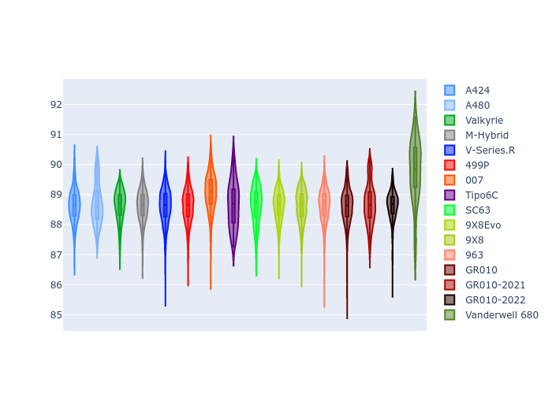
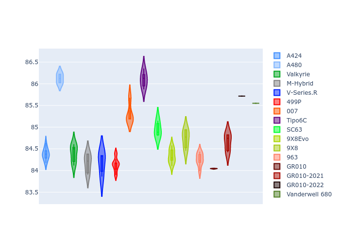
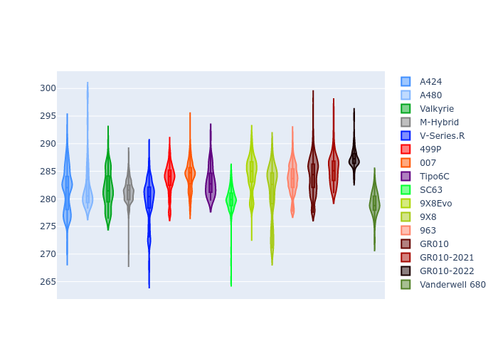
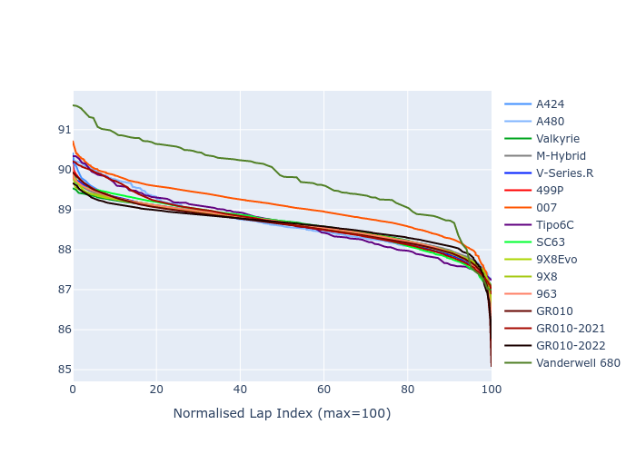

# Combined Plots

## Metadata

- BoP Accuracy: 97.36%
- Overall BoP Grade: A1
- Track: INTERLAGOS
- Threshhold: 0.0kph
- Average Laptime: 1:28.13
- Average Quali Laptime: 1:24.81
- Laptime Std Dev: 0.25 seconds
- Filtered Average Topspeed: 282.55kph

## BoP Table
| Manufacturer     | Car            | Weight   | Power   | PINC   | E/Stint   | FDS    | RDP    | QDP    | TDP    |
|:-----------------|:---------------|:---------|:--------|:-------|:----------|:-------|:-------|:-------|:-------|
| Alpine           | A424           | 1042kg   | 490.0kw | -      | 886MJ     | -      | 52.20% | 54.51% | 24.58% |
| Alpine           | A480           | 980kg    | 410.0kw | -      | 749MJ     | -      | 53.05% | 74.07% | 48.97% |
| Aston Martin     | Valkyrie       | 1045kg   | 520.0kw | -      | 921MJ     | -      | 53.39% | 54.11% | 23.71% |
| BMW              | M-Hybrid       | 1043kg   | 492.0kw | -      | 892MJ     | -      | 53.47% | 52.95% | 33.73% |
| Cadillac         | V-Series.R     | 1045kg   | 498.0kw | -      | 893MJ     | -      | 49.22% | 60.31% | 18.04% |
| Ferrari          | 499P           | 1063kg   | 481.0kw | -      | 908MJ     | 190kph | 51.56% | 44.72% | 9.86%  |
| Glickenhaus      | 007            | 1032kg   | 520.0kw | -      | 910MJ     | -      | 46.14% | 49.30% | 41.45% |
| Isotta Fraschini | Tipo6C         | 1053kg   | 520.0kw | -      | 916MJ     | 200kph | 43.95% | 47.22% | 31.53% |
| Lamborghini      | SC63           | 1065kg   | 520.0kw | -      | 915MJ     | -      | 48.25% | 60.95% | 28.65% |
| Peugeot          | 9X8Evo         | 1030kg   | 492.0kw | -      | 888MJ     | 200kph | 50.17% | 49.36% | 17.73% |
| Peugeot          | 9X8            | 1037kg   | 503.0kw | -      | 890MJ     | 150kph | 54.54% | 58.39% | 9.69%  |
| Porsche          | 963            | 1039kg   | 486.0kw | -      | 889MJ     | -      | 50.78% | 41.25% | 27.61% |
| Toyota           | GR010          | 1063kg   | 480.0kw | -      | 917MJ     | 190kph | 51.68% | 51.25% | 14.48% |
| Toyota           | GR010-2021     | 1068kg   | 480.0kw | -      | 876MJ     | 150kph | 54.04% | 54.81% | 9.72%  |
| Toyota           | GR010-2022     | 1057kg   | 483.0kw | -      | 876MJ     | 200kph | 53.24% | 64.49% | 9.72%  |
| Vanwall          | Vanderwell 680 | 1030kg   | 520.0kw | -      | 908MJ     | -      | 49.68% | 60.93% | 34.43% |

## Performance Table
| Manufacturer     | Car            | RP      | QP      | Vavg      |   RDLC | BOP-Grade   | Match   |
|:-----------------|:---------------|:--------|:--------|:----------|-------:|:------------|:--------|
| Alpine           | A424           | 1:28.06 | 1:24.38 | 280.70kph |   1.04 | ~A1         | 99.94%  |
| Alpine           | A480           | 1:28.07 | 1:26.12 | 274.29kph |   1.02 | ~A1         | 99.07%  |
| Aston Martin     | Valkyrie       | 1:28.06 | 1:24.39 | 283.95kph |   1.04 | ~A1         | 100.00% |
| BMW              | M-Hybrid       | 1:28.07 | 1:24.17 | 280.78kph |   1.05 | ~A1         | 100.00% |
| Cadillac         | V-Series.R     | 1:28.06 | 1:24.18 | 280.08kph |   1.05 | ~A1         | 99.86%  |
| Ferrari          | 499P           | 1:28.07 | 1:24.14 | 281.69kph |   1.05 | ~A1         | 99.88%  |
| Glickenhaus      | 007            | 1:28.07 | 1:25.31 | 287.64kph |   1.03 | ~A1         | 99.08%  |
| Isotta Fraschini | Tipo6C         | 1:28.06 | 1:26.10 | 286.48kph |   1.02 | ~A1         | 100.00% |
| Lamborghini      | SC63           | 1:28.07 | 1:24.94 | 283.18kph |   1.04 | ~A1         | 100.00% |
| Peugeot          | 9X8Evo         | 1:28.06 | 1:24.34 | 283.84kph |   1.04 | ~A1         | 100.00% |
| Peugeot          | 9X8            | 1:28.07 | 1:24.73 | 282.12kph |   1.04 | ~A1         | 100.00% |
| Porsche          | 963            | 1:28.06 | 1:24.25 | 282.54kph |   1.05 | ~A1         | 99.93%  |
| Toyota           | GR010          | 1:28.07 | 1:24.04 | 282.18kph |   1.05 | ~A1         | 99.83%  |
| Toyota           | GR010-2021     | 1:28.07 | 1:24.66 | 283.04kph |   1.04 | ~A1         | 100.00% |
| Toyota           | GR010-2022     | 1:28.06 | 1:25.72 | 285.57kph |   1.03 | ~A1         | 99.48%  |
| Vanwall          | Vanderwell 680 | 1:29.09 | 1:25.55 | 282.77kph |   1.04 | +D2         | 60.66%  |

## Race Laptimes

## Quali Laptimes

## Topspeeds

## Laptimes Lineplot

