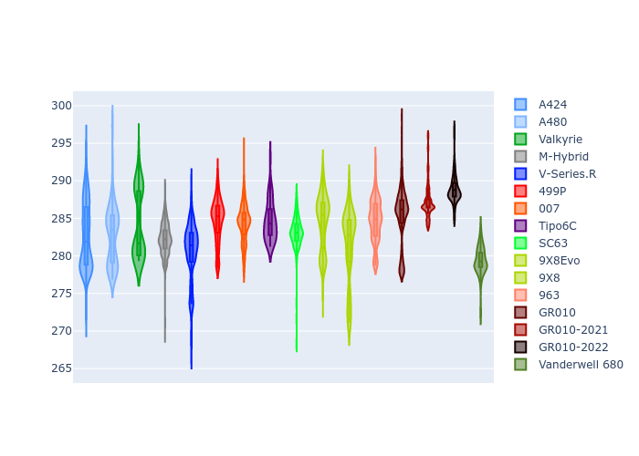
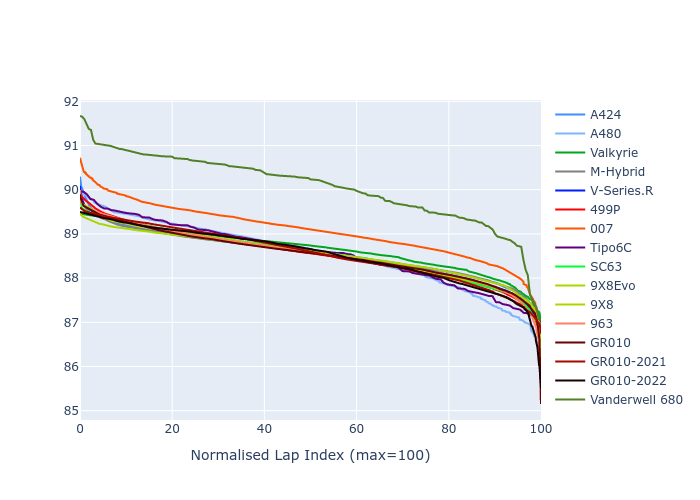

# Combined Plots

## Metadata

- BoP Accuracy: 95.77%
- Overall BoP Grade: A1
- Track: INTERLAGOS
- Threshhold: 0.0kph
- Average Laptime: 1:28.68
- Average Quali Laptime: 1:24.89
- Average Topspeed: 283.80kph

## BoP Table
| Manufacturer     | Car            | Weight   | Power   | PINC   | E/Stint   | FDS    | RDP    | QDP    | TDP    |
|:-----------------|:---------------|:---------|:--------|:-------|:----------|:-------|:-------|:-------|:-------|
| Alpine           | A424           | 1039kg   | 514.0kw | -      | 911MJ     | -      | 51.64% | 59.31% | 26.80% |
| Alpine           | A480           | 930kg    | 438.0kw | -      | 769MJ     | -      | 53.05% | 74.07% | 48.97% |
| Aston Martin     | Valkyrie       | 1030kg   | 520.0kw | -      | 911MJ     | -      | 53.50% | 53.33% | 21.51% |
| BMW              | M-Hybrid       | 1042kg   | 516.0kw | -      | 911MJ     | -      | 52.89% | 56.22% | 33.41% |
| Cadillac         | V-Series.R     | 1044kg   | 520.0kw | -      | 912MJ     | -      | 48.63% | 60.80% | 19.01% |
| Ferrari          | 499P           | 1059kg   | 511.0kw | -      | 907MJ     | 190kph | 51.38% | 44.98% | 9.83%  |
| Glickenhaus      | 007            | 1030kg   | 520.0kw | -      | 910MJ     | -      | 46.15% | 49.30% | 41.45% |
| Isotta Fraschini | Tipo6C         | 1036kg   | 520.0kw | -      | 914MJ     | 190kph | 43.95% | 47.22% | 31.53% |
| Lamborghini      | SC63           | 1030kg   | 520.0kw | -      | 912MJ     | -      | 48.33% | 60.95% | 28.65% |
| Peugeot          | 9X8Evo         | 1030kg   | 511.0kw | -      | 908MJ     | 190kph | 48.87% | 52.78% | 15.41% |
| Peugeot          | 9X8            | 1044kg   | 520.0kw | -      | 906MJ     | 150kph | 54.54% | 58.39% | 9.69%  |
| Porsche          | 963            | 1036kg   | 513.0kw | -      | 907MJ     | -      | 50.70% | 44.30% | 29.51% |
| Toyota           | GR010          | 1058kg   | 510.0kw | -      | 908MJ     | 190kph | 51.09% | 52.71% | 11.46% |
| Toyota           | GR010-2021     | 1056kg   | 511.0kw | -      | 903MJ     | 150kph | 54.08% | 54.81% | 9.72%  |
| Toyota           | GR010-2022     | 1053kg   | 513.0kw | -      | 902MJ     | 190kph | 53.45% | 68.83% | 9.58%  |
| Vanwall          | Vanderwell 680 | 1030kg   | 520.0kw | -      | 908MJ     | -      | 49.68% | 60.93% | 34.43% |

## Performance Table
| Manufacturer     | Car            | RP      | QP      | Vavg      |   RDLC | BOP-Grade   | Match   |
|:-----------------|:---------------|:--------|:--------|:----------|-------:|:------------|:--------|
| Alpine           | A424           | 1:28.55 | 1:24.48 | 282.67kph |   1.05 | ~A1         | 99.36%  |
| Alpine           | A480           | 1:28.53 | 1:25.61 | 282.84kph |   1.03 | ~A1         | 99.73%  |
| Aston Martin     | Valkyrie       | 1:28.66 | 1:24.19 | 284.25kph |   1.05 | ~A1         | 100.00% |
| BMW              | M-Hybrid       | 1:28.55 | 1:24.19 | 282.23kph |   1.05 | ~A1         | 100.00% |
| Cadillac         | V-Series.R     | 1:28.54 | 1:24.21 | 280.50kph |   1.05 | ~A1         | 99.86%  |
| Ferrari          | 499P           | 1:28.53 | 1:24.14 | 284.72kph |   1.05 | ~A1         | 99.95%  |
| Glickenhaus      | 007            | 1:29.06 | 1:25.91 | 284.35kph |   1.04 | -A2         | 94.00%  |
| Isotta Fraschini | Tipo6C         | 1:28.55 | 1:26.23 | 284.68kph |   1.03 | ~A1         | 100.00% |
| Lamborghini      | SC63           | 1:28.55 | 1:25.00 | 283.16kph |   1.04 | ~A1         | 100.00% |
| Peugeot          | 9X8Evo         | 1:28.54 | 1:24.37 | 284.57kph |   1.05 | ~A1         | 100.00% |
| Peugeot          | 9X8            | 1:28.55 | 1:24.91 | 281.39kph |   1.04 | ~A1         | 100.00% |
| Porsche          | 963            | 1:28.55 | 1:24.49 | 284.70kph |   1.05 | ~A1         | 99.85%  |
| Toyota           | GR010          | 1:28.54 | 1:24.03 | 285.31kph |   1.05 | ~A1         | 99.79%  |
| Toyota           | GR010-2021     | 1:28.55 | 1:24.80 | 287.20kph |   1.04 | ~A1         | 100.00% |
| Toyota           | GR010-2022     | 1:28.53 | 1:25.66 | 288.88kph |   1.03 | ~A1         | 99.49%  |
| Vanwall          | Vanderwell 680 | 1:30.06 | 1:26.09 | 279.34kph |   1.05 | +Ω1         | 40.28%  |

## Race Laptimes

## Quali Laptimes

## Topspeeds

## Laptimes Lineplot

