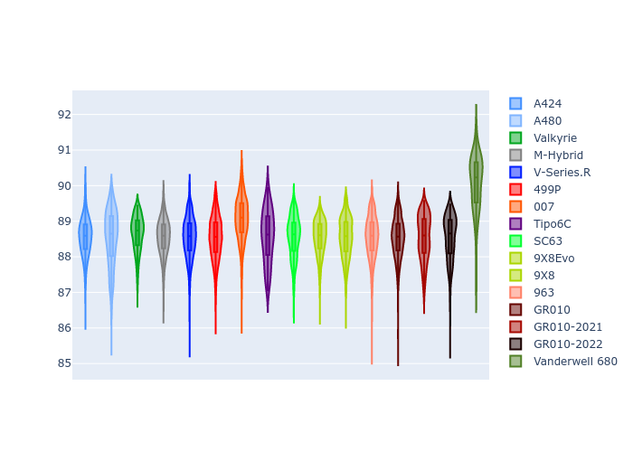

# Combined Plots

## Metadata

- BoP Accuracy: 97.86%
- Overall BoP Grade: A1
- Track: INTERLAGOS
- Threshhold: 0.0kph

## BoP Table
| Manufacturer     | Car            | Weight   | Power   | PINC   | E/Stint   | FDS    |
|:-----------------|:---------------|:---------|:--------|:-------|:----------|:-------|
| Alpine           | A424           | 1058kg   | 504.0kw | -      | 904MJ     | -      |
| Alpine           | A480           | 1030kg   | 434.0kw | -      | 766MJ     | -      |
| Aston Martin     | Valkyrie       | 1052kg   | 511.0kw | -      | 905MJ     | -      |
| BMW              | M-Hybrid       | 1073kg   | 505.0kw | -      | 905MJ     | -      |
| Cadillac         | V-Series.R     | 1092kg   | 508.0kw | -      | 907MJ     | -      |
| Ferrari          | 499P           | 1064kg   | 501.0kw | -      | 899MJ     | 190kph |
| Glickenhaus      | 007            | 1073kg   | 515.0kw | -      | 910MJ     | -      |
| Isotta Fraschini | Tipo6C         | 1100kg   | 520.0kw | -      | 921MJ     | 190kph |
| Lamborghini      | SC63           | 1100kg   | 515.0kw | -      | 914MJ     | -      |
| Peugeot          | 9X8Evo         | 1096kg   | 508.0kw | -      | 912MJ     | 190kph |
| Peugeot          | 9X8            | 1059kg   | 514.0kw | -      | 902MJ     | 150kph |
| Porsche          | 963            | 1100kg   | 505.0kw | -      | 907MJ     | -      |
| Toyota           | GR010          | 1094kg   | 502.0kw | -      | 905MJ     | 190kph |
| Toyota           | GR010OLD       | 1093kg   | 498.0kw | -      | 949MJ     | 150kph |
| Vanwall          | Vanderwell 680 | 1030kg   | 520.0kw | -      | 903MJ     | -      |

## Performance Table
| Manufacturer     | Car            | RP      | QP      | Vavg      |   RDLC | BOP-Grade   | Match   |
|:-----------------|:---------------|:--------|:--------|:----------|-------:|:------------|:--------|
| Alpine           | A424           | 1:27.56 | 1:24.34 | 277.29kph |   1.04 | ~A1         | 99.88%  |
| Alpine           | A480           | 1:27.56 | 1:25.23 | 273.87kph |   1.03 | ~A1         | 97.43%  |
| Aston Martin     | Valkyrie       | 1:27.56 | 1:23.75 | 278.32kph |   1.05 | ~A1         | 100.00% |
| BMW              | M-Hybrid       | 1:27.56 | 1:24.06 | 275.08kph |   1.04 | ~A1         | 100.00% |
| Cadillac         | V-Series.R     | 1:27.56 | 1:24.14 | 270.89kph |   1.04 | ~A1         | 100.00% |
| Ferrari          | 499P           | 1:27.56 | 1:24.00 | 278.52kph |   1.04 | ~A1         | 99.98%  |
| Glickenhaus      | 007            | 1:27.56 | 1:24.98 | 273.41kph |   1.03 | ~A1         | 98.19%  |
| Isotta Fraschini | Tipo6C         | 1:27.54 | 1:25.78 | 274.46kph |   1.02 | ~A1         | 100.00% |
| Lamborghini      | SC63           | 1:27.54 | 1:24.76 | 273.52kph |   1.03 | ~A1         | 99.88%  |
| Peugeot          | 9X8Evo         | 1:27.56 | 1:24.08 | 276.28kph |   1.04 | ~A1         | 99.62%  |
| Peugeot          | 9X8            | 1:27.56 | 1:24.39 | 271.04kph |   1.04 | ~A1         | 99.96%  |
| Porsche          | 963            | 1:27.55 | 1:24.11 | 272.78kph |   1.04 | ~A1         | 99.90%  |
| Toyota           | GR010          | 1:27.50 | 1:23.87 | 276.41kph |   1.04 | ~A1         | 99.97%  |
| Toyota           | GR010OLD       | 1:27.53 | 1:24.95 | 270.53kph |   1.03 | ~A1         | 100.00% |
| Vanwall          | Vanderwell 680 | 1:28.60 | 1:24.88 | 272.98kph |   1.04 | +C2         | 73.07%  |

## Race Laptimes

## Quali Laptimes

## Topspeeds

## Laptimes Lineplot

