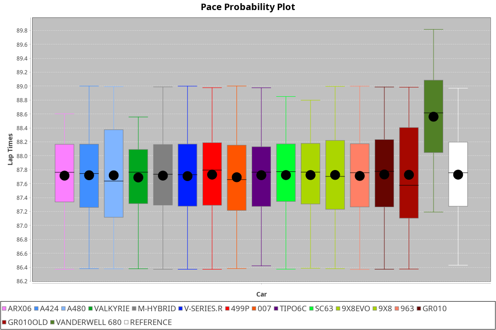
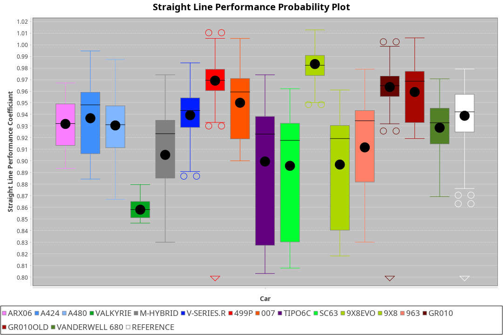
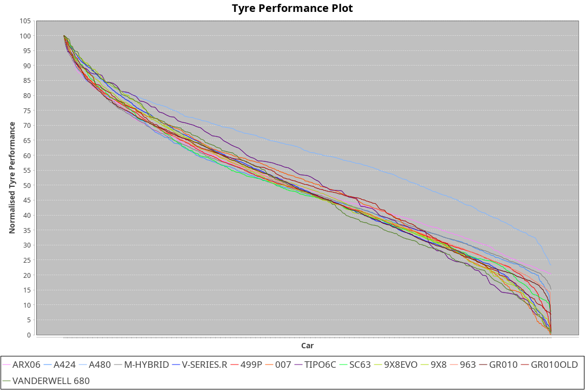

| Manufacturer     | Car            | Weight | Power   | PINC    | E/Stint | FDS     |
|:-|:-|:-|:-|:-|:-|:-|
| Acura            | ARX06          | 1069kg | 480.0kw |    -    | 883MJ   |    -    |
| Alpine           | A424           | 1049kg | 480.0kw |    -    | 878MJ   |    -    |
| Alpine           | A480           | 952kg  | 410.0kw |    -    | 747MJ   |    -    |
| BMW              | M-Hybrid       | 1048kg | 480.0kw |    -    | 877MJ   |    -    |
| Cadillac         | V-Series.R     | 1057kg | 480.0kw |    -    | 873MJ   |    -    |
| Ferrari          | 499P           | 1069kg | 480.0kw |    -    | 870MJ   | 190kph  |
| Glickenhaus      | 007            | 1031kg | 480.0kw |    -    | 874MJ   |    -    |
| Isotta Fraschini | Tipo6C         | 1082kg | 520.0kw |    -    | 919MJ   | 190kph  |
| Lamborghini      | SC63           | 1063kg | 498.0kw |    -    | 892MJ   |    -    |
| Peugeot          | 9X8Evo         | 1050kg | 480.0kw |    -    | 872MJ   | 190kph  |
| Peugeot          | 9X8            | 1036kg | 485.0kw |    -    | 874MJ   | 150kph  |
| Porsche          | 963            | 1057kg | 480.0kw |    -    | 871MJ   |    -    |
| Toyota           | GR010          | 1071kg | 480.0kw |    -    | 876MJ   | 190kph  |
| Toyota           | GR010OLD       | 1094kg | 480.0kw |    -    | 932MJ   | 150kph  |
| Vanwall          | Vanderwell 680 | 1049kg | 520.0kw |    -    | 905MJ   |    -    |

### BoP Accuracy: 90.82%; Overall BoP Grade: A2
| Manufacturer     | Car            | Type  | RP      | QP      | Weight | Power¹  | Threshhold | PINC    | Power²   | E/Stint | AVG Vmax  | FDS     | RDLC | L/Stint | BOP-Grade | Model Accuracy | Model Points | Match%  | SimDiff |
|:-|:-|:-|:-|:-|:-|:-|:-|:-|:-|:-|:-|:-|:-|:-|:-|:-|:-|:-|:-|
| Acura            | ARX06          | LMDH  | 1:28.11 | 1:25.27 | 1069kg | 480.0kw | 0.0kph     |    -    | 480.00kw |  883MJ  | 293.24kph |    -    | 1.01 | 43      | +C1       | 100.00%        | 996          | 78.87%  | #       |
| Alpine           | A424           | LMDH  | 1:28.08 | 1:25.54 | 1049kg | 480.0kw | 0.0kph     |    -    | 480.00kw |  878MJ  | 303.91kph |    -    | 1.01 | 43      | ~A1       | 100.00%        | 946          | 96.69%  | #       |
| Alpine           | A480           | LMP1  | 1:27.35 | 1:25.75 |  952kg | 410.0kw | 0.0kph     |    -    | 410.00kw |  747MJ  | 292.96kph |    -    | 0.97 | 40      | -D2       | 97.08%         | 1727         | 60.15%  | #       |
| BMW              | M-Hybrid       | LMDH  | 1:28.11 | 1:25.32 | 1048kg | 480.0kw | 0.0kph     |    -    | 480.00kw |  877MJ  | 301.80kph |    -    | 1.02 | 43      | -A2       | 100.00%        | 1998         | 94.82%  | #       |
| Cadillac         | V-Series.R     | LMDH  | 1:28.10 | 1:25.56 | 1057kg | 480.0kw | 0.0kph     |    -    | 480.00kw |  873MJ  | 298.52kph |    -    | 1.01 | 43      | +A2       | 98.11%         | 3991         | 92.80%  | #       |
| Ferrari          | 499P           | LMHHU | 1:28.09 | 1:25.42 | 1069kg | 480.0kw | 0.0kph     |    -    | 480.00kw |  870MJ  | 302.97kph | 190kph  | 1.02 | 43      | ~A1       | 98.72%         | 4180         | 98.15%  | #       |
| Glickenhaus      | 007            | LMHNH | 1:28.11 | 1:26.20 | 1031kg | 480.0kw | 0.0kph     |    -    | 480.00kw |  874MJ  | 298.41kph |    -    | 0.96 | 43      | +A2       | 94.07%         | 2174         | 92.80%  | #       |
| Isotta Fraschini | Tipo6C         | LMHHU | 1:28.10 | 1:26.73 | 1082kg | 520.0kw | 0.0kph     |    -    | 520.00kw |  919MJ  | 306.56kph | 190kph  | 1.02 | 43      | +C2       | 97.73%         | 129          | 74.26%  | #       |
| Lamborghini      | SC63           | LMDH  | 1:28.10 | 1:25.95 | 1063kg | 498.0kw | 0.0kph     |    -    | 498.00kw |  892MJ  | 302.84kph |    -    | 1.02 | 43      | ~A1       | 100.00%        | 784          | 99.29%  | #       |
| Peugeot          | 9X8Evo         | LMHHU | 1:28.08 | 1:25.74 | 1050kg | 480.0kw | 0.0kph     |    -    | 480.00kw |  872MJ  | 303.50kph | 190kph  | 1.01 | 43      | ~A1       | 100.00%        | 636          | 97.94%  | #       |
| Peugeot          | 9X8            | LMHHE | 1:28.10 | 1:25.99 | 1036kg | 485.0kw | 0.0kph     |    -    | 485.00kw |  874MJ  | 300.52kph | 150kph  | 1.03 | 43      | ~A1       | 99.28%         | 4250         | 96.82%  | #       |
| Porsche          | 963            | LMDH  | 1:28.09 | 1:25.17 | 1057kg | 480.0kw | 0.0kph     |    -    | 480.00kw |  871MJ  | 301.75kph |    -    | 1.01 | 43      | ~A1       | 99.91%         | 11713        | 100.00% | #       |
| Toyota           | GR010          | LMHHU | 1:28.10 | 1:25.28 | 1071kg | 480.0kw | 0.0kph     |    -    | 480.00kw |  876MJ  | 302.37kph | 190kph  | 1.02 | 43      | ~A1       | 99.90%         | 3123         | 98.13%  | #       |
| Toyota           | GR010OLD       | LMHHE | 1:28.10 | 1:25.94 | 1094kg | 480.0kw | 0.0kph     |    -    | 480.00kw |  932MJ  | 297.59kph | 150kph  | 1.00 | 43      | +B2       | 100.00%        | 730          | 81.65%  | #       |
| Vanwall          | Vanderwell 680 | LMHNH | 1:28.10 | 1:25.30 | 1049kg | 520.0kw | 0.0kph     |    -    | 520.00kw |  905MJ  | 301.79kph |    -    | 1.00 | 43      | ~A1       | 95.99%         | 527          | 100.00% | #       |

## Power below Threshhold
| N/Nmax    | ARX06   | A424    | M-HYBRID | V-SERIES.R | 499P    | 007     | TIPO6C  | SC63    | 9X8EVO  | 9X8     | 963     | GR010   | GR010OLD | VANDERWELL 680 | ​     | RPM      | A480    |
|:-|:-|:-|:-|:-|:-|:-|:-|:-|:-|:-|:-|:-|:-|:-|:-|:-|:-|
|  0.550    |  236    |  236    |  236     |  236       |  236    |  236    |  256    |  245    |  236    |  239    |  236    |  236    |  236     |  256           |  ​    |   --     |   -     |
|  0.575    |  258    |  258    |  258     |  258       |  258    |  258    |  279    |  268    |  258    |  261    |  258    |  258    |  258     |  279           |  ​    |   --     |   -     |
|  0.600    |  277    |  277    |  277     |  277       |  277    |  277    |  300    |  288    |  277    |  280    |  277    |  277    |  277     |  300           |  ​    |   --     |   -     |
|  0.625    |  297    |  297    |  297     |  297       |  297    |  297    |  322    |  308    |  297    |  300    |  297    |  297    |  297     |  322           |  ​    |   --     |   -     |
|  0.650    |  317    |  317    |  317     |  317       |  317    |  317    |  343    |  329    |  317    |  320    |  317    |  317    |  317     |  343           |  ​    |   --     |   -     |
|  0.675    |  337    |  337    |  337     |  337       |  337    |  337    |  365    |  350    |  337    |  341    |  337    |  337    |  337     |  365           |  ​    |   --     |   -     |
|  0.700    |  358    |  358    |  358     |  358       |  358    |  358    |  387    |  371    |  358    |  362    |  358    |  358    |  358     |  387           |  ​    |   --     |   -     |
|  0.725    |  378    |  378    |  378     |  378       |  378    |  378    |  409    |  392    |  378    |  382    |  378    |  378    |  378     |  409           |  ​    |   --     |   -     |
|  0.750    |  397    |  397    |  397     |  397       |  397    |  397    |  430    |  411    |  397    |  401    |  397    |  397    |  397     |  430           |  ​    |   --     |   -     |
|  0.775    |  415    |  415    |  415     |  415       |  415    |  415    |  449    |  430    |  415    |  419    |  415    |  415    |  415     |  449           |  ​    |  5000    |  241    |
|  0.800    |  431    |  431    |  431     |  431       |  431    |  431    |  467    |  447    |  431    |  436    |  431    |  431    |  431     |  467           |  ​    |  5500    |  284    |
|  0.825    |  445    |  445    |  445     |  445       |  445    |  445    |  482    |  462    |  445    |  450    |  445    |  445    |  445     |  482           |  ​    |  6000    |  318    |
|  0.850    |  456    |  456    |  456     |  456       |  456    |  456    |  494    |  473    |  456    |  461    |  456    |  456    |  456     |  494           |  ​    |  6500    |  359    |
|  0.875    |  466    |  466    |  466     |  466       |  466    |  466    |  505    |  483    |  466    |  471    |  466    |  466    |  466     |  505           |  ​    |  7000    |  401    |
|  0.900    |  472    |  472    |  472     |  472       |  472    |  472    |  512    |  490    |  472    |  477    |  472    |  472    |  472     |  512           |  ​    |  7500    |  411    |
|  0.925    |  477    |  477    |  477     |  477       |  477    |  477    |  517    |  495    |  477    |  482    |  477    |  477    |  477     |  517           |  ​    |  8000    |  407    |
| **0.950** | **480** | **480** | **480**  | **480**    | **480** | **480** | **520** | **498** | **480** | **485** | **480** | **480** | **480**  | **520**        | **​** | **8500** | **410** |
|  0.975    |  478    |  478    |  478     |  478       |  478    |  478    |  518    |  496    |  478    |  483    |  478    |  478    |  478     |  518           |  ​    |  9000    |  205    |
|  1.000    |  475    |  475    |  475     |  475       |  475    |  475    |  514    |  493    |  475    |  480    |  475    |  475    |  475     |  514           |  ​    |   --     |   -     |
|  1.025    |  410    |  410    |  410     |  410       |  410    |  410    |  444    |  425    |  410    |  414    |  410    |  410    |  410     |  444           |  ​    |   --     |   -     |

## Power above Threshhold
| N/Nmax    | ARX06   | A424    | M-HYBRID | V-SERIES.R | 499P    | 007     | TIPO6C  | SC63    | 9X8EVO  | 9X8     | 963     | GR010   | GR010OLD | VANDERWELL 680 | ​     | RPM      | A480    |
|:-|:-|:-|:-|:-|:-|:-|:-|:-|:-|:-|:-|:-|:-|:-|:-|:-|:-|
|  0.550    |  236    |  236    |  236     |  236       |  236    |  236    |  256    |  245    |  236    |  239    |  236    |  236    |  236     |  256           |  ​    |   --     |   -     |
|  0.575    |  258    |  258    |  258     |  258       |  258    |  258    |  279    |  268    |  258    |  261    |  258    |  258    |  258     |  279           |  ​    |   --     |   -     |
|  0.600    |  277    |  277    |  277     |  277       |  277    |  277    |  300    |  288    |  277    |  280    |  277    |  277    |  277     |  300           |  ​    |   --     |   -     |
|  0.625    |  297    |  297    |  297     |  297       |  297    |  297    |  322    |  308    |  297    |  300    |  297    |  297    |  297     |  322           |  ​    |   --     |   -     |
|  0.650    |  317    |  317    |  317     |  317       |  317    |  317    |  343    |  329    |  317    |  320    |  317    |  317    |  317     |  343           |  ​    |   --     |   -     |
|  0.675    |  337    |  337    |  337     |  337       |  337    |  337    |  365    |  350    |  337    |  341    |  337    |  337    |  337     |  365           |  ​    |   --     |   -     |
|  0.700    |  358    |  358    |  358     |  358       |  358    |  358    |  387    |  371    |  358    |  362    |  358    |  358    |  358     |  387           |  ​    |   --     |   -     |
|  0.725    |  378    |  378    |  378     |  378       |  378    |  378    |  409    |  392    |  378    |  382    |  378    |  378    |  378     |  409           |  ​    |   --     |   -     |
|  0.750    |  397    |  397    |  397     |  397       |  397    |  397    |  430    |  411    |  397    |  401    |  397    |  397    |  397     |  430           |  ​    |   --     |   -     |
|  0.775    |  415    |  415    |  415     |  415       |  415    |  415    |  449    |  430    |  415    |  419    |  415    |  415    |  415     |  449           |  ​    |  5000    |  241    |
|  0.800    |  431    |  431    |  431     |  431       |  431    |  431    |  467    |  447    |  431    |  436    |  431    |  431    |  431     |  467           |  ​    |  5500    |  284    |
|  0.825    |  445    |  445    |  445     |  445       |  445    |  445    |  482    |  462    |  445    |  450    |  445    |  445    |  445     |  482           |  ​    |  6000    |  318    |
|  0.850    |  456    |  456    |  456     |  456       |  456    |  456    |  494    |  473    |  456    |  461    |  456    |  456    |  456     |  494           |  ​    |  6500    |  359    |
|  0.875    |  466    |  466    |  466     |  466       |  466    |  466    |  505    |  483    |  466    |  471    |  466    |  466    |  466     |  505           |  ​    |  7000    |  401    |
|  0.900    |  472    |  472    |  472     |  472       |  472    |  472    |  512    |  490    |  472    |  477    |  472    |  472    |  472     |  512           |  ​    |  7500    |  411    |
|  0.925    |  477    |  477    |  477     |  477       |  477    |  477    |  517    |  495    |  477    |  482    |  477    |  477    |  477     |  517           |  ​    |  8000    |  407    |
| **0.950** | **480** | **480** | **480**  | **480**    | **480** | **480** | **520** | **498** | **480** | **485** | **480** | **480** | **480**  | **520**        | **​** | **8500** | **410** |
|  0.975    |  478    |  478    |  478     |  478       |  478    |  478    |  518    |  496    |  478    |  483    |  478    |  478    |  478     |  518           |  ​    |  9000    |  205    |
|  1.000    |  475    |  475    |  475     |  475       |  475    |  475    |  514    |  493    |  475    |  480    |  475    |  475    |  475     |  514           |  ​    |   --     |   -     |
|  1.025    |  410    |  410    |  410     |  410       |  410    |  410    |  444    |  425    |  410    |  414    |  410    |  410    |  410     |  444           |  ​    |   --     |   -     |
