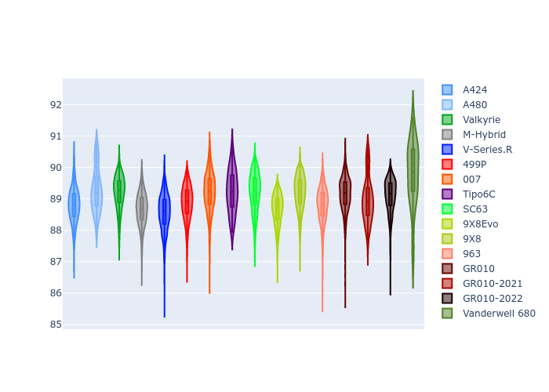
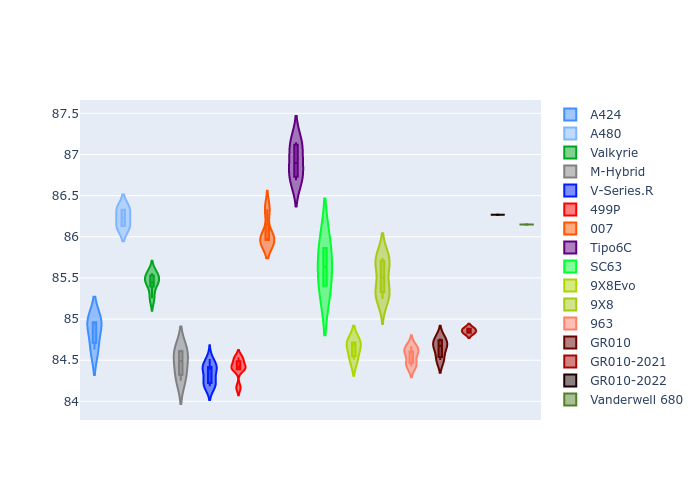
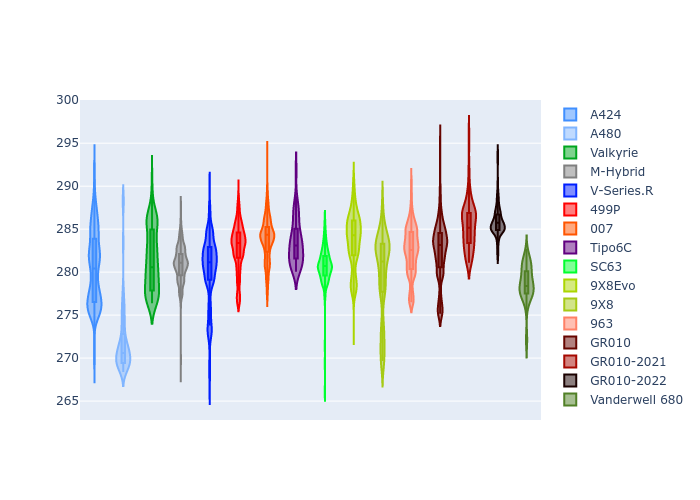
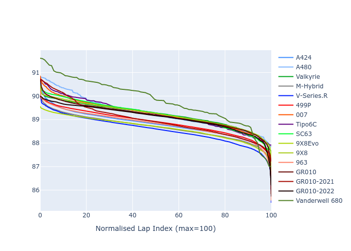

# Combined Plots

## Metadata

- BoP Accuracy: 95.09%
- Overall BoP Grade: A1
- Track: INTERLAGOS
- Threshhold: 250.0kph
- Average Laptime: 1:27.61
- Average Quali Laptime: 1:24.33
- Laptime Std Dev: 0.47 seconds
- Filtered Average Topspeed: 285.56kph

## BoP Table
| Manufacturer     | Car            | Weight   | Power   | PINC   | E/Stint   | FDS    | RDP    | QDP    | TDP    |
|:-----------------|:---------------|:---------|:--------|:-------|:----------|:-------|:-------|:-------|:-------|
| Alpine           | A424           | 1056kg   | 511.0kw | +0.10% | 906MJ     | -      | 52.20% | 54.51% | 24.58% |
| Alpine           | A480           | 990kg    | 421.0kw | +0.10% | 761MJ     | -      | 53.05% | 74.07% | 48.97% |
| Aston Martin     | Valkyrie       | 1030kg   | 520.0kw | -      | 919MJ     | -      | 53.39% | 54.11% | 23.71% |
| BMW              | M-Hybrid       | 1050kg   | 513.0kw | +0.10% | 912MJ     | -      | 53.47% | 52.95% | 33.73% |
| Cadillac         | V-Series.R     | 1047kg   | 519.0kw | -      | 912MJ     | -      | 49.22% | 60.31% | 18.04% |
| Ferrari          | 499P           | 1062kg   | 503.0kw | -0.10% | 928MJ     | 190kph | 51.56% | 44.72% | 9.86%  |
| Glickenhaus      | 007            | 1030kg   | 520.0kw | -      | 910MJ     | -      | 46.14% | 49.30% | 41.45% |
| Isotta Fraschini | Tipo6C         | 1033kg   | 519.0kw | -      | 913MJ     | 190kph | 43.95% | 47.22% | 31.53% |
| Lamborghini      | SC63           | 1040kg   | 520.0kw | +0.10% | 913MJ     | -      | 48.25% | 60.95% | 28.65% |
| Peugeot          | 9X8Evo         | 1052kg   | 518.0kw | -0.10% | 913MJ     | 190kph | 50.17% | 49.36% | 17.73% |
| Peugeot          | 9X8            | 1046kg   | 524.0kw | -      | 909MJ     | 150kph | 54.54% | 58.39% | 9.69%  |
| Porsche          | 963            | 1056kg   | 511.0kw | +0.10% | 914MJ     | -      | 50.78% | 41.25% | 27.61% |
| Toyota           | GR010          | 1071kg   | 502.0kw | +0.10% | 939MJ     | 190kph | 51.68% | 51.25% | 14.48% |
| Toyota           | GR010-2021     | 1055kg   | 509.0kw | -0.10% | 901MJ     | 150kph | 54.04% | 54.81% | 9.72%  |
| Toyota           | GR010-2022     | 1060kg   | 503.0kw | -0.10% | 894MJ     | 190kph | 53.24% | 64.49% | 9.72%  |
| Vanwall          | Vanderwell 680 | 1030kg   | 520.0kw | -      | 908MJ     | -      | 49.68% | 60.93% | 34.43% |

## Performance Table
| Manufacturer     | Car            | RP      | QP      | Vavg      |   RDLC | BOP-Grade   | Match   |
|:-----------------|:---------------|:--------|:--------|:----------|-------:|:------------|:--------|
| Alpine           | A424           | 1:27.51 | 1:23.87 | 283.71kph |   1.04 | ~A1         | 99.96%  |
| Alpine           | A480           | 1:27.79 | 1:25.85 | 275.99kph |   1.02 | -A2         | 94.48%  |
| Aston Martin     | Valkyrie       | 1:27.82 | 1:24.17 | 285.44kph |   1.04 | ~A1         | 100.00% |
| BMW              | M-Hybrid       | 1:27.42 | 1:23.57 | 284.45kph |   1.05 | ~A1         | 99.98%  |
| Cadillac         | V-Series.R     | 1:27.36 | 1:23.53 | 284.10kph |   1.05 | ~A1         | 99.98%  |
| Ferrari          | 499P           | 1:27.26 | 1:23.39 | 286.30kph |   1.05 | ~A1         | 99.96%  |
| Glickenhaus      | 007            | 1:28.03 | 1:25.28 | 287.84kph |   1.03 | -A2         | 93.34%  |
| Isotta Fraschini | Tipo6C         | 1:27.79 | 1:25.84 | 288.27kph |   1.02 | ~A1         | 97.76%  |
| Lamborghini      | SC63           | 1:27.62 | 1:24.52 | 285.71kph |   1.04 | ~A1         | 100.00% |
| Peugeot          | 9X8Evo         | 1:27.49 | 1:23.81 | 286.90kph |   1.04 | ~A1         | 100.00% |
| Peugeot          | 9X8            | 1:27.48 | 1:24.18 | 285.44kph |   1.04 | ~A1         | 100.00% |
| Porsche          | 963            | 1:27.42 | 1:23.66 | 286.12kph |   1.04 | ~A1         | 99.95%  |
| Toyota           | GR010          | 1:27.37 | 1:23.40 | 286.11kph |   1.05 | ~A1         | 99.77%  |
| Toyota           | GR010-2021     | 1:26.84 | 1:23.51 | 290.32kph |   1.04 | ~A1         | 100.00% |
| Toyota           | GR010-2022     | 1:27.39 | 1:25.07 | 289.42kph |   1.03 | ~A1         | 99.33%  |
| Vanwall          | Vanderwell 680 | 1:29.09 | 1:25.55 | 282.77kph |   1.04 | +Ω1         | 36.97%  |

## Race Laptimes

## Quali Laptimes

## Topspeeds

## Laptimes Lineplot

