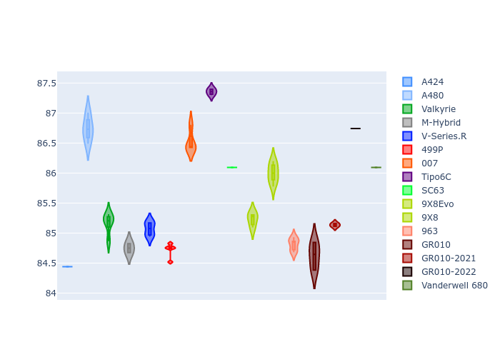
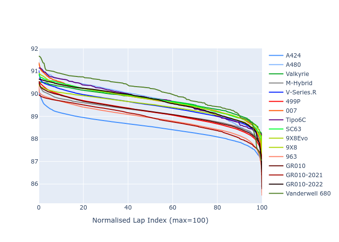

# Combined Plots

## Metadata

- BoP Accuracy: 97.39%
- Overall BoP Grade: A1
- Track: INTERLAGOS
- Threshhold: 250.0kph
- Average Laptime: 1:29.43
- Average Quali Laptime: 1:25.59
- Average Topspeed: 281.72kph

## BoP Table
| Manufacturer     | Car            | Weight   | Power   | PINC   | E/Stint   | FDS    | RDP    | QDP    | TDP    |
|:-----------------|:---------------|:---------|:--------|:-------|:----------|:-------|:-------|:-------|:-------|
| Alpine           | A424           | 1057kg   | 520.0kw | -      | 918MJ     | -      | 51.64% | 59.31% | 26.80% |
| Alpine           | A480           | 950kg    | 433.0kw | -      | 767MJ     | -      | 53.05% | 74.07% | 48.97% |
| Aston Martin     | Valkyrie       | 1033kg   | 510.0kw | -      | 902MJ     | -      | 53.50% | 53.33% | 21.51% |
| BMW              | M-Hybrid       | 1051kg   | 512.0kw | +0.10% | 909MJ     | -      | 52.89% | 56.22% | 33.41% |
| Cadillac         | V-Series.R     | 1044kg   | 510.0kw | +0.10% | 904MJ     | -      | 48.63% | 60.80% | 19.01% |
| Ferrari          | 499P           | 1073kg   | 508.0kw | +0.10% | 906MJ     | 190kph | 51.38% | 44.98% | 9.83%  |
| Glickenhaus      | 007            | 1039kg   | 516.0kw | -      | 907MJ     | -      | 46.15% | 49.30% | 41.45% |
| Isotta Fraschini | Tipo6C         | 1049kg   | 512.0kw | -      | 909MJ     | 190kph | 43.95% | 47.22% | 31.53% |
| Lamborghini      | SC63           | 1036kg   | 510.0kw | -      | 903MJ     | -      | 48.33% | 60.95% | 28.65% |
| Peugeot          | 9X8Evo         | 1060kg   | 510.0kw | +0.10% | 910MJ     | 190kph | 48.87% | 52.78% | 15.41% |
| Peugeot          | 9X8            | 1034kg   | 505.0kw | -      | 891MJ     | 150kph | 54.54% | 58.39% | 9.69%  |
| Porsche          | 963            | 1057kg   | 516.0kw | -0.10% | 912MJ     | -      | 50.70% | 44.30% | 29.51% |
| Toyota           | GR010          | 1090kg   | 512.0kw | +0.10% | 913MJ     | 190kph | 51.09% | 52.71% | 11.46% |
| Toyota           | GR010-2021     | 1075kg   | 513.0kw | -0.10% | 906MJ     | 150kph | 54.08% | 54.81% | 9.72%  |
| Toyota           | GR010-2022     | 1090kg   | 512.0kw | -0.10% | 905MJ     | 190kph | 53.45% | 68.83% | 9.58%  |
| Vanwall          | Vanderwell 680 | 1030kg   | 520.0kw | -      | 908MJ     | -      | 49.68% | 60.93% | 34.43% |

## Performance Table
| Manufacturer     | Car            | RP      | QP      | Vavg      |   RDLC | BOP-Grade   | Match   |
|:-----------------|:---------------|:--------|:--------|:----------|-------:|:------------|:--------|
| Alpine           | A424           | 1:28.50 | 1:24.44 | 282.10kph |   1.05 | ~A1         | 99.79%  |
| Alpine           | A480           | 1:29.72 | 1:26.74 | 279.51kph |   1.03 | -A2         | 93.08%  |
| Aston Martin     | Valkyrie       | 1:29.72 | 1:25.16 | 281.96kph |   1.05 | ~A1         | 100.00% |
| BMW              | M-Hybrid       | 1:29.17 | 1:24.75 | 280.64kph |   1.05 | ~A1         | 100.00% |
| Cadillac         | V-Series.R     | 1:29.47 | 1:25.07 | 278.61kph |   1.05 | ~A1         | 99.51%  |
| Ferrari          | 499P           | 1:29.17 | 1:24.72 | 282.85kph |   1.05 | ~A1         | 99.92%  |
| Glickenhaus      | 007            | 1:29.71 | 1:26.52 | 282.67kph |   1.04 | ~A1         | 95.60%  |
| Isotta Fraschini | Tipo6C         | 1:29.72 | 1:27.36 | 281.81kph |   1.03 | +A2         | 93.28%  |
| Lamborghini      | SC63           | 1:29.73 | 1:26.09 | 280.58kph |   1.04 | ~A1         | 99.42%  |
| Peugeot          | 9X8Evo         | 1:29.47 | 1:25.23 | 281.50kph |   1.05 | ~A1         | 100.00% |
| Peugeot          | 9X8            | 1:29.71 | 1:26.00 | 279.39kph |   1.04 | ~A1         | 97.58%  |
| Porsche          | 963            | 1:28.90 | 1:24.81 | 283.15kph |   1.05 | ~A1         | 99.54%  |
| Toyota           | GR010          | 1:29.19 | 1:24.63 | 282.73kph |   1.05 | ~A1         | 99.74%  |
| Toyota           | GR010-2021     | 1:28.90 | 1:25.14 | 285.67kph |   1.04 | ~A1         | 100.00% |
| Toyota           | GR010-2022     | 1:29.67 | 1:26.74 | 285.00kph |   1.03 | ~A1         | 99.75%  |
| Vanwall          | Vanderwell 680 | 1:30.06 | 1:26.09 | 279.34kph |   1.05 | +B2         | 81.04%  |

## Race Laptimes

## Quali Laptimes

## Topspeeds

## Laptimes Lineplot

