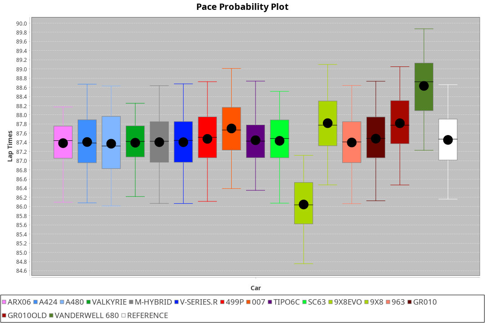
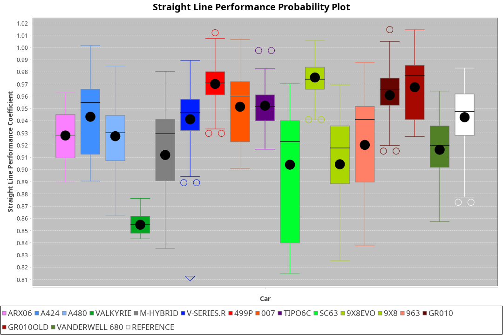
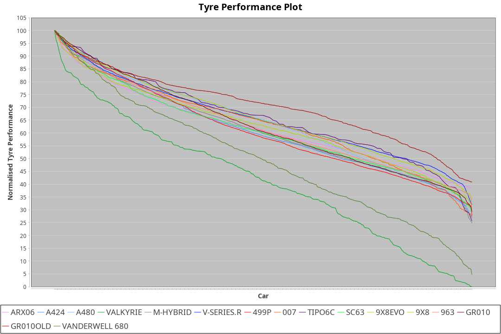

| Manufacturer     | Car            | Weight | Power   | PINC    | E/Stint | FDS     |
|:-|:-|:-|:-|:-|:-|:-|
| Acura            | ARX06          | 1082kg | 508.0kw | 1.00%   | 912MJ   |    -    |
| Alpine           | A424           | 1057kg | 517.0kw | -1.00%  | 910MJ   |    -    |
| Alpine           | A480           | 952kg  | 429.0kw | 1.00%   | 766MJ   |    -    |
| BMW              | M-Hybrid       | 1051kg | 509.0kw | -1.00%  | 901MJ   |    -    |
| Cadillac         | V-Series.R     | 1044kg | 507.0kw | 1.00%   | 899MJ   |    -    |
| Ferrari          | 499P           | 1073kg | 505.0kw | -1.00%  | 891MJ   | 190kph  |
| Glickenhaus      | 007            | 1040kg | 517.0kw |    -    | 908MJ   |    -    |
| Isotta Fraschini | Tipo6C         | 1059kg | 520.0kw |    -    | 917MJ   | 190kph  |
| Lamborghini      | SC63           | 1052kg | 516.0kw | -1.00%  | 904MJ   |    -    |
| Peugeot          | 9X8Evo         | 1060kg | 507.0kw | -1.00%  | 895MJ   | 190kph  |
| Peugeot          | 9X8            | 1040kg | 517.0kw |    -    | 902MJ   | 150kph  |
| Porsche          | 963            | 1057kg | 513.0kw | -1.00%  | 898MJ   |    -    |
| Toyota           | GR010          | 1090kg | 509.0kw | 1.00%   | 906MJ   | 190kph  |
| Toyota           | GR010OLD       | 1075kg | 510.0kw | 1.00%   | 961MJ   | 150kph  |
| Vanwall          | Vanderwell 680 | 1030kg | 520.0kw |    -    | 903MJ   |    -    |

### BoP Accuracy: 75.43%; Overall BoP Grade: C1
| Manufacturer     | Car            | Type  | RP      | QP      | Weight | Power¹  | Threshhold | PINC    | Power²   | E/Stint | AVG Vmax  | FDS     | RDLC | L/Stint | BOP-Grade | Model Accuracy | Model Points | Match% | SimDiff |
|:-|:-|:-|:-|:-|:-|:-|:-|:-|:-|:-|:-|:-|:-|:-|:-|:-|:-|:-|:-|
| Acura            | ARX06          | LMDH  | 1:26.85 | 1:24.09 | 1082kg | 508.0kw | 210.0kph   | 1.00%   | 513.10kw |  912MJ  | 298.83kph |    -    | 0.99 | 43      | +C1       | 100.00%        | 996          | 78.35% | #       |
| Alpine           | A424           | LMDH  | 1:26.45 | 1:24.01 | 1057kg | 517.0kw | 210.0kph   | -1.00%  | 511.80kw |  910MJ  | 310.49kph |    -    | 1.00 | 43      | -B1       | 100.00%        | 946          | 88.62% | #       |
| Alpine           | A480           | LMP1  | 1:26.01 | 1:24.47 |  952kg | 429.0kw | 210.0kph   | 1.00%   | 433.30kw |  766MJ  | 298.61kph |    -    | 0.97 | 40      | -D2       | 97.08%         | 1727         | 64.79% | #       |
| BMW              | M-Hybrid       | LMDH  | 1:26.71 | 1:24.01 | 1051kg | 509.0kw | 210.0kph   | -1.00%  | 503.90kw |  901MJ  | 307.12kph |    -    | 1.01 | 43      | ~A1       | 100.00%        | 1998         | 95.67% | #       |
| Cadillac         | V-Series.R     | LMDH  | 1:26.00 | 1:23.58 | 1044kg | 507.0kw | 210.0kph   | 1.00%   | 512.10kw |  899MJ  | 306.70kph |    -    | 1.02 | 43      | -D2       | 98.11%         | 3991         | 63.94% | #       |
| Ferrari          | 499P           | LMHHU | 1:26.93 | 1:24.33 | 1073kg | 505.0kw | 210.0kph   | -1.00%  | 500.00kw |  891MJ  | 307.34kph | 190kph  | 1.02 | 43      | +B2       | 98.72%         | 4180         | 82.55% | #       |
| Glickenhaus      | 007            | LMHNH | 1:26.49 | 1:24.65 | 1040kg | 517.0kw | 210.0kph   |    -    | 517.00kw |  908MJ  | 305.59kph |    -    | 0.95 | 43      | ~A1       | 94.07%         | 2174         | 96.73% | #       |
| Isotta Fraschini | Tipo6C         | LMHHU | 1:27.31 | 1:25.97 | 1059kg | 520.0kw | 210.0kph   |    -    | 520.00kw |  917MJ  | 308.96kph | 190kph  | 1.05 | 43      | +Ω1       | 97.73%         | 129          | 35.20% | #       |
| Lamborghini      | SC63           | LMDH  | 1:26.86 | 1:24.77 | 1052kg | 516.0kw | 210.0kph   | -1.00%  | 510.80kw |  904MJ  | 307.08kph |    -    | 1.03 | 43      | +B1       | 100.00%        | 784          | 88.60% | #       |
| Peugeot          | 9X8Evo         | LMHHU | 1:27.05 | 1:24.76 | 1060kg | 507.0kw | 210.0kph   | -1.00%  | 501.90kw |  895MJ  | 307.68kph | 190kph  | 1.00 | 43      | +C2       | 100.00%        | 636          | 74.46% | #       |
| Peugeot          | 9X8            | LMHHE | 1:26.44 | 1:24.41 | 1040kg | 517.0kw | 210.0kph   |    -    | 517.00kw |  902MJ  | 307.13kph | 150kph  | 1.03 | 43      | -A2       | 99.28%         | 4250         | 91.15% | #       |
| Porsche          | 963            | LMDH  | 1:26.38 | 1:23.58 | 1057kg | 513.0kw | 210.0kph   | -1.00%  | 507.90kw |  898MJ  | 308.27kph |    -    | 1.01 | 43      | -B1       | 99.91%         | 11713        | 87.01% | #       |
| Toyota           | GR010          | LMHHU | 1:26.94 | 1:24.20 | 1090kg | 509.0kw | 210.0kph   | 1.00%   | 514.10kw |  906MJ  | 307.74kph | 190kph  | 1.00 | 43      | +B2       | 99.90%         | 3123         | 81.92% | #       |
| Toyota           | GR010OLD       | LMHHE | 1:25.68 | 1:23.64 | 1075kg | 510.0kw | 210.0kph   | 1.00%   | 515.10kw |  961MJ  | 306.96kph | 150kph  | 1.02 | 43      | -Ω1       | 100.00%        | 730          | 38.09% | #       |
| Vanwall          | Vanderwell 680 | LMHNH | 1:27.39 | 1:24.65 | 1030kg | 520.0kw | 210.0kph   |    -    | 520.00kw |  903MJ  | 303.79kph |    -    | 1.01 | 43      | +D2       | 95.99%         | 527          | 64.34% | #       |

## Power below Threshhold
| N/Nmax    | ARX06   | A424    | M-HYBRID | V-SERIES.R | 499P    | 007     | TIPO6C  | SC63    | 9X8EVO  | 9X8     | 963     | GR010   | GR010OLD | VANDERWELL 680 | ​     | RPM      | A480       |
|:-|:-|:-|:-|:-|:-|:-|:-|:-|:-|:-|:-|:-|:-|:-|:-|:-|:-|
|  0.550    |  250    |  255    |  251     |  250       |  249    |  255    |  256    |  254    |  250    |  255    |  253    |  251    |  251     |  256           |  ​    |   --     |  0.00      |
|  0.575    |  273    |  278    |  274     |  273       |  272    |  278    |  279    |  277    |  273    |  278    |  276    |  274    |  274     |  279           |  ​    |   --     |  0.00      |
|  0.600    |  293    |  298    |  294     |  293       |  292    |  298    |  300    |  298    |  293    |  298    |  296    |  294    |  295     |  300           |  ​    |   --     |  0.00      |
|  0.625    |  314    |  320    |  315     |  314       |  312    |  320    |  322    |  319    |  314    |  320    |  317    |  315    |  316     |  322           |  ​    |   --     |  0.00      |
|  0.650    |  335    |  341    |  336     |  335       |  333    |  341    |  343    |  340    |  335    |  341    |  338    |  336    |  337     |  343           |  ​    |   --     |  0.00      |
|  0.675    |  357    |  363    |  357     |  356       |  355    |  363    |  365    |  362    |  356    |  363    |  360    |  357    |  358     |  365           |  ​    |   --     |  0.00      |
|  0.700    |  378    |  385    |  379     |  377       |  376    |  385    |  387    |  384    |  377    |  385    |  382    |  379    |  380     |  387           |  ​    |   --     |  0.00      |
|  0.725    |  399    |  407    |  400     |  399       |  397    |  407    |  409    |  406    |  399    |  407    |  403    |  400    |  401     |  409           |  ​    |   --     |  0.00      |
|  0.750    |  420    |  427    |  421     |  419       |  417    |  427    |  430    |  427    |  419    |  427    |  424    |  421    |  422     |  430           |  ​    |   --     |  0.00      |
|  0.775    |  439    |  446    |  440     |  438       |  436    |  446    |  449    |  446    |  438    |  446    |  443    |  440    |  441     |  449           |  ​    |  5000    |  253.07    |
|  0.800    |  456    |  464    |  457     |  455       |  454    |  464    |  467    |  463    |  455    |  464    |  461    |  457    |  458     |  467           |  ​    |  5500    |  299.08    |
|  0.825    |  471    |  479    |  472     |  470       |  469    |  479    |  482    |  478    |  470    |  479    |  476    |  472    |  473     |  482           |  ​    |  6000    |  334.09    |
|  0.850    |  483    |  491    |  484     |  482       |  480    |  491    |  494    |  490    |  482    |  491    |  487    |  484    |  485     |  494           |  ​    |  6500    |  377.11    |
|  0.875    |  493    |  502    |  494     |  492       |  490    |  502    |  505    |  501    |  492    |  502    |  498    |  494    |  495     |  505           |  ​    |  7000    |  421.12    |
|  0.900    |  500    |  509    |  501     |  499       |  497    |  509    |  512    |  508    |  499    |  509    |  505    |  501    |  502     |  512           |  ​    |  7500    |  432.12    |
|  0.925    |  505    |  514    |  506     |  504       |  502    |  514    |  517    |  513    |  504    |  514    |  510    |  506    |  507     |  517           |  ​    |  8000    |  428.12    |
| **0.950** | **508** | **517** | **509**  | **507**    | **505** | **517** | **520** | **516** | **507** | **517** | **513** | **509** | **510**  | **520**        | **​** | **8500** | **431.12** |
|  0.975    |  506    |  515    |  507     |  505       |  503    |  515    |  518    |  514    |  505    |  515    |  511    |  507    |  508     |  518           |  ​    |  9000    |  216.06    |
|  1.000    |  503    |  511    |  504     |  502       |  500    |  511    |  514    |  510    |  502    |  511    |  507    |  504    |  505     |  514           |  ​    |   --     |  0.00      |
|  1.025    |  434    |  441    |  435     |  433       |  431    |  441    |  444    |  441    |  433    |  441    |  438    |  435    |  436     |  444           |  ​    |   --     |  0.00      |

## Power above Threshhold
| N/Nmax    | ARX06      | A424       | M-HYBRID   | V-SERIES.R | 499P       | 007     | TIPO6C  | SC63       | 9X8EVO     | 9X8     | 963        | GR010      | GR010OLD   | VANDERWELL 680 | ​     | RPM      | A480       |
|:-|:-|:-|:-|:-|:-|:-|:-|:-|:-|:-|:-|:-|:-|:-|:-|:-|:-|
|  0.550    |  253.04    |  252.41    |  248.45    |  252.03    |  246.47    |  255    |  256    |  251.41    |  247.46    |  255    |  250.43    |  253.04    |  254.05    |  256           |  ​    |   --     |  0.00      |
|  0.575    |  276.04    |  275.45    |  271.49    |  275.04    |  268.51    |  278    |  279    |  274.45    |  270.50    |  278    |  273.47    |  276.05    |  277.05    |  279           |  ​    |   --     |  0.00      |
|  0.600    |  296.05    |  295.48    |  291.53    |  296.04    |  288.55    |  298    |  300    |  295.49    |  290.54    |  298    |  293.50    |  297.05    |  297.06    |  300           |  ​    |   --     |  0.00      |
|  0.625    |  317.05    |  316.51    |  311.56    |  317.04    |  308.59    |  320    |  322    |  316.52    |  310.58    |  320    |  314.54    |  318.06    |  319.06    |  322           |  ​    |   --     |  0.00      |
|  0.650    |  338.05    |  337.55    |  332.60    |  338.05    |  329.63    |  341    |  343    |  337.56    |  331.61    |  341    |  335.57    |  339.06    |  340.07    |  343           |  ​    |   --     |  0.00      |
|  0.675    |  360.06    |  359.58    |  353.64    |  359.05    |  350.67    |  363    |  365    |  358.59    |  352.65    |  363    |  356.61    |  361.06    |  362.07    |  365           |  ​    |   --     |  0.00      |
|  0.700    |  382.06    |  380.62    |  374.68    |  381.05    |  371.71    |  385    |  387    |  380.63    |  373.69    |  385    |  377.65    |  383.07    |  383.07    |  387           |  ​    |   --     |  0.00      |
|  0.725    |  403.06    |  402.65    |  395.71    |  403.06    |  392.75    |  407    |  409    |  401.66    |  394.73    |  407    |  399.68    |  404.07    |  405.08    |  409           |  ​    |   --     |  0.00      |
|  0.750    |  424.07    |  422.69    |  416.75    |  423.06    |  412.78    |  427    |  430    |  422.70    |  414.77    |  427    |  419.72    |  425.07    |  426.08    |  430           |  ​    |   --     |  0.00      |
|  0.775    |  443.07    |  441.72    |  435.79    |  442.06    |  431.82    |  446    |  449    |  441.73    |  433.80    |  446    |  438.75    |  444.08    |  445.09    |  449           |  ​    |  5000    |  253.07    |
|  0.800    |  461.07    |  459.75    |  452.82    |  460.06    |  448.85    |  464    |  467    |  458.75    |  450.84    |  464    |  455.78    |  462.08    |  463.09    |  467           |  ​    |  5500    |  299.08    |
|  0.825    |  476.07    |  474.77    |  467.84    |  475.06    |  463.88    |  479    |  482    |  473.78    |  465.86    |  479    |  470.81    |  477.08    |  478.09    |  482           |  ​    |  6000    |  334.09    |
|  0.850    |  487.08    |  485.79    |  478.86    |  486.07    |  474.90    |  491    |  494    |  485.80    |  476.88    |  491    |  482.83    |  488.09    |  489.09    |  494           |  ​    |  6500    |  377.11    |
|  0.875    |  498.08    |  496.81    |  488.88    |  497.07    |  484.92    |  502    |  505    |  495.82    |  486.90    |  502    |  492.84    |  499.09    |  500.10    |  505           |  ​    |  7000    |  421.12    |
|  0.900    |  505.08    |  503.82    |  495.90    |  504.07    |  491.93    |  509    |  512    |  502.83    |  493.92    |  509    |  499.86    |  506.09    |  507.10    |  512           |  ​    |  7500    |  432.12    |
|  0.925    |  510.08    |  508.83    |  500.90    |  509.07    |  496.94    |  514    |  517    |  507.84    |  498.92    |  514    |  504.86    |  511.09    |  512.10    |  517           |  ​    |  8000    |  428.12    |
| **0.950** | **513.08** | **511.83** | **503.91** | **512.07** | **499.95** | **517** | **520** | **510.84** | **501.93** | **517** | **507.87** | **514.09** | **515.10** | **520**        | **​** | **8500** | **431.12** |
|  0.975    |  511.08    |  509.83    |  501.91    |  510.07    |  497.95    |  515    |  518    |  508.84    |  499.93    |  515    |  505.87    |  512.09    |  513.10    |  518           |  ​    |  9000    |  216.06    |
|  1.000    |  507.08    |  505.82    |  498.90    |  506.07    |  494.94    |  511    |  514    |  505.83    |  496.92    |  511    |  502.86    |  508.09    |  509.10    |  514           |  ​    |   --     |  0.00      |
|  1.025    |  438.07    |  436.71    |  430.78    |  437.06    |  426.81    |  441    |  444    |  436.72    |  428.79    |  441    |  433.74    |  439.08    |  440.09    |  444           |  ​    |   --     |  0.00      |
