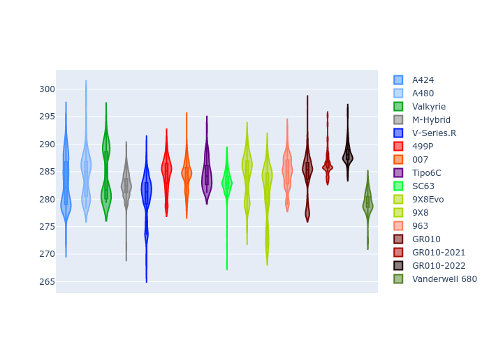

# Combined Plots

## Metadata

- BoP Accuracy: 96.73%
- Overall BoP Grade: A1
- Track: INTERLAGOS
- Threshhold: 250.0kph

## BoP Table
| Manufacturer     | Car            | Weight   | Power   | PINC   | E/Stint   | FDS    | RDP    | QDP    | TDP    |
|:-----------------|:---------------|:---------|:--------|:-------|:----------|:-------|:-------|:-------|:-------|
| Alpine           | A424           | 1075kg   | 480.0kw | +0.30% | 885MJ     | -      | 52.35% | 61.85% | 27.84% |
| Alpine           | A480           | 952kg    | 410.0kw | +0.10% | 763MJ     | -      | 54.51% | 76.19% | 54.04% |
| Aston Martin     | Valkyrie       | 1045kg   | 481.0kw | -0.20% | 877MJ     | -      | 53.59% | 53.33% | 21.51% |
| BMW              | M-Hybrid       | 1080kg   | 480.0kw | +1.60% | 887MJ     | -      | 53.26% | 57.23% | 34.54% |
| Cadillac         | V-Series.R     | 1100kg   | 480.0kw | +6.60% | 898MJ     | -      | 47.80% | 56.73% | 19.63% |
| Ferrari          | 499P           | 1097kg   | 480.0kw | +0.10% | 884MJ     | 190kph | 53.02% | 42.32% | 9.88%  |
| Glickenhaus      | 007            | 1060kg   | 482.0kw | +4.20% | 889MJ     | -      | 46.49% | 46.07% | 47.78% |
| Isotta Fraschini | Tipo6C         | 1084kg   | 520.0kw | -2.40% | 914MJ     | 190kph | 43.95% | 47.22% | 31.53% |
| Lamborghini      | SC63           | 1084kg   | 512.0kw | -2.80% | 903MJ     | -      | 46.33% | 59.50% | 29.33% |
| Peugeot          | 9X8Evo         | 1055kg   | 480.0kw | -      | 882MJ     | 190kph | 48.47% | 51.26% | 16.02% |
| Peugeot          | 9X8            | 1100kg   | 489.0kw | +6.30% | 901MJ     | 160kph | 54.07% | 57.08% | 10.80% |
| Porsche          | 963            | 1076kg   | 480.0kw | +0.80% | 884MJ     | -      | 50.87% | 45.25% | 30.77% |
| Toyota           | GR010          | 1100kg   | 480.0kw | -      | 886MJ     | 190kph | 52.43% | 57.12% | 12.82% |
| Toyota           | GR010-2021     | 1100kg   | 485.0kw | +7.20% | 901MJ     | 200kph | 54.09% | 52.67% | 26.37% |
| Toyota           | GR010-2022     | 1100kg   | 480.0kw | +1.80% | 882MJ     | 200kph | 53.48% | 69.44% | 7.86%  |
| Vanwall          | Vanderwell 680 | 1054kg   | 520.0kw | -      | 906MJ     | -      | 53.41% | 56.28% | 29.85% |

## Performance Table
| Manufacturer     | Car            | RP      | QP      | Vavg      |   RDLC | BOP-Grade   | Match   |
|:-----------------|:---------------|:--------|:--------|:----------|-------:|:------------|:--------|
| Alpine           | A424           | 1:29.24 | 1:25.80 | 270.90kph |   1.04 | ~A1         | 98.98%  |
| Alpine           | A480           | 1:27.29 | 1:24.77 | 267.68kph |   1.03 | -D1         | 65.48%  |
| Aston Martin     | Valkyrie       | 1:29.24 | 1:25.28 | 272.79kph |   1.05 | ~A1         | 100.00% |
| BMW              | M-Hybrid       | 1:29.25 | 1:25.49 | 270.60kph |   1.04 | ~A1         | 98.84%  |
| Cadillac         | V-Series.R     | 1:29.25 | 1:25.52 | 269.28kph |   1.04 | ~A1         | 99.62%  |
| Ferrari          | 499P           | 1:29.23 | 1:25.06 | 271.23kph |   1.05 | ~A1         | 99.93%  |
| Glickenhaus      | 007            | 1:29.24 | 1:26.58 | 271.23kph |   1.03 | +A2         | 94.88%  |
| Isotta Fraschini | Tipo6C         | 1:29.24 | 1:27.51 | 274.06kph |   1.02 | ~A1         | 95.52%  |
| Lamborghini      | SC63           | 1:29.23 | 1:26.30 | 272.23kph |   1.03 | ~A1         | 99.64%  |
| Peugeot          | 9X8Evo         | 1:29.22 | 1:25.61 | 274.43kph |   1.04 | ~A1         | 98.74%  |
| Peugeot          | 9X8            | 1:29.29 | 1:25.72 | 265.83kph |   1.04 | ~A1         | 99.94%  |
| Porsche          | 963            | 1:29.22 | 1:25.52 | 270.88kph |   1.04 | ~A1         | 99.83%  |
| Toyota           | GR010          | 1:29.19 | 1:24.94 | 271.80kph |   1.05 | ~A1         | 99.71%  |
| Toyota           | GR010-2021     | 1:28.78 | 1:25.41 | 269.50kph |   1.04 | ~A1         | 99.85%  |
| Toyota           | GR010-2022     | 1:29.12 | 1:26.38 | 271.12kph |   1.03 | ~A1         | 100.00% |
| Vanwall          | Vanderwell 680 | 1:29.24 | 1:25.50 | 270.71kph |   1.04 | ~A1         | 96.73%  |

## Race Laptimes

## Quali Laptimes

## Topspeeds

## Laptimes Lineplot

