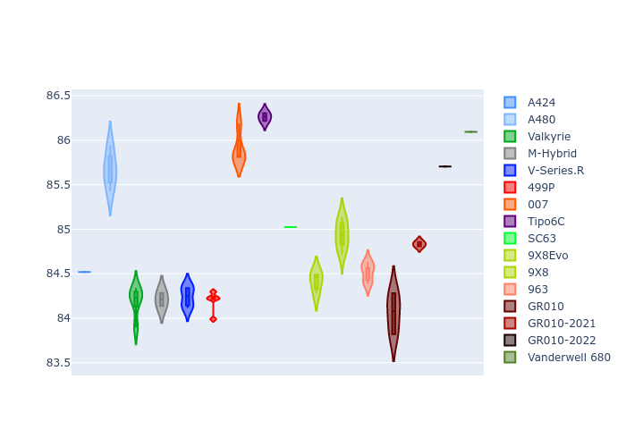
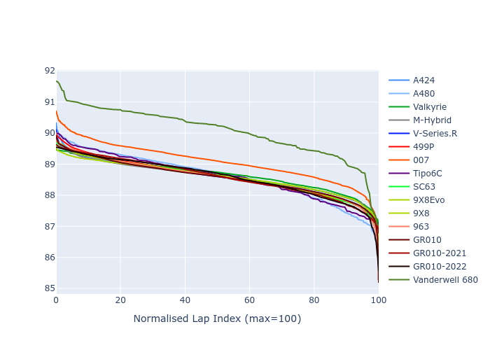

# Combined Plots

## Metadata

- BoP Accuracy: 95.91%
- Overall BoP Grade: A1
- Track: INTERLAGOS
- Threshhold: 250.0kph
- Average Laptime: 1:28.71
- Average Quali Laptime: 1:24.92
- Average Topspeed: 283.75kph

## BoP Table
| Manufacturer     | Car            | Weight   | Power   | PINC   | E/Stint   | FDS    | RDP    | QDP    | TDP    |
|:-----------------|:---------------|:---------|:--------|:-------|:----------|:-------|:-------|:-------|:-------|
| Alpine           | A424           | 1043kg   | 508.0kw | +2.30% | 912MJ     | -      | 51.64% | 59.31% | 26.80% |
| Alpine           | A480           | 934kg    | 418.0kw | +8.50% | 770MJ     | -      | 53.05% | 74.07% | 48.97% |
| Aston Martin     | Valkyrie       | 1030kg   | 520.0kw | -      | 911MJ     | -      | 53.50% | 53.33% | 21.51% |
| BMW              | M-Hybrid       | 1043kg   | 511.0kw | +1.70% | 911MJ     | -      | 52.89% | 56.22% | 33.41% |
| Cadillac         | V-Series.R     | 1045kg   | 520.0kw | -      | 913MJ     | -      | 48.63% | 60.80% | 19.01% |
| Ferrari          | 499P           | 1062kg   | 510.0kw | +0.40% | 908MJ     | 190kph | 51.38% | 44.98% | 9.83%  |
| Glickenhaus      | 007            | 1030kg   | 520.0kw | -      | 910MJ     | -      | 46.15% | 49.30% | 41.45% |
| Isotta Fraschini | Tipo6C         | 1037kg   | 520.0kw | -      | 915MJ     | 190kph | 43.95% | 47.22% | 31.53% |
| Lamborghini      | SC63           | 1031kg   | 520.0kw | -      | 912MJ     | -      | 48.33% | 60.95% | 28.65% |
| Peugeot          | 9X8Evo         | 1034kg   | 510.0kw | +0.60% | 909MJ     | 190kph | 48.87% | 52.78% | 15.41% |
| Peugeot          | 9X8            | 1045kg   | 520.0kw | -      | 906MJ     | 150kph | 54.54% | 58.39% | 9.69%  |
| Porsche          | 963            | 1035kg   | 510.0kw | +0.80% | 907MJ     | -      | 50.70% | 44.30% | 29.51% |
| Toyota           | GR010          | 1061kg   | 518.0kw | -2.50% | 909MJ     | 190kph | 51.09% | 52.71% | 11.46% |
| Toyota           | GR010-2021     | 1055kg   | 520.0kw | -3.20% | 902MJ     | 150kph | 54.08% | 54.81% | 9.72%  |
| Toyota           | GR010-2022     | 1053kg   | 520.0kw | -2.50% | 902MJ     | 190kph | 53.45% | 68.83% | 9.58%  |
| Vanwall          | Vanderwell 680 | 1030kg   | 520.0kw | -      | 908MJ     | -      | 49.68% | 60.93% | 34.43% |

## Performance Table
| Manufacturer     | Car            | RP      | QP      | Vavg      |   RDLC | BOP-Grade   | Match   |
|:-----------------|:---------------|:--------|:--------|:----------|-------:|:------------|:--------|
| Alpine           | A424           | 1:28.59 | 1:24.52 | 282.92kph |   1.05 | ~A1         | 99.36%  |
| Alpine           | A480           | 1:28.60 | 1:25.67 | 284.28kph |   1.03 | ~A1         | 99.73%  |
| Aston Martin     | Valkyrie       | 1:28.66 | 1:24.19 | 284.25kph |   1.05 | ~A1         | 100.00% |
| BMW              | M-Hybrid       | 1:28.58 | 1:24.21 | 282.50kph |   1.05 | ~A1         | 100.00% |
| Cadillac         | V-Series.R     | 1:28.57 | 1:24.24 | 280.40kph |   1.05 | ~A1         | 99.86%  |
| Ferrari          | 499P           | 1:28.59 | 1:24.19 | 284.55kph |   1.05 | ~A1         | 99.98%  |
| Glickenhaus      | 007            | 1:29.06 | 1:25.91 | 284.35kph |   1.04 | -A2         | 94.30%  |
| Isotta Fraschini | Tipo6C         | 1:28.58 | 1:26.26 | 284.58kph |   1.03 | ~A1         | 100.00% |
| Lamborghini      | SC63           | 1:28.58 | 1:25.02 | 283.06kph |   1.04 | ~A1         | 100.00% |
| Peugeot          | 9X8Evo         | 1:28.59 | 1:24.41 | 284.45kph |   1.05 | ~A1         | 100.00% |
| Peugeot          | 9X8            | 1:28.57 | 1:24.94 | 281.29kph |   1.04 | ~A1         | 100.00% |
| Porsche          | 963            | 1:28.58 | 1:24.52 | 284.84kph |   1.05 | ~A1         | 99.86%  |
| Toyota           | GR010          | 1:28.57 | 1:24.06 | 284.57kph |   1.05 | ~A1         | 99.79%  |
| Toyota           | GR010-2021     | 1:28.58 | 1:24.83 | 286.45kph |   1.04 | ~A1         | 100.00% |
| Toyota           | GR010-2022     | 1:28.58 | 1:25.70 | 288.21kph |   1.03 | ~A1         | 99.49%  |
| Vanwall          | Vanderwell 680 | 1:30.06 | 1:26.09 | 279.34kph |   1.05 | +Ω1         | 42.18%  |

## Race Laptimes

## Quali Laptimes

## Topspeeds

## Laptimes Lineplot

