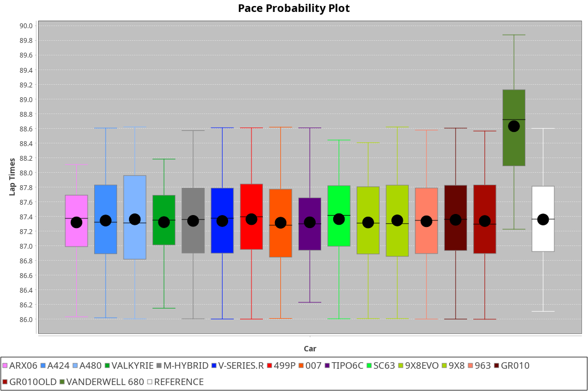
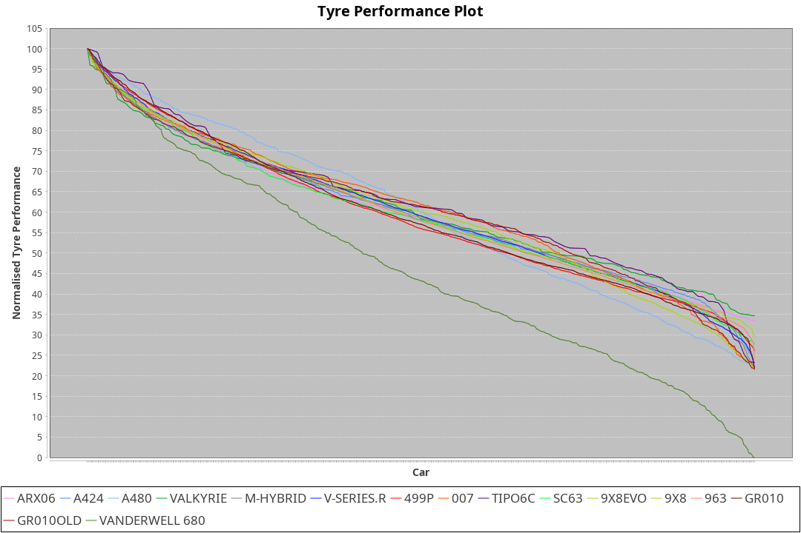

| Manufacturer     | Car            | Weight | Power   | PINC    | E/Stint | FDS     |
|:-|:-|:-|:-|:-|:-|:-|
| Acura            | ARX06          | 1056kg | 481.0kw | 8.10%   | 901MJ   |    -    |
| Alpine           | A424           | 1056kg | 480.0kw | 7.20%   | 899MJ   |    -    |
| Alpine           | A480           | 939kg  | 410.0kw | 6.90%   | 759MJ   |    -    |
| Aston Martin     | Valkyrie       | 1035kg | 485.0kw | 7.20%   | 897MJ   |    -    |
| BMW              | M-Hybrid       | 1060kg | 485.0kw | 7.20%   | 902MJ   |    -    |
| Cadillac         | V-Series.R     | 1059kg | 488.0kw | 6.50%   | 901MJ   |    -    |
| Ferrari          | 499P           | 1088kg | 480.0kw | 6.40%   | 898MJ   | 190kph  |
| Glickenhaus      | 007            | 1037kg | 503.0kw | 3.30%   | 903MJ   |    -    |
| Isotta Fraschini | Tipo6C         | 1100kg | 520.0kw |    -    | 921MJ   | 190kph  |
| Lamborghini      | SC63           | 1088kg | 511.0kw | 1.70%   | 910MJ   |    -    |
| Peugeot          | 9X8Evo         | 1030kg | 518.0kw | -7.30%  | 896MJ   | 190kph  |
| Peugeot          | 9X8            | 1061kg | 502.0kw | 3.50%   | 900MJ   | 150kph  |
| Porsche          | 963            | 1061kg | 481.0kw | 8.10%   | 900MJ   |    -    |
| Toyota           | GR010          | 1093kg | 480.0kw | 6.10%   | 899MJ   | 190kph  |
| Toyota           | GR010OLD       | 1079kg | 480.0kw | 2.00%   | 935MJ   | 150kph  |
| Vanwall          | Vanderwell 680 | 1030kg | 520.0kw |    -    | 903MJ   |    -    |

### BoP Accuracy: 93.36%; Overall BoP Grade: A2
| Manufacturer     | Car            | Type  | RP      | QP      | Weight | Power¹  | Threshhold | PINC    | Power²   | E/Stint | AVG Vmax  | FDS     | RDLC | L/Stint | BOP-Grade | Model Accuracy | Model Points | Match%  | SimDiff |
|:-|:-|:-|:-|:-|:-|:-|:-|:-|:-|:-|:-|:-|:-|:-|:-|:-|:-|:-|:-|
| Acura            | ARX06          | LMDH  | 1:27.68 | 1:23.95 | 1056kg | 481.0kw | 250.0kph   | 8.10%   | 520.00kw |  901MJ  | 271.97kph |    -    | 1.01 | 43      | -B1       | 100.00%        | 996          | 87.35%  | #       |
| Alpine           | A424           | LMDH  | 1:27.67 | 1:24.20 | 1056kg | 480.0kw | 250.0kph   | 7.20%   | 514.60kw |  899MJ  | 274.93kph |    -    | 1.00 | 43      | ~A1       | 97.47%         | 1810         | 97.79%  | #       |
| Alpine           | A480           | LMP1  | 1:27.67 | 1:25.16 |  939kg | 410.0kw | 250.0kph   | 6.90%   | 438.30kw |  759MJ  | 270.77kph |    -    | 0.99 | 40      | ~A1       | 92.36%         | 1643         | 100.00% | #       |
| Aston Martin     | Valkyrie       | LMHNH | 1:27.68 | 1:23.79 | 1035kg | 485.0kw | 250.0kph   | 7.20%   | 519.90kw |  897MJ  | 269.91kph |    -    | 1.04 | 43      | +B1       | 100.00%        | 466          | 87.94%  | #       |
| BMW              | M-Hybrid       | LMDH  | 1:27.67 | 1:24.00 | 1060kg | 485.0kw | 250.0kph   | 7.20%   | 519.90kw |  902MJ  | 271.73kph |    -    | 1.01 | 43      | ~A1       | 100.00%        | 3339         | 98.32%  | #       |
| Cadillac         | V-Series.R     | LMDH  | 1:27.67 | 1:23.91 | 1059kg | 488.0kw | 250.0kph   | 6.50%   | 519.70kw |  901MJ  | 272.47kph |    -    | 1.01 | 43      | ~A1       | 99.00%         | 6039         | 98.11%  | #       |
| Ferrari          | 499P           | LMHHU | 1:27.67 | 1:23.97 | 1088kg | 480.0kw | 250.0kph   | 6.40%   | 510.70kw |  898MJ  | 268.78kph | 190kph  | 1.02 | 43      | ~A1       | 99.56%         | 7418         | 98.93%  | #       |
| Glickenhaus      | 007            | LMHNH | 1:27.67 | 1:24.91 | 1037kg | 503.0kw | 250.0kph   | 3.30%   | 519.60kw |  903MJ  | 275.89kph |    -    | 0.96 | 43      | ~A1       | 93.90%         | 2170         | 100.00% | #       |
| Isotta Fraschini | Tipo6C         | LMHHU | 1:27.63 | 1:25.63 | 1100kg | 520.0kw | 250.0kph   |    -    | 520.00kw |  921MJ  | 265.39kph | 190kph  | 1.03 | 43      | +C1       | 97.73%         | 129          | 78.39%  | #       |
| Lamborghini      | SC63           | LMDH  | 1:27.67 | 1:24.93 | 1088kg | 511.0kw | 250.0kph   | 1.70%   | 519.70kw |  910MJ  | 264.99kph |    -    | 1.02 | 43      | -A2       | 100.00%        | 784          | 94.35%  | #       |
| Peugeot          | 9X8Evo         | LMHHU | 1:27.67 | 1:24.14 | 1030kg | 518.0kw | 250.0kph   | -7.30%  | 480.20kw |  896MJ  | 279.41kph | 190kph  | 1.02 | 43      | ~A1       | 100.00%        | 1889         | 95.66%  | #       |
| Peugeot          | 9X8            | LMHHE | 1:27.67 | 1:24.54 | 1061kg | 502.0kw | 250.0kph   | 3.50%   | 519.60kw |  900MJ  | 266.59kph | 150kph  | 1.02 | 43      | ~A1       | 99.16%         | 4816         | 99.27%  | #       |
| Porsche          | 963            | LMDH  | 1:27.68 | 1:23.86 | 1061kg | 481.0kw | 250.0kph   | 8.10%   | 520.00kw |  900MJ  | 269.91kph |    -    | 1.01 | 43      | ~A1       | 100.00%        | 14574        | 95.26%  | #       |
| Toyota           | GR010          | LMHHU | 1:27.67 | 1:23.94 | 1093kg | 480.0kw | 250.0kph   | 6.10%   | 509.30kw |  899MJ  | 266.24kph | 190kph  | 1.02 | 43      | ~A1       | 97.78%         | 5323         | 99.85%  | #       |
| Toyota           | GR010OLD       | LMHHE | 1:27.67 | 1:24.72 | 1079kg | 480.0kw | 250.0kph   | 2.00%   | 489.60kw |  935MJ  | 271.46kph | 150kph  | 1.02 | 43      | ~A1       | 94.52%         | 690          | 97.17%  | #       |
| Vanwall          | Vanderwell 680 | LMHNH | 1:28.49 | 1:24.65 | 1030kg | 520.0kw | 0.0kph     |    -    | 520.00kw |  903MJ  | 272.98kph |    -    | 1.02 | 43      | +D1       | 95.37%         | 639          | 65.40%  | #       |

## Power below Threshhold
| N/Nmax    | ARX06   | A424    | VALKYRIE | M-HYBRID | V-SERIES.R | 499P    | 007     | TIPO6C  | SC63    | 9X8EVO  | 9X8     | 963     | GR010   | GR010OLD | VANDERWELL 680 | ​     | RPM      | A480       |
|:-|:-|:-|:-|:-|:-|:-|:-|:-|:-|:-|:-|:-|:-|:-|:-|:-|:-|:-|
|  0.550    |  237    |  236    |  239     |  239     |  240       |  236    |  248    |  256    |  252    |  255    |  247    |  237    |  236    |  236     |  256           |  ​    |   --     |  0.00      |
|  0.575    |  259    |  258    |  261     |  261     |  262       |  258    |  271    |  279    |  275    |  278    |  270    |  259    |  258    |  258     |  279           |  ​    |   --     |  0.00      |
|  0.600    |  278    |  277    |  280     |  280     |  282       |  277    |  291    |  300    |  295    |  299    |  290    |  278    |  277    |  277     |  300           |  ​    |   --     |  0.00      |
|  0.625    |  298    |  297    |  300     |  300     |  302       |  297    |  311    |  322    |  316    |  321    |  310    |  298    |  297    |  297     |  322           |  ​    |   --     |  0.00      |
|  0.650    |  318    |  317    |  320     |  320     |  322       |  317    |  332    |  343    |  337    |  342    |  331    |  318    |  317    |  317     |  343           |  ​    |   --     |  0.00      |
|  0.675    |  338    |  337    |  341     |  341     |  343       |  337    |  353    |  365    |  359    |  364    |  352    |  338    |  337    |  337     |  365           |  ​    |   --     |  0.00      |
|  0.700    |  359    |  358    |  362     |  362     |  364       |  358    |  374    |  387    |  380    |  386    |  374    |  359    |  358    |  358     |  387           |  ​    |   --     |  0.00      |
|  0.725    |  379    |  378    |  382     |  382     |  384       |  378    |  395    |  409    |  402    |  407    |  395    |  379    |  378    |  378     |  409           |  ​    |   --     |  0.00      |
|  0.750    |  398    |  397    |  401     |  401     |  403       |  397    |  416    |  430    |  422    |  428    |  415    |  398    |  397    |  397     |  430           |  ​    |   --     |  0.00      |
|  0.775    |  416    |  415    |  419     |  419     |  422       |  415    |  435    |  449    |  441    |  447    |  434    |  416    |  415    |  415     |  449           |  ​    |  5000    |  250.17    |
|  0.800    |  432    |  431    |  436     |  436     |  438       |  431    |  452    |  467    |  459    |  465    |  451    |  432    |  431    |  431     |  467           |  ​    |  5500    |  295.20    |
|  0.825    |  446    |  445    |  450     |  450     |  453       |  445    |  467    |  482    |  474    |  480    |  466    |  446    |  445    |  445     |  482           |  ​    |  6000    |  329.22    |
|  0.850    |  457    |  456    |  461     |  461     |  464       |  456    |  478    |  494    |  485    |  492    |  477    |  457    |  456    |  456     |  494           |  ​    |  6500    |  372.25    |
|  0.875    |  467    |  466    |  471     |  471     |  474       |  466    |  488    |  505    |  496    |  503    |  487    |  467    |  466    |  466     |  505           |  ​    |  7000    |  416.28    |
|  0.900    |  473    |  472    |  477     |  477     |  480       |  472    |  495    |  512    |  503    |  510    |  494    |  473    |  472    |  472     |  512           |  ​    |  7500    |  426.28    |
|  0.925    |  478    |  477    |  482     |  482     |  485       |  477    |  500    |  517    |  508    |  515    |  499    |  478    |  477    |  477     |  517           |  ​    |  8000    |  422.28    |
| **0.950** | **481** | **480** | **485**  | **485**  | **488**    | **480** | **503** | **520** | **511** | **518** | **502** | **481** | **480** | **480**  | **520**        | **​** | **8500** | **425.28** |
|  0.975    |  479    |  478    |  483     |  483     |  486       |  478    |  501    |  518    |  509    |  516    |  500    |  479    |  478    |  478     |  518           |  ​    |  9000    |  213.14    |
|  1.000    |  476    |  475    |  480     |  480     |  483       |  475    |  498    |  514    |  505    |  512    |  497    |  476    |  475    |  475     |  514           |  ​    |   --     |  0.00      |
|  1.025    |  411    |  410    |  414     |  414     |  417       |  410    |  430    |  444    |  436    |  442    |  429    |  411    |  410    |  410     |  444           |  ​    |   --     |  0.00      |

## Power above Threshhold
| N/Nmax    | ARX06      | A424       | VALKYRIE   | M-HYBRID   | V-SERIES.R | 499P       | 007        | TIPO6C  | SC63       | 9X8EVO     | 9X8        | 963        | GR010      | GR010OLD   | VANDERWELL 680 | ​     | RPM      | A480       |
|:-|:-|:-|:-|:-|:-|:-|:-|:-|:-|:-|:-|:-|:-|:-|:-|:-|:-|:-|
|  0.550    |  256.47    |  253.28    |  256.45    |  256.45    |  256.36    |  251.35    |  256.30    |  256    |  256.34    |  236.09    |  256.28    |  256.47    |  251.14    |  241.30    |  256           |  ​    |   --     |  0.00      |
|  0.575    |  279.52    |  276.30    |  279.49    |  279.49    |  279.39    |  274.39    |  279.32    |  279    |  279.37    |  258.10    |  279.31    |  279.52    |  274.15    |  263.32    |  279           |  ​    |   --     |  0.00      |
|  0.600    |  299.55    |  297.32    |  299.53    |  299.53    |  299.41    |  295.42    |  299.35    |  300    |  299.40    |  277.11    |  299.33    |  299.55    |  294.16    |  282.35    |  300           |  ​    |   --     |  0.00      |
|  0.625    |  321.59    |  318.35    |  321.57    |  321.57    |  321.45    |  316.45    |  321.37    |  322    |  321.42    |  297.12    |  321.35    |  321.59    |  315.17    |  302.37    |  322           |  ​    |   --     |  0.00      |
|  0.650    |  342.63    |  339.37    |  342.61    |  342.61    |  342.47    |  337.48    |  342.39    |  343    |  342.45    |  317.12    |  342.38    |  342.63    |  336.18    |  323.40    |  343           |  ​    |   --     |  0.00      |
|  0.675    |  364.67    |  361.39    |  364.65    |  364.65    |  364.50    |  358.51    |  364.42    |  365    |  364.48    |  337.13    |  364.40    |  364.67    |  357.20    |  343.42    |  365           |  ​    |   --     |  0.00      |
|  0.700    |  386.71    |  383.42    |  386.68    |  386.68    |  386.54    |  380.54    |  386.45    |  387    |  386.51    |  358.14    |  386.42    |  386.71    |  379.21    |  364.45    |  387           |  ​    |   --     |  0.00      |
|  0.725    |  408.76    |  404.44    |  408.72    |  408.72    |  408.57    |  401.57    |  408.47    |  409    |  408.54    |  378.15    |  408.45    |  408.76    |  400.22    |  385.47    |  409           |  ​    |   --     |  0.00      |
|  0.750    |  429.79    |  425.46    |  429.76    |  429.76    |  429.60    |  422.60    |  429.50    |  430    |  429.57    |  397.15    |  429.47    |  429.79    |  421.23    |  404.50    |  430           |  ​    |   --     |  0.00      |
|  0.775    |  448.83    |  444.48    |  448.79    |  448.79    |  448.62    |  441.62    |  448.52    |  449    |  448.59    |  415.16    |  448.49    |  448.83    |  440.24    |  423.52    |  449           |  ​    |  5000    |  250.17    |
|  0.800    |  466.86    |  462.50    |  466.83    |  466.83    |  466.65    |  458.65    |  466.54    |  467    |  466.62    |  431.17    |  466.51    |  466.86    |  457.25    |  439.54    |  467           |  ​    |  5500    |  295.20    |
|  0.825    |  481.89    |  477.52    |  481.85    |  481.85    |  481.67    |  473.67    |  481.56    |  482    |  481.64    |  445.17    |  481.53    |  481.89    |  472.26    |  454.56    |  482           |  ​    |  6000    |  329.22    |
|  0.850    |  493.91    |  488.53    |  493.87    |  493.87    |  493.68    |  485.68    |  493.57    |  494    |  493.65    |  456.18    |  493.54    |  493.91    |  484.27    |  465.57    |  494           |  ​    |  6500    |  372.25    |
|  0.875    |  504.93    |  499.54    |  504.89    |  504.89    |  504.70    |  495.70    |  504.58    |  505    |  504.67    |  466.18    |  504.55    |  504.93    |  494.27    |  475.58    |  505           |  ​    |  7000    |  416.28    |
|  0.900    |  511.95    |  506.55    |  511.91    |  511.91    |  511.71    |  502.71    |  511.59    |  512    |  511.68    |  472.18    |  511.56    |  511.95    |  501.28    |  481.59    |  512           |  ​    |  7500    |  426.28    |
|  0.925    |  516.96    |  511.56    |  516.91    |  516.91    |  516.72    |  507.72    |  516.60    |  517    |  516.68    |  477.18    |  516.57    |  516.96    |  506.28    |  486.60    |  517           |  ​    |  8000    |  422.28    |
| **0.950** | **519.96** | **514.56** | **519.92** | **519.92** | **519.72** | **510.72** | **519.60** | **520** | **519.69** | **480.19** | **519.57** | **519.96** | **509.28** | **489.60** | **520**        | **​** | **8500** | **425.28** |
|  0.975    |  517.96    |  512.56    |  517.92    |  517.92    |  517.72    |  508.72    |  517.60    |  518    |  517.68    |  478.19    |  517.57    |  517.96    |  507.28    |  487.60    |  518           |  ​    |  9000    |  213.14    |
|  1.000    |  513.95    |  508.55    |  513.91    |  513.91    |  513.71    |  505.71    |  513.59    |  514    |  513.68    |  475.18    |  513.56    |  513.95    |  504.28    |  484.59    |  514           |  ​    |   --     |  0.00      |
|  1.025    |  443.82    |  439.48    |  443.79    |  443.79    |  443.61    |  436.62    |  443.51    |  444    |  443.59    |  410.16    |  443.49    |  443.82    |  435.24    |  418.51    |  444           |  ​    |   --     |  0.00      |
