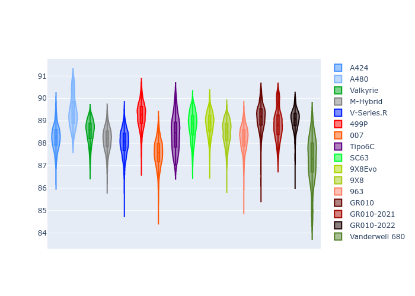
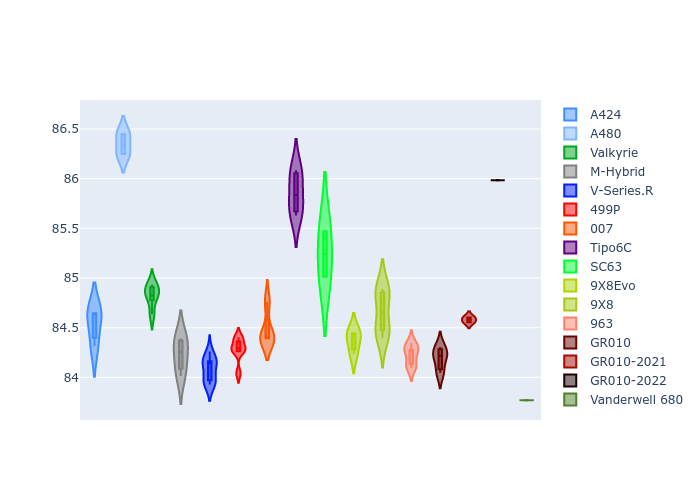
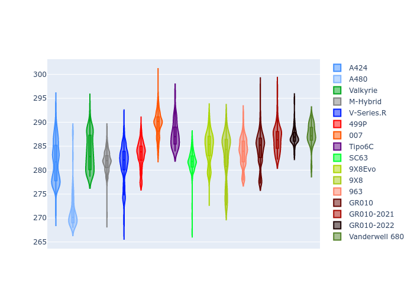
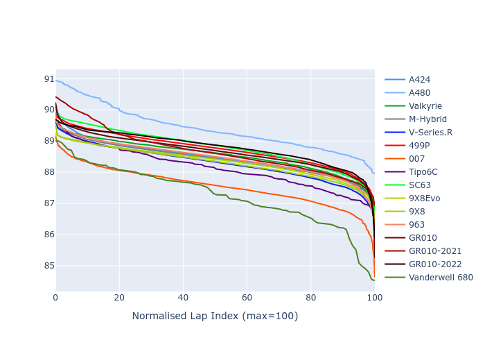

# Combined Plots

## Metadata

- BoP Accuracy: 90.07%
- Overall BoP Grade: A2
- Track: INTERLAGOS
- Threshhold: 250.0kph
- Average Laptime: 1:28.82
- Average Quali Laptime: 1:25.08
- Laptime Std Dev: 1.01 seconds
- Filtered Average Topspeed: 283.83kph

## BoP Table
| Manufacturer     | Car            | Weight   | Power   | PINC   | E/Stint   | FDS    | RDP    | QDP    | TDP    |
|:-----------------|:---------------|:---------|:--------|:-------|:----------|:-------|:-------|:-------|:-------|
| Alpine           | A424           | 1046kg   | 511.0kw | +0.50% | 911MJ     | -      | 51.45% | 55.09% | 24.89% |
| Alpine           | A480           | 992kg    | 420.0kw | +0.10% | 776MJ     | -      | 54.77% | 76.19% | 54.04% |
| Aston Martin     | Valkyrie       | 1030kg   | 520.0kw | -      | 911MJ     | -      | 53.07% | 48.70% | 24.00% |
| BMW              | M-Hybrid       | 1040kg   | 513.0kw | -      | 908MJ     | -      | 52.63% | 52.34% | 34.06% |
| Cadillac         | V-Series.R     | 1037kg   | 519.0kw | -      | 911MJ     | -      | 48.80% | 57.26% | 18.10% |
| Ferrari          | 499P           | 1052kg   | 503.0kw | -0.60% | 898MJ     | 190kph | 51.39% | 44.34% | 9.89%  |
| Glickenhaus      | 007            | 1003kg   | 533.0kw | -      | 918MJ     | -      | 46.14% | 49.30% | 41.45% |
| Isotta Fraschini | Tipo6C         | 1015kg   | 523.0kw | -      | 915MJ     | 190kph | 43.95% | 47.22% | 31.53% |
| Lamborghini      | SC63           | 1030kg   | 520.0kw | -1.60% | 907MJ     | -      | 48.32% | 60.95% | 28.65% |
| Peugeot          | 9X8Evo         | 1042kg   | 518.0kw | -      | 915MJ     | 190kph | 49.16% | 50.25% | 18.00% |
| Peugeot          | 9X8            | 1036kg   | 524.0kw | -      | 908MJ     | 150kph | 54.54% | 58.39% | 9.69%  |
| Porsche          | 963            | 1046kg   | 511.0kw | +0.60% | 908MJ     | -      | 50.61% | 41.90% | 27.68% |
| Toyota           | GR010          | 1061kg   | 502.0kw | +1.50% | 905MJ     | 190kph | 51.33% | 51.71% | 14.89% |
| Toyota           | GR010-2021     | 1045kg   | 509.0kw | +0.10% | 900MJ     | 150kph | 54.02% | 52.67% | 26.37% |
| Toyota           | GR010-2022     | 1050kg   | 503.0kw | +0.10% | 893MJ     | 190kph | 53.24% | 64.49% | 9.72%  |
| Vanwall          | Vanderwell 680 | 980kg    | 539.0kw | -      | 914MJ     | -      | 50.86% | 59.83% | 31.84% |

## Performance Table
| Manufacturer     | Car            | RP      | QP      | Vavg      |   RDLC | BOP-Grade   | Match   |
|:-----------------|:---------------|:--------|:--------|:----------|-------:|:------------|:--------|
| Alpine           | A424           | 1:28.89 | 1:24.83 | 281.89kph |   1.05 | ~A1         | 99.83%  |
| Alpine           | A480           | 1:31.89 | 1:28.32 | 272.54kph |   1.04 | +Ω1         | 1.38%   |
| Aston Martin     | Valkyrie       | 1:28.77 | 1:24.87 | 283.48kph |   1.05 | ~A1         | 100.00% |
| BMW              | M-Hybrid       | 1:28.77 | 1:24.52 | 281.97kph |   1.05 | ~A1         | 100.00% |
| Cadillac         | V-Series.R     | 1:28.38 | 1:24.14 | 281.46kph |   1.05 | ~A1         | 99.83%  |
| Ferrari          | 499P           | 1:29.60 | 1:25.17 | 283.35kph |   1.05 | +B2         | 80.23%  |
| Glickenhaus      | 007            | 1:27.34 | 1:24.31 | 289.68kph |   1.04 | ~A1         | 95.75%  |
| Isotta Fraschini | Tipo6C         | 1:28.18 | 1:25.91 | 287.40kph |   1.03 | ~A1         | 100.00% |
| Lamborghini      | SC63           | 1:29.06 | 1:25.48 | 281.86kph |   1.04 | ~A1         | 99.62%  |
| Peugeot          | 9X8Evo         | 1:28.54 | 1:24.50 | 284.94kph |   1.05 | ~A1         | 99.84%  |
| Peugeot          | 9X8            | 1:28.12 | 1:24.50 | 282.96kph |   1.04 | ~A1         | 99.84%  |
| Porsche          | 963            | 1:28.74 | 1:24.70 | 283.80kph |   1.05 | ~A1         | 99.93%  |
| Toyota           | GR010          | 1:29.17 | 1:24.60 | 284.15kph |   1.05 | -A2         | 94.34%  |
| Toyota           | GR010-2021     | 1:28.77 | 1:24.95 | 286.83kph |   1.04 | ~A1         | 97.20%  |
| Toyota           | GR010-2022     | 1:29.57 | 1:26.75 | 287.06kph |   1.03 | +B2         | 80.12%  |
| Vanwall          | Vanderwell 680 | 1:27.36 | 1:23.68 | 287.97kph |   1.04 | -A2         | 93.19%  |

## Race Laptimes

## Quali Laptimes

## Topspeeds

## Laptimes Lineplot

